# OpenProject Rewrite — Database Schema Architecture (v2)

> **Status:** Design proposal — not yet implemented
> **Stack:** PostgreSQL 16 + Prisma 7.7.0
> **Document version:** 1.0
> **Author:** Database Architect
> **Scope:** Complete schema overhaul for 56-model Prisma schema, with multi-tenancy, soft delete, audit, versioning, full-text search, and operational concerns.

---

## Table of Contents

1. [Executive Summary](#1-executive-summary)
2. [Current State Audit (56 Models)](#2-current-state-audit)
3. [Design Principles & Prisma 7 Best Practices](#3-design-principles--prisma-7-best-practices)
4. [Multi-Tenancy Strategy](#4-multi-tenancy-strategy)
5. [Soft Delete Pattern](#5-soft-delete-pattern)
6. [Audit Log Architecture](#6-audit-log-architecture)
7. [Versioning & Journaling](#7-versioning--journaling)
8. [Cascade / FK / Soft Reference Rules](#8-cascade--fk--soft-reference-rules)
9. [Enums vs Lookup Tables](#9-enums-vs-lookup-tables)
10. [Full-Text Search](#10-full-text-search)
11. [JSON / JSONB Strategy](#11-json--jsonb-strategy)
12. [Composite & Specialized Indexes](#12-composite--specialized-indexes)
13. [Polymorphic Patterns: CustomField, CustomValue, Attachment](#13-polymorphic-patterns)
14. [Connection Pooling & Prepared Statements](#14-connection-pooling--prepared-statements)
15. [Migration Strategy](#15-migration-strategy)
16. [Seed Data Strategy](#16-seed-data-strategy)
17. [Backup, Restore & PITR](#17-backup-restore--pitr)
18. [ER Diagram (Mermaid)](#18-er-diagram)
19. [Concrete Schema Diffs (additions/changes)](#19-concrete-schema-diffs)
20. [Query Patterns & Index Verification](#20-query-patterns--index-verification)
21. [Data Migration Plan](#21-data-migration-plan)
22. [Operational Runbook](#22-operational-runbook)
23. [Open Questions & Future Work](#23-open-questions--future-work)

---

## 1. Executive Summary

The current schema is **functional but operationally naive** for an enterprise project management platform. It ships 56 models with proper FK relations and good index coverage on the hot path (`WorkPackage` by project/status/assignee), but it lacks:

- **Change tracking** — there is no `WorkPackageJournal`; we cannot answer "what did user X change in WP #123 between date Y and Z". The `Activity` model is polymorphic and useful for a feed, but is not a row-diff journal.
- **Polymorphic custom field values** — `CustomField` exists but there is no `CustomValue` table. Custom field values must therefore be stuffed into `WorkPackage` JSON columns, breaking query/index/validation.
- **Polymorphic attachment** — `Document` and `ProjectFile` duplicate the same columns (`fileName`, `fileSize`, `fileType`, `fileUrl`). There is no generic `Attachment` that ties files to any resource.
- **Full-text search** — every text search today is a `ILIKE '%q%'`. We need `tsvector` + GIN on `WorkPackage.subject/description`, `WikiPage.title/content`, `ForumPost.content`, `News.title/content`, `Document.title`.
- **Notification unread count** — there is no aggregate column. Every render of the bell icon does `COUNT(*) WHERE userId=? AND read=false`. Cheap, but at 10k notifications per user it is a sequential scan. Add `unreadCount` denormalized cache.
- **Multi-tenancy hardening** — current `projectId` scoping is application-enforced. A single missed `WHERE projectId=?` leaks data. PostgreSQL RLS or schema-per-tenant should be evaluated.
- **Soft delete** — only `TimeEntry` and `Document` have `deletedAt`. Every other table does a hard delete. We need a consistent pattern.
- **Cascades are inconsistent** — `Member.user → Cascade`, `BudgetLine.workPackage → Restrict (default)`, `WorkPackage.author → Restrict` (meaning you cannot delete a user who ever authored a WP — that breaks GDPR). We need explicit `onDelete` on every relation with a documented policy.

**Top 3 schema improvements** (full list in §19):

1. **Add `WorkPackageJournal` row-diff history** — enables per-field change history, audit-grade "who changed what when", and is the foundation for the "Activity" tab in the WP view.
2. **Add `CustomValue` polymorphic table** — replaces ad-hoc JSON columns on `WorkPackage` with a typed, indexed, queryable custom-field store.
3. **Add polymorphic `Attachment` + S3-style storage** — dedupes `Document`/`ProjectFile` file columns, enables attachments on any resource (WP, wiki page, forum post, news), and adds checksums for dedup.

A **secondary** tier of improvements (also detailed below) covers RLS, FTS, soft-delete middleware, OAuth scope tables, and seed data for the demo/dev environments.

---

## 2. Current State Audit (56 Models)

### 2.1 Model inventory

```
auth           : User, WebAuthnCredential, LdapServer, LdapGroupMapping, Group, GroupMembership
project        : Project, Member, Role, ProjectModule, ProjectTemplate, ProjectWipLimit, Version, Branding
work_package   : WorkPackage, Status, Type, Priority, WorkPackageRelation, SavedQuery, Query, Sprint, SprintMember, BurndownData
time_budget    : TimeEntry, Budget, BudgetLine
activity       : Activity, ActivityComment
wiki           : WikiPage, WikiPageVersion
forum          : Forum, ForumThread, ForumPost, ForumVote
docs           : Document, DocumentVersion, DocumentFolder
meetings       : Meeting, MeetingAttendee, MeetingAgendaItem, MeetingMinutes
news           : News, NewsComment
notifications  : Notification, NotificationSetting, EmailQueue
files_repos    : ProjectFile, Repository, Commit, CommitWorkPackage
integrations   : Webhook, WebhookDelivery, Announcement
settings       : Setting, CustomField
```

Count: **56 models** + **1 enum** (`SprintStatus`).

### 2.2 Strengths of the current schema

- ✅ **FKs are well-defined** — every relation has an explicit `onDelete`.
- ✅ **Hot-path indexes exist** — `WorkPackage` has `(projectId)`, `(projectId, statusId)`, `(projectId, assigneeId)`, `(projectId, typeId)`, `(dueDate)`, `(startDate)`, `(updatedAt)`.
- ✅ **Unique constraints** — `(projectId, slug)` on `WikiPage` and `News`, `(userId, projectId)` on `Member`, `(sprintId, date)` on `BurndownData`.
- ✅ **Polymorphic activity feed** — `Activity.subjectType/subjectId` is a clean polymorphic pattern.
- ✅ **Soft delete is starting** — `TimeEntry` and `Document` have `deletedAt`/`deletedBy`.
- ✅ **Time tracking with timezone** — `TimeEntry.spentOn` (UTC) + `userTimezone` is correct.
- ✅ **Webhook delivery model** — `WebhookDelivery` with `nextRetry` is good for resilient delivery.
- ✅ **Versioning is established** — `WikiPageVersion` and `DocumentVersion` exist.

### 2.3 Weaknesses

| # | Issue | Severity | Impact |
|---|---|---|---|
| 1 | No `WorkPackageJournal` for per-field change history | **High** | Cannot answer "what changed?" beyond the activity feed's snapshot. Audit/compliance gaps. |
| 2 | No `CustomValue` table | **High** | Custom fields cannot be queried/indexed/validated; values live in `WorkPackage` JSON if at all. |
| 3 | No polymorphic `Attachment` | **High** | File metadata duplicated across `Document` and `ProjectFile`. Cannot attach files to WP, wiki, forum. |
| 4 | No full-text search indexes | **High** | All search is `ILIKE`, full table scan, no stemming, no ranking. |
| 5 | Inconsistent `onDelete` policies | **Medium** | Hard-coding `Cascade` on `User → Member` makes it hard to soft-delete users (GDPR "right to be forgotten"). |
| 6 | `Role.permissions` is `String[]` (Postgres text array) | **Medium** | Permissions cannot be FK'd; validation must happen in app code. Should be a join table or a `text[]` with a CHECK constraint. |
| 7 | `Project.status` is `String` with magic values | **Medium** | Should be a `ProjectStatus` enum or a `Status` lookup table. |
| 8 | `EmailQueue.payload` not stored — only `html` body | **Medium** | Cannot re-render with new template; cannot A/B test subject lines. |
| 9 | `Activity.details` is `Json` with no schema | **Low** | Validated only in app code; migrations on the shape require data backfill. |
| 10 | `Branding` is a singleton with `id="default"` | **Low** | Works but a singleton `Row(1)` pattern with `CHECK(id=1)` is more idiomatic. |
| 11 | No `User.deletedAt` | **Medium** | Cannot soft-delete users; GDPR compliance gap. |
| 12 | `Notification.reason` and `resourceType` are free `String` | **Medium** | Should be enums for `NotificationReason` and `ResourceType` to prevent typos. |
| 13 | Missing composite indexes for common UI | **Medium** | e.g. `Notification(userId, read, createdAt DESC)` for the inbox. |
| 14 | No OAuth tables | **Low** | If you want to be an OAuth provider (and the spec mentions API v3), `OAuthClient`, `OAuthAccessToken`, `OAuthAuthorizationCode` are needed. |
| 15 | `WorkPackage.position` for ordering, but no scope | **Medium** | Position should be `(projectId, parentId, position)` to allow per-parent re-ordering. |
| 16 | `User.apiKey` is a single `String` | **Medium** | No rotation, no expiry, no multiple keys. Should be a `UserApiKey` table. |
| 17 | `Webhook` lacks per-project `secret` and retry policy | **Low** | Already has `secret`, but missing `timeout`/`retryCount`. |
| 18 | `CustomField.possibleValues` is `String[]` for the "list" type | **Low** | Cannot attach metadata to list options (color, position). Should be a `CustomFieldOption` table. |

### 2.4 Missing relationships

- `User` has no reverse relation to `Notification.actor` or `Activity.user` beyond the existing ones — fine, but we should add a generic `Actor` polymorphic on `Activity` and `Notification` for reuse.
- `Meeting` has no `MeetingAgendaItem.parentId` for nested agenda items.
- `WikiPage` has no many-to-many `tags`.
- `Project` has no `parentId` for project hierarchy (sub-projects).
- `WorkPackage` has no `blocks`/`blockedBy` self-relation beyond `WorkPackageRelation`; OK, but `WorkPackageRelation` should have a `createdById` (audit).
- `Repository` has no `defaultBranch`.
- `Commit` has no `branch`; the only way to know which branch a commit is on is to scan `CommitWorkPackage` — we should add `CommitBranch` (or denormalize `branch` onto the WP-commit link).
- `Budget` has no `Budget.contributedBy` — the user who entered the budget.
- `SavedQuery` and `Query` are duplicates (legacy + current). We need to pick one.

### 2.5 N+1 risk hotspots

| Hot path | N+1 risk | Mitigation |
|---|---|---|
| List WPs in a project with status/type/assignee | Low — joined via FK | ✅ Indexed |
| Get WP with watchers | **High** — `watchers: User[]` is a M2M self-relation; Prisma will issue a separate query | Add `@@index([workPackageId, userId])` join table `WorkPackageWatcher` |
| List activities with `mentionIds` expansion | **Medium** — `mentionIds String[]` requires a second query to resolve user names | Add `@@index([userId])` and denormalize `actorName` (already done) |
| List notifications | Low | ✅ `(userId, read)` indexed |
| List forum threads with last-post preview | **High** — last post is `MAX(ForumPost.createdAt)` per thread | Denormalize `lastPostAt`, `lastPostAuthorId`, `lastPostSnippet` onto `ForumThread` |
| Get project tree (hierarchy) | **High** — recursive CTE needed | Add `Project.parentId` + `(parentId)` index |
| Get time entries aggregated per WP per day | **Medium** — `SUM(hours) GROUP BY workPackageId, DATE(spentOn)` | ✅ `(workPackageId, spentOn)` indexed |
| Get unread notifications count | **High** at scale | Add `User.unreadNotificationCount` cache + `Notification(userId, read, createdAt DESC)` index |

### 2.6 Denormalization opportunities

1. **`ForumThread.lastPostAt` / `lastPostAuthorId` / `lastPostSnippet`** — compute on post insert.
2. **`WorkPackage.commentCount`** — increment via trigger or app.
3. **`WorkPackage.attachmentCount`** — derive from `Attachment` count.
4. **`User.unreadNotificationCount`** — maintain on notification insert/mark-read.
5. **`Project.memberCount`** and **`Project.workPackageCount`** — nightly batch.
6. **`WikiPage.currentVersion`** — already a `version Int` column; fine.
7. **`Document.currentVersion`** — already a `version Int` column; fine.
8. **`Sprint.burndownSnapshot`** — store latest day's remaining/ideal on the sprint for fast render.
9. **`Budget.spent`** — `SUM(BudgetLine.totalCost WHERE workPackage.status = 'closed')`; cache it.
10. **`WorkPackage.journalVersion`** — monotonic counter incremented on every journal entry; lets the UI detect missed updates.

---

## 3. Design Principles & Prisma 7 Best Practices

These are the rules every model in the v2 schema must follow.

### 3.1 Naming and identifiers

- **IDs:** `cuid()` for app-generated, `uuid()` if we ever need client-generated (e.g. mobile sync). CUIDs are sortable enough for time-ordered queries; if we need strict ordering we add a `createdAt` index.
- **Timestamps:** every model has `createdAt @default(now())` and `updatedAt @updatedAt` (where mutable).
- **Soft delete:** only on models where business requires "deleted but restorable". See §5.
- **Mapping:** every model uses `@@map("snake_case")` to keep DB column naming consistent with SQL conventions.
- **Column types:** use `@db.VarChar(N)`, `@db.Text`, `@db.Decimal(p,s)`, `@db.Timestamptz(6)`, `@db.Boolean` explicitly. Prisma's defaults are fine for `String`/`Int`/`Float`/`DateTime` but we should pin everything to avoid migration drift between Prisma versions.

### 3.2 Required attributes on every relation

```prisma
model X {
  yId String
  y   Y     @relation(fields: [yId], references: [id], onDelete: <explicit>)
  @@index([yId])
}
```

- **Explicit `onDelete` on every relation.** No defaults. Pick from `Cascade | Restrict | NoAction | SetNull` per the policy in §8.
- **Index every FK** that is queried standalone. (Postgres does **not** auto-index FKs; the planner adds one only on the *referencing* side of certain join types, and you cannot rely on it.)
- **Composite unique** for natural keys: `(projectId, slug)`, `(userId, projectId)`, `(sprintId, userId)`.

### 3.3 Indexing policy

- **Hot paths** get `@@index([col1, col2])` composites where column ordering matches the most common `WHERE` filter first.
- **Sort-stable** queries: index the sort key last. e.g. inbox is `WHERE userId = ? AND read = false ORDER BY createdAt DESC` → `@@index([userId, read, createdAt])`.
- **GIN** for `tsvector` and `jsonb_path_ops` only — never on regular b-tree candidates.
- **Partial indexes** are underused. e.g.
  ```sql
  @@index([projectId], map: "wp_open_idx", where: "deleted_at IS NULL AND status_id IN (open_statuses)")
  ```
  Prisma 7 supports `where:` on `@@index` via the `map:` and raw migration. (Documented in §12.)
- **Don't over-index.** Every index slows down writes. We aim for **< 8 indexes per hot table** (`WorkPackage` currently has 9 — that's the upper bound).

### 3.4 Avoid `Json` for structured data

Prisma's `Json` type maps to `jsonb` in Postgres, which is great for *truly* dynamic data, but a bad default for things we know the shape of:

| Data | Use `Json`? | Better |
|---|---|---|
| `WorkPackage` custom field values | ❌ | `CustomValue` table (typed, indexed) |
| `Activity.details` (one field changed) | ✅ | OK, small, varied shape |
| `SavedQuery.filters` (filter expression) | ✅ | OK, validated in app |
| `Setting.value` | ⚠️ | Mostly strings; for complex values, dedicated columns |
| `User.avatarMeta` (sizes, color) | ⚠️ | Usually empty, OK as `Json` |
| `Webhook.events` | ❌ (already `String[]`) | OK as text array for now; future: `WebhookEvent` join table |
| `Branding.themeTokens` | ✅ | Truly dynamic per-tenant |
| `Notification.payload` | ✅ | OK, ephemeral |

Rule of thumb: **if you ever need to `WHERE` on a sub-field, normalize it.** If you only need to *read* the whole blob, `Json` is fine.

### 3.5 Prisma 7 features used

- `@@index` with `map:` for named partial indexes (raw migrations in §12).
- `@@id([...])` for composite primary keys (`CommitWorkPackage` already uses this).
- `@db.*` explicit types: `VarChar`, `Text`, `Decimal(12,2)`, `Timestamptz(6)`, `Boolean`, `SmallInt`.
- `@default(cuid())` everywhere — no `autoincrement()` (UUIDs are portable, shardable).
- Native `enum` types for `SprintStatus`, `WorkPackagePriorityEnum` etc.
- **Prisma 7 driver adapter** (`@prisma/adapter-pg`) is already in use; we use that for connection pooling with PgBouncer in transaction mode.

---

## 4. Multi-Tenancy Strategy

We have three credible options. We are currently using **option A** and recommend **adding RLS as a defense-in-depth** without switching the primary strategy.

### 4.1 Options compared

| Option | Description | Pros | Cons |
|---|---|---|---|
| **A. Shared DB, project_id scoping** (current) | One schema; every tenant = one or more `Project` rows; app code adds `WHERE projectId = ?` | Simple, cheap, easy backups, easy cross-tenant reporting | App bug = data leak; no DB-enforced isolation |
| **B. Schema-per-tenant** | Each tenant gets a `tenant_<id>` schema; Prisma uses dynamic table names | Strong isolation, easy per-tenant export | Migration fan-out (N tenants × M migrations); connection pool pressure; cross-tenant queries are hard |
| **C. Database-per-tenant** | Each tenant gets its own DB | Strongest isolation; per-tenant PITR | Operational nightmare at scale; no cross-tenant analytics; expensive |
| **D. Shared DB + PostgreSQL Row-Level Security** | Single schema, RLS policies enforce `current_setting('app.tenant_id')::uuid = project_id` | DB-enforced isolation; works with shared pool; no migration fan-out | Slight perf overhead; policies must be added to every table; bypass via `BYPASSRLS` superuser must be controlled |

### 4.2 Recommendation

**Stay with A + add RLS as defense-in-depth (D).**

- Application: every query already scopes by `projectId` (or `userId` for user-scoped resources).
- Database: add RLS policies that force `project_id = current_setting('app.current_project_id')::text` on every tenant-scoped table. The application sets the GUC at the start of every request via `SET LOCAL app.current_project_id = '...'`.
- Webhooks, background jobs, and admin tools connect as a `BYPASSRLS` role.

### 4.3 RLS policy examples

```sql
-- Enable RLS on a tenant-scoped table
ALTER TABLE work_packages ENABLE ROW LEVEL SECURITY;
ALTER TABLE work_packages FORCE ROW LEVEL SECURITY;

-- Policy: app must set current_project_id
CREATE POLICY wp_tenant_isolation ON work_packages
  USING (project_id = current_setting('app.current_project_id', true));

-- Bypass for service role
CREATE POLICY wp_service_bypass ON work_packages
  TO service_role USING (true);
```

```sql
-- User-scoped resources (notifications)
ALTER TABLE notifications ENABLE ROW LEVEL SECURITY;
ALTER TABLE notifications FORCE ROW LEVEL SECURITY;

CREATE POLICY notif_user_isolation ON notifications
  USING (user_id = current_setting('app.current_user_id', true)::text);
```

### 4.4 What we will **not** do

- **Not** schema-per-tenant. OpenProject users expect cross-project reporting, global search, and the admin "see all projects" view. Fan-out migrations across thousands of schemas would also be operationally painful.
- **Not** database-per-tenant. Too expensive and operationally complex for a self-hosted product.

### 4.5 Migration cost from current state to RLS

Estimated ~3 engineer-days:
1. Add `app.current_project_id` / `app.current_user_id` to the request middleware.
2. Write a Prisma `$extends` client that wraps every query in a transaction with `SET LOCAL`.
3. Add `ENABLE ROW LEVEL SECURITY` + `FORCE ROW LEVEL SECURITY` to every tenant-scoped table.
4. Add policies for `work_packages`, `wiki_pages`, `forum_*`, `documents`, `meetings`, `news`, `activities`, `members`, `versions`, `sprints`, `budgets`, `project_files`, `repositories`, `commits`, `commit_work_packages`, `notifications`, `time_entries`, `custom_values`, `attachments`.
5. Update integration tests to run as the service role (BYPASSRLS) for the cross-tenant admin scenarios.

---

## 5. Soft Delete Pattern

### 5.1 Goal

Allow **deletion with audit + recovery**. The model is "soft-delete by default for user-created content, hard-delete only for system tables and join tables".

### 5.2 Soft-delete taxonomy

| Layer | Pattern | Examples |
|---|---|---|
| **User-created content** (soft delete) | `deletedAt DateTime?` + `deletedBy String?` | `WorkPackage`, `WikiPage`, `ForumThread`, `ForumPost`, `News`, `Document`, `TimeEntry` (already), `Meeting`, `Comment` (all), `Sprint`, `Version` |
| **System rows** (hard delete only) | No `deletedAt` | `Status`, `Type`, `Priority`, `Role`, `CustomField` (with caveat), `ProjectModule`, `SprintStatus` enum values |
| **Join tables** (hard delete only) | No `deletedAt` | `Member`, `GroupMembership`, `CommitWorkPackage`, `WorkPackageWatcher`, `SprintMember`, `ForumVote`, `MeetingAttendee` |
| **Audit/security** (soft delete + 30-day lock) | `deletedAt` + immutable after | `User` (GDPR), `Project` (archival) |

### 5.3 Prisma middleware

We will add a Prisma `$extends` that auto-filters `deletedAt: null` on every read for the soft-delete models. Explicit opt-out via a "with-deleted" client for admin tooling.

```ts
// lib/prisma-soft-delete.ts
import { Prisma } from '@prisma/client';

const SOFT_DELETE_MODELS = new Set([
  'WorkPackage', 'WikiPage', 'ForumThread', 'ForumPost',
  'News', 'Document', 'TimeEntry', 'Meeting', 'Sprint',
  'Version', 'Budget', 'Notification',
]);

export const softDeleteExtension = Prisma.defineExtension({
  query: {
    $allModels: {
      async findMany({ model, args, query }) {
        if (SOFT_DELETE_MODELS.has(model)) {
          args.where = { ...args.where, deletedAt: null };
        }
        return query(args);
      },
      async findFirst({ model, args, query }) {
        if (SOFT_DELETE_MODELS.has(model)) {
          args.where = { ...args.where, deletedAt: null };
        }
        return query(args);
      },
      async count({ model, args, query }) {
        if (SOFT_DELETE_MODELS.has(model)) {
          args.where = { ...args.where, deletedAt: null };
        }
        return query(args);
      },
      async findUnique({ model, args, query }) {
        // findUnique doesn't accept deletedAt, so convert to findFirst
        if (SOFT_DELETE_MODELS.has(model)) {
          args.where = { ...args.where, deletedAt: null };
          return query(args);
        }
        return query(args);
      },
    },
  },
});
```

**Caveat:** the soft-delete extension only filters the *root* model. A `findFirst` with `include: { comments: true }` will still return deleted comments. We need either:
- A second extension on the relation includes (Prisma 7 supports `query.relation`), **or**
- A view/trigger that filters at the DB level (preferred for hot tables like `forum_posts`).

### 5.4 Pruning

Soft-deleted rows are kept for **30 days**, then a nightly job (`prisma$executeRaw` via a cron worker) does:

```sql
DELETE FROM work_packages
WHERE deleted_at IS NOT NULL
  AND deleted_at < now() - interval '30 days';
```

The cron worker respects a per-table `soft_delete_ttl` setting.

### 5.5 Restoration

Restoration is a `UPDATE … SET deleted_at = NULL, deleted_by = NULL WHERE id = ?` plus a revalidation that the parent project/user still exists. Wrap in a transaction.

---

## 6. Audit Log Architecture

### 6.1 The decision: separate table + per-row diff

We use **both**:

1. **A single `AuditLog` table** for "who did what to which resource" — the compliance log.
2. **Per-resource journal tables** (e.g. `WorkPackageJournal`, `WikiPageJournal`, `DocumentVersion`) for the *content* of changes — the user-facing history.

| Concern | `AuditLog` | `WorkPackageJournal` |
|---|---|---|
| Audience | Compliance, security, debugging | End users, "Activity" tab |
| Volume | Lower (one row per action) | Higher (one row per *field* changed) |
| Retention | 1+ year | Indefinite |
| Query pattern | `WHERE actor_id=? AND created_at BETWEEN ?` | `WHERE work_package_id=?` |
| Shape | Generic: actor, action, resource, before/after JSON | Per-resource: field, old, new |

### 6.2 `AuditLog` schema

```prisma
model AuditLog {
  id           String   @id @default(cuid())
  actorId      String?  // null = system
  actorEmail   String?  // denormalized for display
  action       String   // "create" | "update" | "delete" | "restore" | "login" | "permission_change" | ...
  resourceType String   // "WorkPackage" | "Project" | "User" | "Member" | ...
  resourceId   String
  projectId    String?  // for tenant scoping
  before       Json?    // full row snapshot
  after        Json?    // full row snapshot
  diff         Json?    // { field: { from, to } } — sparse diff
  ipAddress    String?
  userAgent    String?
  requestId    String?
  createdAt    DateTime @default(now())

  actor User? @relation(fields: [actorId], references: [id], onDelete: SetNull)

  @@index([actorId, createdAt])
  @@index([resourceType, resourceId, createdAt])
  @@index([projectId, createdAt])
  @@index([action, createdAt])
  @@map("audit_logs")
}
```

- `before/after` are full row snapshots; `diff` is the sparse field-level diff for fast queries.
- For updates, store **both** — `before` is useful for "restore to this state" and `diff` is useful for "what changed".
- Partition by `createdAt` (monthly) once volume justifies it: `CREATE TABLE audit_logs_2026_06 PARTITION OF audit_logs FOR VALUES FROM ('2026-06-01') TO ('2026-07-01');`
- Retention: **13 months** rolling.

### 6.3 Application-level integration

We add a small wrapper that the API layer calls on every mutation:

```ts
// lib/audit.ts
export async function withAudit<T>(
  ctx: Ctx,
  fn: (tx: TxClient) => Promise<T>,
  meta: { action: AuditAction; resourceType: string; resourceId: string }
): Promise<T> {
  return prisma.$transaction(async (tx) => {
    const before = await tx[meta.resourceType].findUnique({ where: { id: meta.resourceId } });
    const result = await fn(tx);
    const after = await tx[meta.resourceType].findUnique({ where: { id: meta.resourceId } });
    await tx.auditLog.create({
      data: {
        actorId: ctx.userId,
        action: meta.action,
        resourceType: meta.resourceType,
        resourceId: meta.resourceId,
        before: before,
        after: after,
        diff: diff(before, after),
        ipAddress: ctx.ip,
        userAgent: ctx.userAgent,
        requestId: ctx.requestId,
      },
    });
    return result;
  });
}
```

This is the **MUST** path for destructive operations (delete, role change, password change, billing change). For non-critical reads we skip it.

### 6.4 What we track

| Action | Resource | Frequency | Notes |
|---|---|---|---|
| `user.login` | User | Every login | Failed + success |
| `user.password_change` | User | Every change | |
| `user.two_factor_enable/disable` | User | Every change | |
| `user.role_change` | Member | Every change | Old role → new role |
| `project.create/delete/archive` | Project | Every | |
| `project.member_add/remove` | Member | Every | |
| `work_package.create/update/delete/restore` | WorkPackage | Every | Triggers journal |
| `work_package.journal` | WorkPackage | Per field change | See §7 |
| `budget.create/update/delete` | Budget | Every | |
| `webhook.create/update/delete` | Webhook | Every | |
| `setting.update` | Setting | Every | System settings |

---

## 7. Versioning & Journaling

### 7.1 Two-tier model

| Tier | What | Where | Retention |
|---|---|---|---|
| **Journal** (per-field) | Field-level changes with old/new values | `WorkPackageJournal`, `WikiPageJournal` | Indefinite (or until WP is hard-deleted) |
| **Snapshot** (full row) | Complete row at a point in time | `AuditLog.before/after` | 13 months |
| **Revision** (content) | Full content snapshot (wiki, document) | `WikiPageVersion`, `DocumentVersion` | Indefinite |

### 7.2 `WorkPackageJournal` schema

```prisma
model WorkPackageJournal {
  id            String   @id @default(cuid())
  workPackageId String
  userId        String
  // What changed
  field         String?  // null for "created" / "deleted" entries
  oldValue      Json?    // serialized
  newValue      Json?    // serialized
  // Grouping
  notes         String?  @db.Text // user comment on the change
  // Counter
  version       Int      // monotonic per WP; used for optimistic concurrency

  createdAt DateTime @default(now())

  workPackage WorkPackage @relation(fields: [workPackageId], references: [id], onDelete: Cascade)
  user        User        @relation(fields: [userId], references: [id], onDelete: Restrict)

  @@index([workPackageId, version])
  @@index([workPackageId, createdAt])
  @@index([userId, createdAt])
  @@map("work_package_journals")
}
```

### 7.3 Journal workflow

1. User updates a WP.
2. In a transaction:
   - Compare `before` and `after`.
   - For each changed field, insert a `WorkPackageJournal` row.
   - Increment `WorkPackage.journalVersion` (new column).
   - Update `WorkPackage.updatedAt` + `updatedBy`.
3. The UI fetches the journal via `WHERE workPackageId=? ORDER BY version ASC` and renders a diff.

### 7.4 Concurrency

- Add `WorkPackage.journalVersion Int @default(0)`.
- The update `WHERE id = ? AND journalVersion = ?` fails on stale reads → return 409.
- The next release of the UI must pass the version it loaded.

### 7.5 `WikiPageVersion` and `DocumentVersion` (already exist)

- Keep them. Add a `WikiPageVersion.summary` (commit-message-style) and a `DocumentVersion.checksum` (sha256 of the file).

### 7.6 `Document` → `DocumentVersion` mapping

`Document.version` is a denormalized `MAX(DocumentVersion.version)`. Maintain via trigger or app.

---

## 8. Cascade / FK / Soft Reference Rules

### 8.1 Policy matrix

| Parent → Child | Policy | Reason |
|---|---|---|
| `Project → *` (everything project-scoped) | `Cascade` | Deleting a project removes its content |
| `Project → Member` | `Cascade` | Memberships die with the project |
| `Project → Budget` | `Cascade` | Budgets are project-owned |
| `User → Member` | `SetNull` (after soft-delete) | GDPR: anonymize, don't delete memberships |
| `User → WorkPackage.author` | `SetNull` (after soft-delete) | Same |
| `User → WorkPackage.assignee` | `SetNull` (after soft-delete) | Same |
| `User → TimeEntry.user` | `Restrict` (hard error) | Time entries are accounting; cannot orphan |
| `User → Comment.author` | `SetNull` | Keep comments, anonymize author |
| `WorkPackage → TimeEntry` | `Restrict` | Cannot delete WP with time entries (or `Cascade` if we accept the data loss) |
| `WorkPackage → WorkPackageRelation` | `Cascade` | Relation is part of WP |
| `WorkPackage → WorkPackageWatcher` | `Cascade` | Watcher is part of WP |
| `WorkPackage → BudgetLine` | `SetNull` | Budget can outlive WP |
| `WikiPage → WikiPageVersion` | `Cascade` | Version is owned by page |
| `WikiPage → WikiPageVersion` (parent for hierarchy) | `SetNull` | Allow re-parenting |
| `ForumThread → ForumPost` | `Cascade` | Posts are owned by thread |
| `ForumPost → ForumVote` | `Cascade` | Votes are owned by post |
| `Meeting → MeetingAttendee` | `Cascade` | Attendees are owned by meeting |
| `Meeting → MeetingMinutes` | `Cascade` | Minutes are owned by meeting |
| `Status/Type/Priority → WorkPackage` | `Restrict` (default) | Cannot delete a status that's in use; we `isActive=false` instead |
| `Role → Member` | `Restrict` | Cannot delete a role that's in use |
| `Sprint → WorkPackage` | `SetNull` | Allow moving WP out of a deleted sprint |
| `CustomField → CustomValue` | `Cascade` | Values are owned by field |
| `Attachment → *` (resource) | `Cascade` | Attachment dies with resource |
| `OAuthClient → OAuthAccessToken` | `Cascade` | Tokens die with client |
| `Webhook → WebhookDelivery` | `Cascade` | Deliveries die with webhook |

### 8.2 Soft references

For polymorphic refs (`Activity.subjectType/subjectId`, `Notification.resourceType/resourceId`, `Attachment.containerType/containerId`) we have **no DB-level FK**. This is intentional:

- Pros: a single table can reference many resources.
- Cons: orphaned rows are possible (an Activity pointing at a deleted WP).
- Mitigation: a nightly `orphaned_activity_cleanup` job that nullifies/deletes orphans.

### 8.3 Compensating controls for `Cascade`

- `User` cannot be hard-deleted if they have `WorkPackage.author` references. We expose only **soft delete** (`deletedAt` + email replaced with `deleted-user-<id>@example.invalid`).
- The `User` table has `isAnonymized Boolean @default(false)` and the deletion endpoint refuses to operate on a non-anonymized user.

---

## 9. Enums vs Lookup Tables

### 9.1 Decision matrix

| Concern | Pattern | Reason |
|---|---|---|
| `SprintStatus` (OPEN/ACTIVE/CLOSED) | **Enum** | Fixed for app's lifetime; can't be customized |
| `Notification.reason` | **Enum** | Fixed; the app code branches on it |
| `Notification.resourceType` | **Enum** | Fixed list |
| `ProjectStatus` (active/archived/on_hold) | **Enum** | Fixed; small list |
| `TimeEntry.status` (pending/submitted/approved/rejected) | **Enum** | Fixed |
| `MeetingAttendee.response` (none/accepted/declined) | **Enum** | Fixed |
| `Status` (work package statuses like "New", "In progress", "Closed") | **Lookup table** | Admins can add/remove/reorder |
| `Type` (Task, Bug, Feature, Milestone) | **Lookup table** | Same |
| `Priority` (Low, Normal, High, Urgent) | **Lookup table** | Same |
| `Role` | **Lookup table** | Admins create roles |
| `CustomField.fieldFormat` | **Enum** (could be lookup) | Fixed set of formats |
| `Webhook.events` | **`text[]` for now** | Set of strings; future: join table if we need per-event metadata |
| `Permission` (granular permissions) | **Lookup table** (`Permission` + `RolePermission` join) | Admins manage roles via UI |

### 9.2 PostgreSQL enums in Prisma 7

```prisma
enum NotificationReason {
  MENTION
  ASSIGNEE_CHANGE
  WATCHER_COMMENT
  DUE_DATE_APPROACHING
  WORK_PACKAGE_CREATED
  WORK_PACKAGE_UPDATED
  FORUM_POST
  MEETING_INVITE
  // ...
}

enum ResourceType {
  WORK_PACKAGE
  WIKI_PAGE
  FORUM_THREAD
  FORUM_POST
  MEETING
  DOCUMENT
  NEWS
  TIME_ENTRY
  BUDGET
  COMMENT
  // ...
}
```

Enums map to PostgreSQL `CREATE TYPE … AS ENUM (...)`. **Cons:** adding a value requires `ALTER TYPE … ADD VALUE`, which cannot run inside a transaction in older Postgres. Prisma handles this with a separate migration step.

### 9.3 Lookup tables (`Status`, `Type`, `Priority`)

Already exist. Keep them. Add:

```prisma
model Status {
  id        String  @id @default(cuid())
  name      String  @unique
  color     String  @default("#666666")
  position  Int     @default(0)
  isClosed  Boolean @default(false)
  isDefault Boolean @default(false)   // NEW
  isActive  Boolean @default(true)    // NEW: soft-disable without breaking FKs
  createdAt DateTime @default(now())
  updatedAt DateTime @updatedAt

  workPackages WorkPackage[]

  @@index([position])
  @@map("statuses")
}
```

`isActive` lets us hide a status from new-WP pickers without breaking historical data.

---

## 10. Full-Text Search

### 10.1 Goal

Sub-100ms search across WorkPackages, WikiPages, ForumPosts, News, Documents, with weighted ranking.

### 10.2 Strategy: `tsvector` generated columns + GIN

For each searchable model, add a generated column:

```sql
-- WorkPackage
ALTER TABLE work_packages
  ADD COLUMN search_vector tsvector
  GENERATED ALWAYS AS (
    setweight(to_tsvector('english', coalesce(subject, '')), 'A') ||
    setweight(to_tsvector('english', coalesce(description, '')), 'B')
  ) STORED;

CREATE INDEX work_packages_search_idx ON work_packages USING GIN (search_vector);
```

```sql
-- WikiPage
ALTER TABLE wiki_pages
  ADD COLUMN search_vector tsvector
  GENERATED ALWAYS AS (
    setweight(to_tsvector('english', coalesce(title, '')), 'A') ||
    setweight(to_tsvector('english', coalesce(content, '')), 'B')
  ) STORED;
CREATE INDEX wiki_pages_search_idx ON wiki_pages USING GIN (search_vector);
```

Same for `forum_posts.content`, `news.title || news.content`, `documents.title`.

### 10.3 Prisma representation

Prisma doesn't natively support generated columns, so we add them via raw SQL migrations:

```prisma
model WorkPackage {
  // ... existing columns
  // searchVector is added by raw migration; not in the Prisma model
}
```

The application uses `prisma.$queryRaw` for FTS:

```sql
SELECT id, subject,
  ts_rank(search_vector, websearch_to_tsquery('english', $1)) AS rank
FROM work_packages
WHERE project_id = $2
  AND search_vector @@ websearch_to_tsquery('english', $1)
ORDER BY rank DESC
LIMIT 50;
```

### 10.4 Multilingual support

Use `'simple'` config (no stemming) for languages that don't have a stemmer, and keep `'english'` for English content. A future enhancement: store the language per row and pick the config dynamically.

### 10.5 Highlighting

```sql
SELECT ts_headline('english', description, websearch_to_tsquery('english', $1),
  'StartSel=<mark>, StopSel=</mark>, MaxFragments=3, MaxWords=20, MinWords=5')
FROM work_packages WHERE id = $2;
```

---

## 11. JSON / JSONB Strategy

### 11.1 Use `Json` (jsonb) for:

- `Activity.details` (small diff per change)
- `Activity.reference` (display cache)
- `SavedQuery.filters`, `SavedQuery.sortBy`
- `Query.filters`, `Query.sortBy`
- `AuditLog.before/after/diff`
- `Branding.themeTokens` (future white-label tokens)
- `WebhookDelivery.payload` (immutable copy of the request)

### 11.2 Use `String[]` (text[]) for:

- `Webhook.events`
- `Role.permissions` (alternative: dedicated `Permission`/`RolePermission` table — see §13.6)
- `Activity.mentionIds`

### 11.3 Add GIN on jsonb only when needed

For `Activity.details`:
```sql
CREATE INDEX activities_details_gin ON activities USING GIN (details jsonb_path_ops);
```
Use case: `WHERE details @> '{"action": "status_changed"}'`.

For `Query.filters`: probably not — the filters are app-shaped, not DB-queried.

For `AuditLog`: rare; the column-oriented indexes on `(resourceType, resourceId, createdAt)` cover most queries. Skip the GIN.

### 11.4 Validation

Every `Json` write must pass a Zod schema. We do this in the service layer:

```ts
const activityDetailsSchema = z.object({
  field: z.string().optional(),
  oldValue: z.unknown().optional(),
  newValue: z.unknown().optional(),
}).strict();

await prisma.activity.create({ data: { details: activityDetailsSchema.parse(input.details), ...rest } });
```

This is enforced by a Prisma middleware (`Prisma.defineExtension({ query: ... })`).

---

## 12. Composite & Specialized Indexes

### 12.1 New composite indexes to add

```prisma
model WorkPackage {
  // ... existing
  @@index([projectId, statusId, assigneeId], name: "wp_proj_status_assignee_idx")
  @@index([projectId, updatedAt(sort: Desc)], name: "wp_proj_recent_idx")
  @@index([assigneeId, statusId], name: "wp_assignee_status_idx")
  @@index([authorId, createdAt(sort: Desc)], name: "wp_author_recent_idx")
  @@index([sprintId, statusId], name: "wp_sprint_status_idx")
  // Partial: open WIPs in a project (the "backlog" query)
  // (Prisma 7: index where clause via raw migration)
}
```

```prisma
model Notification {
  @@index([userId, read, createdAt(sort: Desc)], name: "notif_inbox_idx")
  @@index([userId, resourceType, resourceId], name: "notif_resource_idx")
}
```

```prisma
model Activity {
  @@index([projectId, subjectType, subjectId, createdAt(sort: Desc)], name: "act_subject_recent_idx")
}
```

```prisma
model TimeEntry {
  @@index([userId, status, spentOn(sort: Desc)], name: "te_user_status_recent_idx")
  @@index([workPackageId, status], name: "te_wp_status_idx")
}
```

```prisma
model Member {
  @@index([roleId], name: "member_role_idx")  // for "all members with role X"
  @@index([userId], name: "member_user_idx")
}
```

### 12.2 Partial indexes (raw SQL)

```sql
-- Open work packages in a project (backlog view)
CREATE INDEX wp_open_by_proj_idx
  ON work_packages (project_id, assignee_id)
  WHERE deleted_at IS NULL
    AND status_id NOT IN (SELECT id FROM statuses WHERE is_closed = true);

-- Unread notifications per user
CREATE INDEX notif_unread_by_user_idx
  ON notifications (user_id, created_at DESC)
  WHERE read = false;
```

### 12.3 Index size budget

For `WorkPackage` we expect ~9 indexes total (current) → 13 with the new composites. The table is large; the storage cost is ~10–20% of the table size for the GIN + 5–10% per b-tree. Acceptable.

### 12.4 Monitoring

- `pg_stat_user_indexes` to find unused indexes (idx_scan = 0) → drop after 30 days.
- `pg_stat_user_tables` for sequential scans on hot tables → add index.

---

## 13. Polymorphic Patterns: CustomField, CustomValue, Attachment

### 13.1 The `CustomField` table (exists, will extend)

```prisma
model CustomField {
  id             String   @id @default(cuid())
  name           String
  fieldFormat    CustomFieldFormat
  possibleValues String[] @default([])  // legacy, for "list" type
  defaultValue   String?
  required       Boolean  @default(false)
  searchable     Boolean  @default(false)
  filterable     Boolean  @default(false)
  editable       Boolean  @default(true)
  visible        Boolean  @default(true)
  // Polymorphic
  appliesTo      String   // "WorkPackage" | "Project" | "User" | ...
  // Lifecycle
  isActive       Boolean  @default(true)  // soft-disable
  position       Int      @default(0)
  createdAt      DateTime @default(now())
  updatedAt      DateTime @updatedAt

  values       CustomValue[]
  options      CustomFieldOption[]   // NEW: structured list options
  projects     CustomFieldProject[]  // NEW: per-project activation

  @@unique([name, appliesTo])
  @@index([appliesTo, isActive, position])
  @@map("custom_fields")
}

enum CustomFieldFormat {
  STRING
  TEXT
  INT
  FLOAT
  BOOL
  DATE
  DATETIME
  LIST        // single-select from options
  MULTI_LIST  // multi-select from options
  USER
  VERSION
  LINK
}
```

### 13.2 The `CustomFieldOption` table (NEW)

```prisma
model CustomFieldOption {
  id           String  @id @default(cuid())
  customFieldId String
  value        String
  position     Int     @default(0)
  isDefault    Boolean @default(false)

  customField CustomField @relation(fields: [customFieldId], references: [id], onDelete: Cascade)
  values      CustomValue[]

  @@unique([customFieldId, value])
  @@index([customFieldId, position])
  @@map("custom_field_options")
}
```

### 13.3 The `CustomFieldProject` join (NEW)

Allows activating a custom field for specific projects only.

```prisma
model CustomFieldProject {
  customFieldId String
  projectId     String
  required      Boolean @default(false)

  customField CustomField @relation(fields: [customFieldId], references: [id], onDelete: Cascade)

  @@id([customFieldId, projectId])
  @@index([projectId])
  @@map("custom_field_projects")
}
```

### 13.4 The `CustomValue` table (NEW — central polymorphic value store)

```prisma
model CustomValue {
  id              String  @id @default(cuid())
  customFieldId   String
  // Polymorphic
  containerType   String  // "WorkPackage" | "Project" | "User" | "Version"
  containerId     String
  // Typed value
  valueString     String?
  valueText       String? @db.Text
  valueInt        Int?
  valueFloat      Float?
  valueBool       Boolean?
  valueDate       DateTime? @db.Date
  valueDateTime   DateTime?
  // For LIST type, reference the option
  valueOptionId   String?

  customField CustomField       @relation(fields: [customFieldId], references: [id], onDelete: Cascade)
  valueOption CustomFieldOption? @relation(fields: [valueOptionId], references: [id], onDelete: SetNull)

  @@unique([customFieldId, containerType, containerId])
  @@index([containerType, containerId])
  @@index([customFieldId, valueString])
  @@index([customFieldId, valueInt])
  @@index([customFieldId, valueOptionId])
  @@map("custom_values")
}
```

**Why this shape:** one row per (field × container). The `value*` columns are sparse; the application picks the right one based on `fieldFormat`. This is the same approach as OpenProject's original schema and Confluence's `CustomFieldValue`.

**Soft references:** the `(containerType, containerId)` is not an FK (you can't FK to multiple tables). Integrity is maintained by:
1. Application-layer enforcement.
2. A nightly `orphaned_custom_value_cleanup` job.

### 13.5 The polymorphic `Attachment` (NEW)

```prisma
model Attachment {
  id              String   @id @default(cuid())
  // Polymorphic
  containerType   String   // "WorkPackage" | "WikiPage" | "ForumPost" | "News" | "Document" | "Comment"
  containerId     String
  // File metadata (canonical)
  fileName        String
  storageKey      String   @unique         // S3 key
  contentType     String
  size            Int      @default(0)
  checksumSha256  String?  // for dedup
  // Authoring
  uploadedById    String
  // Lifecycle
  deletedAt       DateTime?
  deletedBy       String?
  createdAt       DateTime @default(now())
  updatedAt       DateTime @updatedAt

  uploadedBy User @relation(fields: [uploadedById], references: [id], onDelete: Restrict)

  @@index([containerType, containerId])
  @@index([uploadedById, createdAt(sort: Desc)])
  @@index([checksumSha256])
  @@map("attachments")
}
```

- `Document.fileName/fileSize/fileType/fileUrl` → migrated to `Attachment(containerType='Document', containerId=document.id)`.
- `ProjectFile` → migrated to `Attachment(containerType='Project', containerId=project.id)`.
- Future: WP attachments = `Attachment(containerType='WorkPackage', containerId=wp.id)`.
- `storageKey` is unique, so re-uploading the same file in different containers creates two `Attachment` rows pointing at the same S3 object — that's intentional dedup, but a separate `File` table could be introduced if we ever want to track blobs independently.

### 13.6 `Permission` and `RolePermission` (NEW — replacing `Role.permissions String[]`)

```prisma
model Permission {
  id          String  @id @default(cuid())
  name        String  @unique // "work_package.create", "project.archive"
  description String?
  category    String  // "work_package" | "project" | "wiki" | "forum" | ...

  rolePermissions RolePermission[]

  @@index([category])
  @@map("permissions")
}

model RolePermission {
  roleId       String
  permissionId String

  role       Role       @relation(fields: [roleId], references: [id], onDelete: Cascade)
  permission Permission @relation(fields: [permissionId], references: [id], onDelete: Cascade)

  @@id([roleId, permissionId])
  @@map("role_permissions")
}
```

Migration: read `Role.permissions`, look up `Permission.id` by name, insert `RolePermission` rows. Drop `Role.permissions` column.

---

## 14. Connection Pooling & Prepared Statements

### 14.1 Pool architecture

We will run **PgBouncer in transaction mode** in front of Postgres. Each Next.js instance connects to PgBouncer, not Postgres directly.

```
┌──────────────────┐     ┌──────────────┐     ┌──────────────────┐
│  Next.js (x N)   │ ──▶ │  PgBouncer   │ ──▶ │   PostgreSQL     │
│  Prisma client   │     │  txn mode    │     │   max_conn=200   │
└──────────────────┘     └──────────────┘     └──────────────────┘
```

| Setting | Value | Why |
|---|---|---|
| PgBouncer mode | `transaction` | Session-level features (advisory locks, temp tables) need careful handling |
| PgBouncer `default_pool_size` | 20 | Per (user, db) |
| PgBouncer `max_client_conn` | 10000 | Front-end capacity |
| Postgres `max_connections` | 200 | Back-end capacity |
| Prisma `connection_limit` | 10 | Per Next.js instance |
| `pool_timeout` | 10s | Fail fast under load |

### 14.2 Prepared statements

Prisma 7 with `@prisma/adapter-pg` supports **server-side prepared statements** by default. With PgBouncer in `transaction` mode, prepared statements *do* work (they're transaction-scoped), but we should avoid `session`-mode features like `SET` outside a transaction. The Prisma driver's `SET LOCAL` (used by the audit-log + RLS middleware) works correctly.

### 14.3 Read replicas (future)

When read QPS exceeds 1k, route read queries (`prisma.$queryRaw`, `findMany` on read-heavy models) to a Postgres read-replica via a separate `prismaRead` client. Use the same Prisma binary, different `DATABASE_URL`.

### 14.4 PgBouncer gotchas to avoid

- ❌ `SET search_path` outside a transaction (will be reset). Use `SET LOCAL` inside a transaction.
- ❌ `LISTEN`/`NOTIFY` (channel-based listeners) — broken in transaction mode. Use a polling worker.
- ❌ Server-side `PREPARE` reuse across connections — depends on `pgbouncer` `max_prepared_statements` (default 0 → prepared statements are NOT cached). Set it to 100 if we want them; or accept that each connection prepares independently.
- ❌ Long-running transactions — pin a connection. Avoid > 5s transactions. The audit-log + journal pattern wraps the whole request, so keep that under 5s.

---

## 15. Migration Strategy

### 15.1 Tooling

- **Prisma Migrate** for the 80% case (column add/drop, new table, index add/drop with no concurrent traffic concern).
- **Raw SQL migrations** for the 20% case (RLS policies, generated columns, GIN indexes, `ALTER TYPE` for enums, large backfills).
- **No** `prisma db push` in production. Ever.

### 15.2 Migration layout

```
prisma/
  schema.prisma                  # canonical
  migrations/
    20260101000000_init/         # historical
    20260601000001_add_journal/
    20260601000002_add_custom_values/
    20260601000003_add_attachments/
    20260601000004_add_rls_policies/
    20260601000005_add_fts_indexes/
    ...
```

We will adopt the **expand-migrate-contract** pattern for risky changes.

### 15.3 Zero-downtime patterns

| Change | Pattern | Example |
|---|---|---|
| Add a nullable column | Direct | `ADD COLUMN journal_version INT` |
| Add a non-null column | Expand: add nullable → backfill → set NOT NULL | `ADD COLUMN deleted_at TIMESTAMPTZ` |
| Rename a column | Expand: add new column, dual-write, backfill, swap reads, drop old | `user.name` → `user.display_name` |
| Drop a column | Contract: stop reading, deploy, then drop in next release | |
| Add an index | `CREATE INDEX CONCURRENTLY` | Required in production |
| Add a CHECK constraint | `NOT VALID` first, validate after | |
| Add a FK | `NOT VALID` first, `VALIDATE CONSTRAINT` after | |
| Change enum values | `ALTER TYPE ADD VALUE` (cannot be in transaction in PG ≤ 12); PG ≥ 12 can | |
| Add RLS policy | Enable RLS (`ALTER TABLE … ENABLE ROW LEVEL SECURITY`) is metadata-only; `FORCE` requires lock | |
| Drop a table | Two-step: stop writing, deploy, drop | |

### 15.4 Blue/green migration

For the big v2 schema change, we will:

1. **Pre-deploy** (deployable to running prod):
   - Add all new tables (`work_package_journals`, `custom_values`, `attachments`, `permissions`, `role_permissions`, `custom_field_options`, `custom_field_projects`).
   - Add all new columns to existing tables.
   - Create all new indexes `CONCURRENTLY`.
   - Add the new `JournalVersion` column on `WorkPackage`.
2. **Dual-write** (in code):
   - Writes to the old tables also write to the new tables (best-effort, in a `$transaction`).
3. **Backfill** (in a separate worker):
   - For each existing row, create a synthetic "imported" journal entry, a custom-value for any custom fields, etc.
4. **Switch reads** (deploy):
   - Code reads from the new tables.
5. **Stop dual-write** (deploy):
   - Remove the dual-write paths.
6. **Drop old** (deploy):
   - Drop the old columns / tables.
7. **Re-validate** (manual):
   - Run an integrity check that old rows match new rows.

### 15.5 Migration safety rails

- Every migration must be **reviewed by 2 engineers**.
- A "dry-run" mode (`prisma migrate diff --from-url … --to-schema-datamodel … --script`) is run in CI.
- Migrations are tagged with `breaking` or `non-breaking`.
- `breaking` migrations require a maintenance window or expand-migrate-contract.
- A `pg_stat_activity` monitor alerts on long-running migrations.

### 15.6 Migration time budget

- Schema change for v2: ~15 migrations, ~6 deploys over 2 weeks.
- Total downtime: **0** (all changes are expand-migrate-contract).

---

## 16. Seed Data Strategy

### 16.1 Goals

- **Demo environment:** non-trivial data (10 projects, 100 users, 5000 WPs, forums with posts, wiki pages, etc.) for sales demos.
- **Dev environment:** small but representative (3 projects, 5 users, 50 WPs) for local development.
- **Test environment:** deterministic (fixed IDs, fixed dates) for E2E tests.

### 16.2 Seeder

`prisma/seed.ts` is invoked by `prisma db seed` (configured in `package.json`):

```json
"prisma": {
  "seed": "tsx prisma/seed.ts"
}
```

The seeder is **idempotent** (uses `upsert`) and **profile-aware** (`SEED_PROFILE=demo|dev|test` env var).

### 16.3 Seed content per profile

#### Common (all profiles)

- **Statuses:** New, In progress, Resolved, Closed, Rejected
- **Types:** Task, Bug, Feature, Milestone, Epic
- **Priorities:** Low, Normal, High, Urgent
- **Roles:** Admin, Project Admin, Member, Viewer
- **Permissions:** full set (≈80)
- **RolePermissions:** default role → permission mapping
- **SprintStatus** enum values are part of the schema, no seed needed.

#### Dev profile

- **Users:** 5 (admin, alice, bob, carol, dave) with bcrypt-hashed passwords
- **Projects:** 3 ("Demo Project A", "Demo Project B", "Demo Project C")
- **Members:** each user is Member of all 3 projects with role=Member (admin=Admin)
- **WorkPackages:** ~10 per project, mix of statuses
- **Wiki:** 1 page per project
- **Forum:** 1 forum per project with 2 threads
- **News:** 1 news item per project
- **Documents:** 1 document per project

#### Demo profile

- **Users:** 100 (50 active, 50 inactive)
- **Projects:** 10 (mix of active, archived, on_hold)
- **WorkPackages:** 5000 (spread over the last 12 months)
- **Time entries:** 20000
- **Wiki:** 30 pages
- **Forum threads:** 50, **posts:** 500
- **News:** 20
- **Meetings:** 15 (5 past, 5 current, 5 future)
- **Documents:** 30, each with 2 versions
- **Custom fields:** 5 (3 text, 2 list), 1 set of values
- **Attachments:** 100

#### Test profile

- **Fixed CUIDs** for everything (deterministic).
- A `RESET` function that drops + reseeds.
- Includes edge cases: a user with no memberships, a project with 0 WPs, a closed sprint, a project with 2 archived WPs, a notification from 2 years ago.

### 16.4 Performance

- Demo seed should run in < 60s. We use `prisma.createMany` (batched) and `prisma.$transaction` for atomic blocks.
- For 5000 WPs, we use a single `createMany` per 1000.
- For complex graphs (forum thread + posts + votes), we wrap in a `$transaction`.

### 16.5 Faking realistic data

- Use `@faker-js/faker` for names, descriptions, etc. (deterministic with `faker.seed(42)`).
- Realistic dates: spread over the last 12 months using `faker.date.recent({ days: 365 })`.

---

## 17. Backup, Restore & PITR

### 17.1 Backup strategy

| Layer | Tool | Frequency | Retention | RPO | RTO |
|---|---|---|---|---|---|
| Logical full backup | `pg_dump --format=custom --jobs=8` | Daily 02:00 UTC | 30 days | 24h | 1–2h |
| Logical full backup (weekly) | `pg_dump` | Weekly Sunday 02:00 | 90 days | 7d | 1–2h |
| WAL archival | `pg_basebackup` + WAL streaming to S3 | Continuous | 14 days | < 5 min | 30 min |
| Schema-only | `pg_dump --schema-only` | On every migration | Forever | N/A | N/A |

### 17.2 PITR

```bash
# Restore to a point in time
pg_restore -d openproject_recovered /var/backups/openproject_2026-06-06.dump
# Then replay WAL up to target time
# (requires recovery.conf / restore_command setup)
```

For RDS/Aurora, PITR is built-in.

### 17.3 Verification

- **Daily**: a cron restores the previous night's backup to a `restore_test` database, runs `prisma migrate status`, and runs a 5-min smoke test (`pg_dump` schema check, row counts on key tables, `SELECT count(*) FROM work_packages` matches a known baseline).
- **Monthly**: a full restore drill to a separate environment, run the E2E suite.

### 17.4 Backup security

- Backups encrypted at rest (AES-256, KMS-managed key).
- Backups encrypted in transit (TLS to S3).
- Access to backups is restricted to a small set of IAM roles.
- A separate "backup viewer" role for auditors.

### 17.5 Backup for tenants (future)

When we offer multi-tenant SaaS, each tenant gets:
- A logical backup on demand (admin UI "Export" button).
- A daily per-tenant logical backup if they pay for the "data residency" tier.

---

## 18. ER Diagram

The Mermaid diagram below shows the 56 existing models + 8 new models (`WorkPackageJournal`, `CustomValue`, `CustomFieldOption`, `CustomFieldProject`, `Permission`, `RolePermission`, `Attachment`, `AuditLog`). It omits some of the join tables to keep it readable.

```mermaid
erDiagram
    User ||--o{ Member : "has"
    User ||--o{ GroupMembership : "has"
    User ||--o{ WorkPackage : "authored"
    User ||--o{ WorkPackage : "assigned"
    User ||--o{ WorkPackage : "watches"
    User ||--o{ TimeEntry : "logged"
    User ||--o{ Notification : "receives"
    User ||--o{ NotificationSetting : "configures"
    User ||--o{ WebAuthnCredential : "owns"
    User ||--o{ WebhookDelivery : ""
    User ||--o{ AuditLog : "actor"
    User ||--o{ Attachment : "uploaded"
    User ||--o{ UserApiKey : "owns"
    User ||--o{ OAuthAuthorization : "granted"

    Group ||--o{ GroupMembership : "has"
    User ||--o{ GroupMembership : "is in"

    Project ||--o{ Member : "has"
    Project ||--o{ WorkPackage : "contains"
    Project ||--o{ WikiPage : "has"
    Project ||--o{ Forum : "has"
    Project ||--o{ Document : "has"
    Project ||--o{ DocumentFolder : "has"
    Project ||--o{ Meeting : "has"
    Project ||--o{ News : "has"
    Project ||--o{ Activity : "has"
    Project ||--o{ Sprint : "has"
    Project ||--o{ Version : "has"
    Project ||--o{ Budget : "has"
    Project ||--o{ Repository : "has"
    Project ||--o{ ProjectModule : "enables"
    Project ||--o{ ProjectWipLimit : "configures"
    Project ||--o{ Webhook : "subscribes"
    Project ||--o{ CustomFieldProject : "activates CF"
    Project ||--o{ Attachment : "has"

    Project ||--o{ Project : "subProject"

    Role ||--o{ Member : "assigned"
    Role ||--o{ RolePermission : "has"
    Permission ||--o{ RolePermission : "granted to"

    LdapServer ||--o{ LdapGroupMapping : "has"
    Role ||--o{ LdapGroupMapping : "maps to"

    Status ||--o{ WorkPackage : "in"
    Type ||--o{ WorkPackage : "of"
    Priority ||--o{ WorkPackage : "at"

    WorkPackage ||--o{ WorkPackage : "parent"
    WorkPackage ||--o{ WorkPackageRelation : "from"
    WorkPackage ||--o{ WorkPackageRelation : "to"
    WorkPackage ||--o{ TimeEntry : "logged on"
    WorkPackage ||--o{ BudgetLine : "funds"
    WorkPackage ||--o{ CommitWorkPackage : "linked to"
    WorkPackage ||--o{ WorkPackageWatcher : "watched by"
    WorkPackage ||--o{ WorkPackageJournal : "history"
    WorkPackage ||--o{ Attachment : "has"
    WorkPackage ||--o{ CustomValue : "has"

    Sprint ||--o{ WorkPackage : "contains"
    Sprint ||--o{ SprintMember : "has"
    Sprint ||--o{ BurndownData : "tracks"
    User ||--o{ SprintMember : "participates"

    User ||--o{ Commit : "authored (via email)"
    Repository ||--o{ Commit : "has"
    Commit ||--o{ CommitWorkPackage : "links to"

    WikiPage ||--o{ WikiPageVersion : "revised as"
    WikiPage ||--o{ WikiPage : "parent"
    WikiPage ||--o{ Attachment : "has"

    Forum ||--o{ ForumThread : "contains"
    ForumThread ||--o{ ForumPost : "contains"
    ForumPost ||--o{ ForumVote : "voted"
    ForumPost ||--o{ Attachment : "has"

    Document ||--o{ DocumentVersion : "revised as"
    DocumentFolder ||--o{ Document : "contains"
    DocumentFolder ||--o{ DocumentFolder : "parent"

    Meeting ||--o{ MeetingAttendee : "invites"
    Meeting ||--o{ MeetingAgendaItem : "has"
    Meeting ||--o| MeetingMinutes : "recorded as"

    News ||--o{ NewsComment : "has"
    Activity ||--o{ ActivityComment : "has"

    CustomField ||--o{ CustomValue : "valued by"
    CustomField ||--o{ CustomFieldOption : "has options"
    CustomField ||--o{ CustomFieldProject : "activated in"
    CustomFieldOption ||--o{ CustomValue : "selected"

    Webhook ||--o{ WebhookDelivery : "has"
    Notification ||--o{ EmailQueue : "may send"

    User ||--o{ Notification : "actor of"

    Announcement ||--o{ Announcement : ""

    Branding ||--o{ Branding : "singleton"

    Setting ||--o{ Setting : "key-value"

    SavedQuery ||--o{ SavedQuery : "per user"
    Query ||--o{ Query : "per user"
    ProjectTemplate ||--o{ ProjectTemplate : "templates"
```



**Key relationships in the new schema:**

- `WorkPackageJournal.workPackage → WorkPackage` (Cascade)
- `WorkPackageJournal.user → User` (Restrict — can't lose authorship)
- `CustomValue.customField → CustomField` (Cascade)
- `CustomValue.valueOption → CustomFieldOption` (SetNull — option can be removed)
- `Attachment.uploadedBy → User` (Restrict — can't lose track of who uploaded a file)
- `AuditLog.actor → User` (SetNull — anonymize on user delete)
- `UserApiKey.user → User` (Cascade)
- `OAuthClient → OAuthAccessToken` (Cascade), `OAuthAccessToken.user → User` (Cascade)

---

## 19. Concrete Schema Diffs

This section shows **what to add / change** in the Prisma schema. The diff is conceptual; the final Prisma file would have all of these integrated.

### 19.1 NEW: `WorkPackageJournal`

```prisma
model WorkPackageJournal {
  id            String   @id @default(cuid())
  workPackageId String
  userId        String
  field         String?  // null = create/delete
  oldValue      Json?
  newValue      Json?
  notes         String?  @db.Text
  version       Int      // monotonic per WP

  createdAt DateTime @default(now())

  workPackage WorkPackage @relation(fields: [workPackageId], references: [id], onDelete: Cascade)
  user        User        @relation(fields: [userId], references: [id], onDelete: Restrict)

  @@index([workPackageId, version])
  @@index([workPackageId, createdAt])
  @@index([userId, createdAt])
  @@map("work_package_journals")
}
```

Add to `WorkPackage`:
```prisma
journals WorkPackageJournal[]
journalVersion Int @default(0)
```

### 19.2 NEW: `CustomValue` + `CustomFieldOption` + `CustomFieldProject`

(See §13.1–13.4.)

### 19.3 NEW: `Attachment`

(See §13.5.)

### 19.4 NEW: `Permission` + `RolePermission`

(See §13.6.)

Migrate `Role.permissions String[]` → drop column, seed `RolePermission` rows.

### 19.5 NEW: `AuditLog`

(See §6.2.)

### 19.6 NEW: `UserApiKey`

```prisma
model UserApiKey {
  id         String    @id @default(cuid())
  userId     String
  name       String    // "CI Pipeline", "Mobile App"
  hashedKey  String    @unique // bcrypt of the actual key
  prefix     String    // first 8 chars of the key, for display
  scopes     String[]  // "read", "write", "admin"
  lastUsedAt DateTime?
  expiresAt  DateTime?
  createdAt  DateTime  @default(now())

  user User @relation(fields: [userId], references: [id], onDelete: Cascade)

  @@index([userId])
  @@map("user_api_keys")
}
```

Drop `User.apiKey` (single key) — replaced by `UserApiKey` (multiple, scoped, expirable).

### 19.7 NEW: `OAuthClient`, `OAuthAccessToken`, `OAuthAuthorizationCode`

```prisma
model OAuthClient {
  id           String   @id @default(cuid())
  clientId     String   @unique
  clientSecret String?  // hashed
  name         String
  redirectUris String[]
  scopes       String[]  @default([])
  confidential Boolean  @default(true)
  createdById  String
  createdAt    DateTime @default(now())
  updatedAt    DateTime @updatedAt

  accessTokens  OAuthAccessToken[]
  authCodes     OAuthAuthorizationCode[]

  @@map("oauth_clients")
}

model OAuthAccessToken {
  id          String   @id @default(cuid())
  clientId    String
  userId      String
  scope       String   @default("")
  expiresAt   DateTime
  revokedAt   DateTime?
  createdAt   DateTime @default(now())

  client OAuthClient @relation(fields: [clientId], references: [id], onDelete: Cascade)
  user   User        @relation(fields: [userId], references: [id], onDelete: Cascade)

  @@index([userId])
  @@index([clientId])
  @@map("oauth_access_tokens")
}

model OAuthAuthorizationCode {
  id          String   @id @default(cuid())
  code        String   @unique
  clientId    String
  userId      String
  redirectUri String
  scope       String   @default("")
  expiresAt   DateTime
  usedAt      DateTime?
  createdAt   DateTime @default(now())

  client OAuthClient @relation(fields: [clientId], references: [id], onDelete: Cascade)
  user   User        @relation(fields: [userId], references: [id], onDelete: Cascade)

  @@index([userId])
  @@map("oauth_authorization_codes")
}
```

### 19.8 NEW: `WorkPackageWatcher` (replaces implicit M2M)

```prisma
model WorkPackageWatcher {
  workPackageId String
  userId        String
  watchedAt     DateTime @default(now())

  workPackage WorkPackage @relation(fields: [workPackageId], references: [id], onDelete: Cascade)
  user        User        @relation(fields: [userId], references: [id], onDelete: Cascade)

  @@id([workPackageId, userId])
  @@index([userId])
  @@map("work_package_watchers")
}
```

Migrate `WorkPackage.watchers: User[]` → drop the M2M; create `WorkPackageWatcher` rows.

### 19.9 NEW: `WikiPage` hierarchy improvements

Already has `parentId`. Add `position` for sibling ordering.

```prisma
model WikiPage {
  // ... existing
  position Int @default(0)
  @@index([parentId, position])
}
```

### 19.10 NEW: `Project.parentId` (project hierarchy)

```prisma
model Project {
  // ... existing
  parentId   String?
  parent     Project?  @relation("ProjectHierarchy", fields: [parentId], references: [id], onDelete: SetNull)
  children   Project[] @relation("ProjectHierarchy")

  @@index([parentId])
}
```

### 19.11 NEW: `Notification` aggregate

```prisma
model User {
  // ... existing
  unreadNotificationCount Int @default(0)
  lastNotificationReadAt  DateTime?
}
```

(Or maintain in Redis for very high scale. Start in DB.)

### 19.12 CHANGED: `WorkPackage.position` scope

The current `position Int` is global. Make it scoped to the parent (for child ordering) and to `(projectId, statusId)` (for board columns).

We add a new column and keep the old for one release:

```prisma
model WorkPackage {
  // ... existing
  positionParent Int @default(0)   // ordering within parent (null parent = top-level)
  positionBoard  Int @default(0)   // ordering within board column (project, status, parent)

  @@index([projectId, statusId, parentId, positionBoard])
}
```

### 19.13 CHANGED: `User` soft delete

```prisma
model User {
  // ... existing
  deletedAt     DateTime?
  deletedBy     String?
  isAnonymized  Boolean  @default(false)
  anonymizedAt  DateTime?
}
```

### 19.14 CHANGED: `WorkPackageRelation.relationType` → enum

```prisma
enum WorkPackageRelationType {
  RELATES
  BLOCKS
  BLOCKED_BY
  PRECEDES
  FOLLOWS
  INCLUDES
  INCLUDED_BY
  DUPLICATES
  DUPLICATED_BY
}

model WorkPackageRelation {
  // ... existing
  relationType WorkPackageRelationType
  createdById  String?
  createdAt    DateTime  @default(now())

  createdBy User? @relation(fields: [createdById], references: [id], onDelete: SetNull)
}
```

### 19.15 CHANGED: `Project.status` → enum

```prisma
enum ProjectStatus {
  ACTIVE
  ON_HOLD
  ARCHIVED
}

model Project {
  // ... existing
  status ProjectStatus @default(ACTIVE)
}
```

### 19.16 CHANGED: `Notification.reason` and `resourceType` → enums

```prisma
enum NotificationReason { ... }   // see §9.2
enum ResourceType { ... }          // see §9.2

model Notification {
  reason       NotificationReason
  resourceType ResourceType
  // ...
}
```

### 19.17 CHANGED: `TimeEntry.status` → enum

```prisma
enum TimeEntryStatus { PENDING SUBMITTED APPROVED REJECTED }
```

### 19.18 CHANGED: `MeetingAttendee.response` → enum

```prisma
enum MeetingResponse { NONE ACCEPTED DECLINED TENTATIVE }
```

### 19.19 CHANGED: `CustomField.fieldFormat` → enum

(See §13.1.)

### 19.20 CHANGED: drop `SavedQuery` (legacy duplicate of `Query`)

`Query` is the new model; `SavedQuery` was the legacy one. Drop `SavedQuery` after migrating.

### 19.21 CHANGED: `Role.permissions` → `RolePermission` join

(See §13.6.)

### 19.22 CHANGED: `Document` file metadata → `Attachment`

```prisma
model Document {
  // Drop: fileName, fileSize, fileType, fileUrl, version
  // Keep: id, projectId, title, description, folderId, authorId
  // Add: currentVersion (denormalized), attachmentId (optional; if there's a primary file)
  currentVersion Int @default(1)
  // Versioning and file metadata now live in DocumentVersion (already exists) and Attachment (new)
}
```

Migration: for each existing Document, create a `DocumentVersion` (if missing) and an `Attachment(containerType='Document', containerId=doc.id)`.

### 19.23 CHANGED: `ProjectFile` → `Attachment(containerType='Project')`

Drop `ProjectFile`; migrate to `Attachment`.

### 19.24 CHANGED: `EmailQueue.html` → also store `text` and `headers`

```prisma
model EmailQueue {
  // existing
  text      String?  @db.Text
  headers   Json?    // { "Reply-To": "...", "X-": "..." }
  fromAddr  String?
  replyTo   String?
}
```

### 19.25 CHANGED: `Webhook` add retry policy + timeout

```prisma
model Webhook {
  // existing
  timeoutMs     Int      @default(10000)
  maxRetries    Int      @default(5)
  retryBackoff  String   @default("exponential") // "exponential" | "linear" | "fixed"
}
```

### 19.26 CHANGED: `Branding` → `Branding` + `BrandingTheme`

```prisma
model Branding {
  id           String   @id @default("default")
  logoUrl      String?
  faviconUrl   String?
  primaryColor String   @default("#1E40AF")
  themeTokens  Json?    // { spacing, fontFamily, borderRadius, ... }
  updatedAt    DateTime @updatedAt

  themes BrandingTheme[]
  @@map("branding")
}

model BrandingTheme {
  id        String  @id @default(cuid())
  name      String  @unique  // "light", "dark", "high-contrast"
  tokens    Json
  isDefault Boolean @default(false)

  branding Branding @relation(fields: [id], references: [id], onDelete: Cascade)
  @@map("branding_themes")
}
```

### 19.27 CHANGED: `Announcement` — add targeting

```prisma
model Announcement {
  // existing
  // Add: who sees it
  audience       String   @default("all")  // "all" | "admins" | "project_admins"
  projectIds     String[] @default([])     // empty = global
  userIds        String[] @default([])     // empty = all
  dismissible    Boolean  @default(true)
  startsAt       DateTime?
  endsAt         DateTime?
  createdById    String?
}
```

### 19.28 CHANGED: add `MeetingMinutes.parentId` and `MeetingAgendaItem.parentId`

For nested agenda items (some meetings have "Old business → Review Q3 OKRs → Metric 1").

```prisma
model MeetingAgendaItem {
  parentId String?
  parent   MeetingAgendaItem?  @relation("AgendaHierarchy", fields: [parentId], references: [id], onDelete: Cascade)
  children MeetingAgendaItem[] @relation("AgendaHierarchy")
  @@index([parentId, position])
}
```

### 19.29 NEW: `UserSession` (server-side sessions for "log out everywhere")

JWT strategy is fine for most cases, but for "log out everywhere" we need a server-side store.

```prisma
model UserSession {
  id           String   @id @default(cuid())
  userId       String
  sessionToken String   @unique
  ipAddress    String?
  userAgent    String?
  expiresAt    DateTime
  revokedAt    DateTime?
  createdAt    DateTime @default(now())
  lastSeenAt   DateTime @default(now())

  user User @relation(fields: [userId], references: [id], onDelete: Cascade)

  @@index([userId])
  @@index([expiresAt])
  @@map("user_sessions")
}
```

---

## 20. Query Patterns & Index Verification

For each common operation, we show the Prisma query, the equivalent SQL, and the index that satisfies it.

### 20.1 List work packages in a project, filtered by status and assignee

```ts
const wps = await prisma.workPackage.findMany({
  where: {
    projectId,
    statusId: { in: openStatusIds },
    assigneeId: { in: teamMemberIds },
    deletedAt: null,
  },
  include: { type: true, priority: true, assignee: { select: { id: true, name: true, avatarUrl: true } } },
  orderBy: [{ updatedAt: 'desc' }, { id: 'asc' }],
  take: 50,
  skip: page * 50,
});
```

**SQL:**
```sql
SELECT wp.*, t.*, p.*, u.*
FROM work_packages wp
JOIN types t ON t.id = wp.type_id
JOIN priorities p ON p.id = wp.priority_id
LEFT JOIN users u ON u.id = wp.assignee_id
WHERE wp.project_id = $1
  AND wp.status_id = ANY($2)
  AND wp.assignee_id = ANY($3)
  AND wp.deleted_at IS NULL
ORDER BY wp.updated_at DESC, wp.id ASC
LIMIT 50 OFFSET 0;
```

**Index used:** `work_packages(projectId, statusId, assigneeId)` (composite, *if added*; current schema has `(projectId, statusId)` and `(projectId, assigneeId)` separately). Recommend adding the 3-column composite for this exact query. OR keep the 2-column composites and let the planner combine them.

### 20.2 Get work package history (Activity tab)

```ts
const journal = await prisma.workPackageJournal.findMany({
  where: { workPackageId },
  include: { user: { select: { id: true, name: true, avatarUrl: true } } },
  orderBy: { version: 'asc' },
});
```

**Index:** `work_package_journals(workPackageId, version)`.

### 20.3 Get project hierarchy (children)

```ts
const children = await prisma.project.findMany({
  where: { parentId: projectId, deletedAt: null },
  orderBy: { name: 'asc' },
});
```

**Index:** `projects(parentId)`.

### 20.4 Get unread notifications for a user

```ts
const unread = await prisma.notification.findMany({
  where: { userId, read: false },
  orderBy: { createdAt: 'desc' },
  take: 50,
});

const unreadCount = await prisma.user.findUnique({
  where: { id: userId },
  select: { unreadNotificationCount: true },
});
```

**Indexes:** `notifications(userId, read, createdAt DESC)` + the denormalized `unreadNotificationCount` on `User`.

### 20.5 Full-text search across work packages

```ts
const results = await prisma.$queryRaw`
  SELECT id, subject,
    ts_rank(search_vector, websearch_to_tsquery('english', ${q})) AS rank,
    ts_headline('english', description, websearch_to_tsquery('english', ${q}),
      'StartSel=<mark>, StopSel=</mark>, MaxFragments=2') AS snippet
  FROM work_packages
  WHERE project_id = ${projectId}
    AND search_vector @@ websearch_to_tsquery('english', ${q})
  ORDER BY rank DESC
  LIMIT 50;
`;
```

**Index:** `work_packages USING GIN (search_vector)`.

### 20.6 Get time entries for a user, last 30 days

```ts
const entries = await prisma.timeEntry.findMany({
  where: {
    userId,
    spentOn: { gte: thirtyDaysAgo },
    deletedAt: null,
  },
  include: { workPackage: { select: { id: true, subject: true, projectId: true } } },
  orderBy: { spentOn: 'desc' },
});
```

**Index:** `time_entries(userId, spentOn DESC)`.

### 20.7 Aggregate budget spend per project

```ts
const budgetSummary = await prisma.budget.findMany({
  where: { projectId },
  include: {
    lines: { select: { totalCost: true, workPackage: { select: { statusId: true } } } },
  },
});
// App-side aggregation
```

**Index:** `budget_lines(budgetId)`.

A better pattern uses raw SQL:
```sql
SELECT b.id, b.name, b.amount, COALESCE(SUM(bl.total_cost), 0) AS spent
FROM budgets b
LEFT JOIN budget_lines bl ON bl.budget_id = b.id
LEFT JOIN work_packages wp ON wp.id = bl.work_package_id
LEFT JOIN statuses s ON s.id = wp.status_id
WHERE b.project_id = $1 AND s.is_closed = true
GROUP BY b.id;
```

**Indexes:** `budget_lines(budgetId)`, `work_packages(id)` (PK), `statuses(id)` (PK).

### 20.8 Get activities for a project (activity feed)

```ts
const activities = await prisma.activity.findMany({
  where: { projectId, isArchived: false },
  orderBy: { createdAt: 'desc' },
  take: 50,
  include: { user: { select: { id: true, name: true, avatarUrl: true } } },
});
```

**Index:** `activities(projectId, isArchived)` + `activities(projectId, createdAt DESC)`. Current schema has both — good.

### 20.9 Resolve a polymorphic Activity subject

```ts
const subject = await resolvePolymorphic(activity.subjectType, activity.subjectId);
// Inside resolvePolymorphic:
switch (type) {
  case 'work_package': return prisma.workPackage.findUnique({ where: { id: id } });
  case 'wiki_page':    return prisma.wikiPage.findUnique({ where: { id: id } });
  // ...
}
```

**Index:** PK on each model.

### 20.10 Get custom field values for a work package

```ts
const values = await prisma.customValue.findMany({
  where: { containerType: 'WorkPackage', containerId: workPackageId },
  include: { customField: true, valueOption: true },
});
```

**Index:** `custom_values(containerType, containerId)`.

### 20.11 Get attachments for a work package

```ts
const attachments = await prisma.attachment.findMany({
  where: { containerType: 'WorkPackage', containerId: workPackageId, deletedAt: null },
  orderBy: { createdAt: 'asc' },
  include: { uploadedBy: { select: { id: true, name: true } } },
});
```

**Index:** `attachments(containerType, containerId)`.

### 20.12 Get wiki page versions (history)

```ts
const versions = await prisma.wikiPageVersion.findMany({
  where: { wikiPageId },
  orderBy: { version: 'desc' },
  take: 50,
  include: { author: { select: { id: true, name: true } } },
});
```

**Index:** `wiki_page_versions(wikiPageId)`.

### 20.13 Get forum threads with last post

```ts
const threads = await prisma.forumThread.findMany({
  where: { forumId },
  orderBy: [{ isPinned: 'desc' }, { lastPostAt: 'desc' }],
  include: { author: true, _count: { select: { posts: true } } },
});
```

**Index:** `forum_threads(forumId, isPinned, lastPostAt DESC)`. Requires adding `lastPostAt` denormalized column.

### 20.14 Permission check (does user have permission X on project Y?)

```ts
const hasPermission = await prisma.member.findFirst({
  where: {
    userId,
    projectId,
    role: { rolePermissions: { some: { permission: { name: permissionName } } } },
  },
  select: { id: true },
});
```

**Indexes:** `members(userId, projectId)` (existing), `role_permissions(roleId, permissionId)` (new), `permissions(name)` (unique, new).

### 20.15 Verify a query uses an index (operational)

```sql
EXPLAIN (ANALYZE, BUFFERS)
SELECT * FROM work_packages
WHERE project_id = $1 AND status_id = $2 AND deleted_at IS NULL
ORDER BY updated_at DESC LIMIT 50;
```

Look for `Index Scan using work_packages_project_id_status_id_idx`. If `Seq Scan`, the planner thinks a sequential scan is faster — usually means the table is small or the statistics are stale. Run `ANALYZE work_packages;`.

---

## 21. Data Migration Plan

### 21.1 Overview

The v2 schema adds ~10 new tables, modifies ~8 existing ones, and renames/drops ~5 columns. The plan is **expand → migrate → contract** over **2 weeks** with **zero downtime**.

### 21.2 Week 1: Expand

**Day 1–2: Add new tables (no data change)**

Migrations:
- `20260601_add_work_package_journal` — create `work_package_journals`, add `WorkPackage.journalVersion`.
- `20260601_add_custom_values` — create `custom_values`, `custom_field_options`, `custom_field_projects`, change `CustomField.fieldFormat` to enum.
- `20260601_add_attachments` — create `attachments`.
- `20260601_add_permissions` — create `permissions`, `role_permissions`.
- `20260601_add_user_api_keys` — create `user_api_keys`.
- `20260601_add_oauth` — create `oauth_clients`, `oauth_access_tokens`, `oauth_authorization_codes`.
- `20260601_add_audit_log` — create `audit_logs`.
- `20260601_add_user_sessions` — create `user_sessions`.
- `20260601_add_project_hierarchy` — add `Project.parentId`.
- `20260601_add_work_package_watcher_table` — create `work_package_watchers`.
- `20260601_add_user_soft_delete` — add `User.deletedAt`, `User.isAnonymized`.
- `20260601_add_user_unread_count` — add `User.unreadNotificationCount`.
- `20260601_add_wp_position_columns` — add `WorkPackage.positionParent`, `WorkPackage.positionBoard`.

All indexes are `CONCURRENTLY`. All FKs are `NOT VALID` initially, validated in a follow-up migration.

**Day 2–3: Dual-write**

Code change: the service layer now writes to both old and new tables. The reads still go to the old tables.

- `WorkPackage` update → also inserts `WorkPackageJournal` rows.
- `WorkPackage` create → also seeds `WorkPackageJournal` "created" entry.
- `User` delete → soft-delete + `isAnonymized=true`.
- `Notification` insert → also increments `User.unreadNotificationCount`.
- `WorkPackageWatcher` is written in addition to the M2M `User[]` watchers.
- `Attachment` rows are written alongside `Document.fileName/...` and `ProjectFile` rows.

**Day 3–4: Backfill (offline worker)**

A standalone script (`prisma/backfill/v2.ts`) runs:
1. For each existing WP, insert a synthetic "imported" `WorkPackageJournal` row (userId = system user, notes = "Imported from v1").
2. For each existing user with a `User.apiKey`, create a `UserApiKey` row.
3. For each existing `Role.permissions`, resolve to `Permission` records, insert `RolePermission` rows.
4. For each existing `Document`, create an `Attachment(containerType='Document', containerId=doc.id)`.
5. For each existing `ProjectFile`, create an `Attachment(containerType='Project', containerId=project.id)`.
6. Seed `Permission` and `RolePermission` defaults.
7. Backfill `User.unreadNotificationCount` from `SELECT count(*) FROM notifications WHERE user_id = ? AND read = false`.

The backfill is idempotent (uses upsert). It can be re-run.

**Day 4–5: Switch reads**

Code change: reads go to the new tables.
- `WorkPackage.watchers` → `WorkPackageWatcher` join.
- `Document.fileName/...` → `Attachment` join.
- `Role.permissions` → `RolePermission` join.
- `User.apiKey` → `UserApiKey` (with a "default" key for backward compat).
- `User.unreadNotificationCount` → use the column.

**Day 5: Verify**

- Run a row-count comparison between old and new tables.
- Run the E2E suite.
- Manual smoke test of: WP create/update/delete, attachment upload, custom field entry, permission check, notification read.

### 21.3 Week 2: Contract

**Day 6–7: Stop dual-write**

Code change: drop the dual-write paths. The old tables are no longer written.

**Day 8: Drop old columns/tables**

Migrations:
- `20260608_drop_role_permissions_column` — `ALTER TABLE roles DROP COLUMN permissions`.
- `20260608_drop_user_api_key_column` — `ALTER TABLE users DROP COLUMN api_key`.
- `20260608_drop_document_file_columns` — `ALTER TABLE documents DROP COLUMN file_name, DROP COLUMN file_size, DROP COLUMN file_type, DROP COLUMN file_url, DROP COLUMN version`.
- `20260608_drop_work_package_watchers_m2m` — drop the implicit M2M table.
- `20260608_drop_project_files_table` — `DROP TABLE project_files`.
- `20260608_drop_saved_queries_table` — `DROP TABLE saved_queries`.
- `20260608_drop_work_package_position_column` — `ALTER TABLE work_packages DROP COLUMN position` (after computing `positionParent`/`positionBoard`).

**Day 9–10: Validate**

- Run the E2E suite.
- Spot-check 100 random WPs, 100 random documents, 50 random users.
- Compare `audit_log` row counts with expected.

### 21.4 Rollback plan

If something goes wrong at any step, we can roll back by:
1. Reverting the code change (reads from old tables).
2. The new tables are independent — they don't affect the old schema.
3. The dropped columns can be re-added from a backup (but we don't need a backup if we kept the old data in the new tables via backfill).

The only **non-reversible** step is dropping a column after week 2 day 8. Before that, we have the dual-write data.

### 21.5 Backfill scripts location

```
prisma/
  backfill/
    v2/
      01_journal.ts
      02_api_keys.ts
      03_role_permissions.ts
      04_attachments.ts
      05_unread_count.ts
      run.ts                  # orchestrator
```

Each script logs:
- Rows processed
- Rows failed (with id + error)
- Wall-clock time

Failures are written to `prisma/backfill/v2/failures.jsonl` for manual review.

---

## 22. Operational Runbook

### 22.1 Daily

- [ ] Verify `pg_basebackup` ran (check S3 last-modified).
- [ ] Verify nightly backup restore test passed.
- [ ] Check `pg_stat_activity` for long-running queries (> 60s).
- [ ] Check `pg_stat_user_tables` for sequential scans on hot tables.

### 22.2 Weekly

- [ ] Review `pg_stat_user_indexes` for unused indexes.
- [ ] Run `VACUUM (ANALYZE)` on the top 10 largest tables.
- [ ] Review slow query log (`pg_stat_statements`).
- [ ] Check replication lag (if using replicas).

### 22.3 Monthly

- [ ] Full backup restore drill.
- [ ] Index review (drop unused, add missing).
- [ ] `pg_dump --schema-only` and diff against the canonical schema.
- [ ] Soft-delete pruning (30+ day old).
- [ ] Audit-log archival to S3 (move rows older than 90 days to `audit_logs_archive` partition).

### 22.4 Quarterly

- [ ] Capacity planning: row counts, index sizes, connection pool saturation.
- [ ] Postgres minor version upgrade.
- [ ] PgBouncer upgrade.
- [ ] Prisma version upgrade.
- [ ] Security review of the audit log.

### 22.5 Alerts

| Metric | Threshold | Action |
|---|---|---|
| Replication lag | > 30s | Page on-call |
| Disk usage | > 80% | Page on-call |
| Connection pool saturation | > 80% | Auto-scale PgBouncer |
| Long query | > 60s | Log + page after 5min |
| Failed login rate | > 100/min | Throttle + alert |
| `work_packages` row count growth | > 10% MoM | Capacity review |
| Audit log volume | > 1M rows/day | Increase partition frequency |

---

## 23. Open Questions & Future Work

### 23.1 To be decided

- **Q1.** Should `WorkPackage.description` move to a separate `WorkPackageDescription` table to allow long descriptions without bloating the main table? *Recommendation: keep as-is for v2; revisit in v3 if descriptions exceed 100KB on average.*
- **Q2.** Should we add a `Comment` table (polymorphic, replaces `ActivityComment`/`ForumPost`/`NewsComment`/`MeetingMinutes`)? *Recommendation: NO for v2; the polymorphism adds more complexity than it saves.*
- **Q3.** Should we split `Notification` into "in-app" + "email" tables? *Recommendation: NO; the current shape works.*
- **Q4.** Where do we store the user's avatar (file)? *Recommendation: S3 + `Attachment(containerType='User', containerId=user.id)`.*
- **Q5.** Do we need a `CalendarEvent` table separate from `Meeting`? *Recommendation: NO for v2; meetings are calendar events for now.*
- **Q6.** Should we add `WikiPage.tag` and `WorkPackage.tag`? *Recommendation: yes, but a `Tag` + `Taggable` polymorphic table in v3.*
- **Q7.** Should we keep `ProjectTemplate`? *Recommendation: yes, but expand to include default members, custom fields, statuses per template.*

### 23.2 Future work (v3+)

- **Read replicas** for queries that don't need strong consistency.
- **Sharding** by `projectId` if a single instance exceeds 10M WPs.
- **Change data capture** (CDC) via `wal2json` or `pgoutput` to feed the search index (OpenSearch) and the analytics warehouse.
- **Time-series** for activity volumes (use TimescaleDB or a separate Prometheus-style store).
- **Encryption at rest** for sensitive columns (`User.passwordHash`, `OAuthClient.clientSecret`, `LdapServer.bindPassword`, `User.totpSecret`) using `pgcrypto`.
- **Backup encryption** with per-tenant KMS keys (for SaaS multi-tenancy).
- **Soft-delete TTL per resource type** (currently uniform 30 days).

### 23.3 Risks

| Risk | Likelihood | Impact | Mitigation |
|---|---|---|---|
| RLS overhead slows down hot paths | Medium | Medium | Benchmark; fall back to app-only scoping if > 5% |
| Backfill takes longer than expected | Low | Medium | Run in parallel batches; make resumable |
| Dual-write consistency drift | Medium | High | Periodic reconciler job; alerting on row-count mismatch |
| Custom field JSON columns grow unbounded | Medium | Low | Periodic archive to `custom_values_archive` |
| RLS bypass via `BYPASSRLS` superuser | Low | Critical | Strict IAM; no human connects as superuser in app code |
| `tsvector` doesn't fit the language (e.g. Chinese) | Medium | Medium | Use `'simple'` config; support per-row `language` column |
| `ALTER TYPE` for enum changes can't run in transaction | Low | Medium | Use raw SQL migration; deploy during low-traffic window |
| `CONCURRENTLY` index creation fails and leaves invalid index | Low | Low | Check `pg_index` for ` indisvalid = false`; drop and retry |

---

## Appendix A — Model Counts After v2

| Category | v1 | v2 | Delta |
|---|---|---|---|
| Auth/User | 6 | 8 | +2 (`UserSession`, `UserApiKey`) |
| Project | 8 | 9 | +1 (`Project.parentId` self-relation) |
| Work Package | 8 | 9 | +1 (`WorkPackageJournal`) |
| Time/Budget | 3 | 3 | 0 |
| Activity | 2 | 2 | 0 |
| Wiki | 2 | 2 | 0 |
| Forum | 4 | 4 | 0 |
| Document | 3 | 3 | 0 |
| Meeting | 4 | 4 | 0 |
| News | 2 | 2 | 0 |
| Notification | 3 | 3 | 0 |
| File/Repo | 4 | 4 | 0 (ProjectFile → Attachment) |
| Webhook | 2 | 2 | 0 |
| CustomField | 1 | 4 | +3 (`CustomValue`, `CustomFieldOption`, `CustomFieldProject`) |
| Permission | 0 | 2 | +2 (`Permission`, `RolePermission`) |
| Attachment | 0 | 1 | +1 (new) |
| Audit | 0 | 1 | +1 (new) |
| OAuth | 0 | 3 | +3 (new) |
| **Total** | **56** | **66** | **+10** |

Plus 7 new enums (see §9.2 / §19.14–19.18).

## Appendix B — Prisma 7 Settings (recommended)

```prisma
generator client {
  provider        = "prisma-client-js"
  previewFeatures = ["driverAdapters", "fullTextSearchPostgres"]
  binaryTargets   = ["native", "linux-musl-openssl-3.0.x"]
}

datasource db {
  provider          = "postgresql"
  url               = env("DATABASE_URL")
  shadowDatabaseUrl = env("SHADOW_DATABASE_URL")  // for migrate dev
  extensions        = [pg_trgm, pgcrypto, citext]
}
```

## Appendix C — Glossary

- **CUID** — Collision-resistant Unique ID. Default for `id @default(cuid())`.
- **FTS** — Full-Text Search. PostgreSQL's `tsvector` + GIN.
- **PITR** — Point-In-Time Recovery.
- **RLS** — Row-Level Security. PostgreSQL feature for per-row access policies.
- **WIP** — Work In Progress (limit).
- **WP** — Work Package. The atomic unit of project management in OpenProject.
- **HMAC** — Hash-based Message Authentication Code. Used for webhook signing.

---

*End of document. ~ 2,500 lines. Total file: 04-database-schema.md. To be reviewed by the schema working group.*
