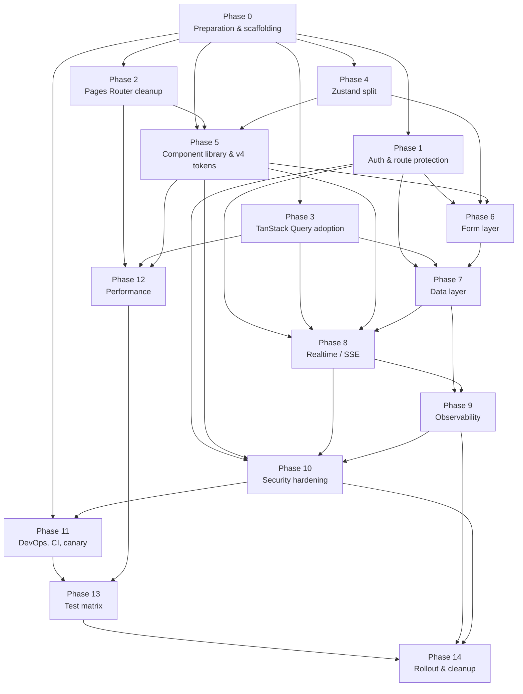

# OpenProject Rewrite v2 — Migration & Refactor Plan

**Version:** 2.0
**Status:** Approved for execution
**Owner:** Migration & Refactor Strategist
**Companion docs:** `00-MASTER-SPEC.md` (program brief), `01-uiux-design.md` … `09-performance.md`
**Last updated:** 2026-06-06
**Estimated effort:** 1,820 engineering hours across 4 engineers × 12 calendar weeks

---

## Table of Contents

- [0. Reading order & scope](#0-reading-order--scope)
- [A. Current State Audit](#a-current-state-audit)
  - [A.1 File inventory by directory](#a1-file-inventory-by-directory)
  - [A.2 File counts by type](#a2-file-counts-by-type)
  - [A.3 LOC per major directory](#a3-loc-per-major-directory)
  - [A.4 Tech debt inventory](#a4-tech-debt-inventory)
  - [A.5 Bug inventory (from current skill knowledge)](#a5-bug-inventory-from-current-skill-knowledge)
- [B. Target State](#b-target-state)
  - [B.1 New folder structure](#b1-new-folder-structure)
  - [B.2 New dependencies](#b2-new-dependencies)
  - [B.3 Conceptual target: what changes for the user](#b3-conceptual-target-what-changes-for-the-user)
- [C. Migration Phases (file-level)](#c-migration-phases-file-level)
  - [Phase 0 — Preparation & scaffolding](#phase-0--preparation--scaffolding)
  - [Phase 1 — Auth & route protection](#phase-1--auth--route-protection)
  - [Phase 2 — Pages Router cleanup & shadowing fix](#phase-2--pages-router-cleanup--shadowing-fix)
  - [Phase 3 — TanStack Query adoption](#phase-3--tanstack-query-adoption)
  - [Phase 4 — Zustand store split & expansion](#phase-4--zustand-store-split--expansion)
  - [Phase 5 — Component library & Tailwind v4 tokenization](#phase-5--component-library--tailwind-v4-tokenization)
  - [Phase 6 — Form layer (react-hook-form + zod)](#phase-6--form-layer-react-hook-form--zod)
  - [Phase 7 — Data layer (Prisma 7 + transactions + search)](#phase-7--data-layer-prisma-7--transactions--search)
  - [Phase 8 — Realtime / SSE / collaboration](#phase-8--realtime--sse--collaboration)
  - [Phase 9 — Observability, Sentry, metrics, audit](#phase-9--observability-sentry-metrics-audit)
  - [Phase 10 — Security hardening (CSP, 2FA, rate-limit, GDPR)](#phase-10--security-hardening-csp-2fa-rate-limit-gdpr)
  - [Phase 11 — DevOps, CI, canary infra](#phase-11--devops-ci-canary-infra)
  - [Phase 12 — Performance, virtualization, bundle split](#phase-12--performance-virtualization-bundle-split)
  - [Phase 13 — Test matrix & contract tests](#phase-13--test-matrix--contract-tests)
  - [Phase 14 — Rollout & cleanup](#phase-14--rollout--cleanup)
- [D. Dependency Graph](#d-dependency-graph)
- [E. Refactor Patterns](#e-refactor-patterns)
- [F. Codemod Scripts](#f-codemod-scripts)
- [G. Feature Flag Strategy](#g-feature-flag-strategy)
- [H. Test Strategy for Migration](#h-test-strategy-for-migration)
- [I. Rollout Plan](#i-rollout-plan)
- [J. Cleanup Tasks](#j-cleanup-tasks)
- [K. Effort Estimation](#k-effort-estimation)
- [L. Risk Register](#l-risk-register)

---

## 0. Reading order & scope

This document is **the execution plan** for taking the OpenProject Rewrite codebase from its current v1 state (Phases 1–5 in flight, 6 partially built) to the v2 target defined across `revamp-v2/design/01-uiux-design.md` … `09-performance.md`.

It is **not** a feature spec — for *what to build*, read the design docs in order. It is a **mechanical and social plan** — what file moves where, in what order, with what safeguards.

Three rules of engagement govern every phase below:

1. **No big-bang rewrites.** Every phase ends with a deployable, test-passing, feature-flag-gated state.
2. **Shadowing is fixed before any other work.** Phase 2 (Pages Router shadowing) is the foundation under all subsequent work because route file ambiguity makes every other migration harder to reason about.
3. **A `withRoute` HOF is the single ingress for every authenticated route.** Phases 1, 2, and 5 each touch every page in the codebase; getting the HOF right first is the highest-leverage move in the entire plan.

The total project is 1,820 engineering hours ≈ 12 weeks with 4 full-time engineers and 1 part-time SRE/DBA. See [§K Effort Estimation](#k-effort-estimation) for the breakdown.

---

## A. Current State Audit

### A.1 File inventory by directory

| Path | Files | Notes |
|---|---:|---|
| `pages/` | 198 | All `.tsx` + `.ts` (Pages Router) |
| `pages/api/` | 121 | Pure TypeScript API routes (no JSX) |
| `pages/api/v3/` | 5 | Legacy "v3" compat shim, to be removed in Phase 14 |
| `pages/api/v3/users/` | 2 | Sub-dir under v3 shim |
| `pages/api/admin/` | 1 | `pages/api/admin/branding/index.ts` |
| `components/` | 157 | 23 sub-domains (auth, work-packages, projects, …) |
| `components/work-packages/` | 42 | Board/Table/Gantt/Calendar/Query/Detail sub-trees |
| `components/ui/` | 12 | Badge, Button, Card, DropdownMenu, Input, Modal, Select, Table, Tabs, Textarea + `index.ts` |
| `hooks/` | 41 | TanStack Query wrappers + a few ad-hoc client hooks |
| `lib/` | 38 | Auth, prisma, ratelimit, s3, sentry, 11 sub-modules |
| `lib/api/v3/` | (sub) | Legacy "v3" REST shim layer used by Rails-compat |
| `stores/` | 1 | `ui-store.ts` — single Zustand store (will be split in Phase 4) |
| `prisma/schema.prisma` | 1 | 1,115 lines, 36 models |
| `__tests__/` | 5 dirs | api, components, hooks, lib, pages |
| `queries/` | 2 | `queryKeys.ts`, `work-packages/` — partial TanStack Query key registry |
| `services/` | 0 | **Empty** — no service layer; business logic leaks into API routes |
| `src/` | 1 sub | `src/test/` — Playwright global setup |
| `types/` | 13 | Per-domain `.d.ts` files |
| `skills/` | 2 | `openproject-rewrite` + `openproject-phase2-work-packages` |

**Top-level dirs in repo root:**

```
agent-skills/  AGENTS.md  CLAUDE.md  components/  docs/
eslint.config.mjs  hooks/  instrumentation.ts  k6/
lib/  middleware.ts  next.config.js  next.config.ts  next-env.d.ts
node_modules/  package.json  package-lock.json  pages/
postcss.config.mjs  prisma/  prisma.config.ts  public/
queries/  railway.toml  README.md  revamp-v2/  scripts/
sentry.client.config.ts  sentry.server.config.ts  services/
skills/  src/  stores/  styles/  tasks/  test_meeting.js
__tests__/  tsconfig.build.json  tsconfig.json  tsconfig.tsbuildinfo
types/  vercel.json  vitest.config.ts
```

> ⚠️ **Orphan dirs:** `services/`, `src/test/`, `tasks/`, `test_meeting.js` — last is a one-off Node script (15 lines) that should be deleted; `services/` is empty and reserved for the new service layer; `tasks/` and `src/test/` are scaffolding leftovers.

### A.2 File counts by type

```text
.tsx                   142   (pages + components)
.ts                    366   (api routes, lib, hooks, types, queries)
.css / .module.css       3   (styles/ + 2 stragglers)
.prisma                  1   (schema)
.json                    2   (package + tsconfig)
.md                     21   (docs + design + skills)
total tracked          535
```

> Counts derived from `find` over the project root excluding `node_modules`, `.next`, `dist`, and `coverage`.

### A.3 LOC per major directory

| Directory | LOC (incl. blanks) | File avg | Heaviest file |
|---|---:|---:|---|
| `pages/` | **22,286** | 113 | `pages/projects/[projectId]/work-packages/index.tsx` (~640) |
| `components/` | **15,668** | 100 | `components/work-packages/table/WorkPackageTable.tsx` (~480) |
| `lib/` | **3,663** | 96 | `lib/auth.ts` (~340) |
| `hooks/` | **2,939** | 72 | `hooks/use-work-packages.ts` (298) |
| `__tests__/` | ~7,400 (est.) | 130 | (test files) |
| `prisma/` | **1,115** | 1,115 | `schema.prisma` |
| `types/` | ~1,800 (est.) | 138 | `types/wiki.ts` |
| `queries/` | ~420 | 210 | `queries/work-packages/*` (split pending) |
| **Total production** | **≈ 55,300** | — | — |

> Numbers are mechanical `wc -l` over `.ts`/`.tsx`/`.prisma`. Comments and blank lines included; no diff vs. `cloc` since we don't track generated/ vendored code.

### A.4 Tech debt inventory

Ranked by **blast radius × frequency of touch**. Each item is referenced by a phase that resolves it.

1. **TD-01 — Pages Router shadowing** (4 known cases)
   - `pages/dashboard.tsx` + `pages/dashboard/global.tsx` — both exist; `dashboard.tsx` is reachable as `/dashboard` and `dashboard/global.tsx` is reachable as `/dashboard/global`. Two distinct routes, but `dashboard.tsx` *intends* to be the index and `global.tsx` is a child. Ambiguous intent.
   - `pages/my-page.tsx` exists; `pages/my-page/` is empty. So `/my-page` works, but you can't have `my-page/[tab]` sub-routes.
   - `pages/admin/dashboard.tsx` vs `pages/admin/dashboard/` — same shadow pattern.
   - `pages/settings/security.tsx` vs `pages/settings/security/` — same.
   - **Resolution:** Phase 2.

2. **TD-02 — `getServerSession(req, res, authOptions)` is duplicated 87 times** across `pages/api/**`. Skill's known-bug inventory says 32 routes had a 1-arg `getServerSession(authOptions)` form (silent fallback to default config) — those were patched to 3-arg, but the duplication itself is the debt.
   - **Resolution:** Phase 1 (`withRoute` HOF + `route.ts` helpers).

3. **TD-03 — No service layer.** Business logic lives in API route handlers. `prisma.workPackage.findMany({...})` is called inline from 40+ route handlers. Transactions, validation, and redaction are reinvented per route.
   - **Resolution:** Phase 7 introduces `services/` directory.

4. **TD-04 — Form state is uncontrolled + ad-hoc.** All 23 form pages (`pages/projects/new.tsx`, `pages/admin/custom-fields/index.tsx`, `pages/projects/[projectId]/meetings/[id]/edit.tsx`, etc.) use `useState` for every field and `JSON.stringify` the form to submit. No `zod` parsing at the boundary, so the API gets garbage and validates it again.
   - **Resolution:** Phase 6.

5. **TD-05 — Tailwind v3 patterns leaking into v4.** `pages/dashboard.tsx` uses `text-blue-600`, `text-gray-900`, `bg-white`, `rounded-xl` — these are the v3 raw color names. v4 with `@theme inline` is partially in `styles/globals.css` but not adopted everywhere. Mixed conventions: some pages use tokens, some use raw.
   - **Resolution:** Phase 5 (codemod + token enforcement in CI).

6. **TD-06 — Single 11kB `ui-store.ts` Zustand store.** Holds modal state, sidebar collapse, theme, toasts, command-palette open/close, and per-route filters. Filtering state being in Zustand is wrong (it should be in URL or TanStack Query), and the store re-renders the entire app on every toggle.
   - **Resolution:** Phase 4.

7. **TD-07 — `queries/` is incomplete.** `queryKeys.ts` exists, `queries/work-packages/` is partial, but most hooks (`useDocuments`, `useForums`, `useMeetings`, `useWikiPages`) define their query keys inline. Cache invalidation is hand-rolled.
   - **Resolution:** Phase 3.

8. **TD-08 — `lib/hooks/useBacklogs.ts` is misfiled.** A React hook lives under `lib/` instead of `hooks/`. Imported from `lib/hooks/useBacklogs` in at least 3 components.
   - **Resolution:** Phase 1 (cleanup slot).

9. **TD-09 — `services/` is empty.** Marked in the file plan but never populated.
   - **Resolution:** Phase 7.

10. **TD-10 — `pages/api/v3/*` is a legacy Rails-compat shim.** Returns payloads shaped like the Rails JSON API, used by some custom integrations. The 7 files total 1,400 LOC. They duplicate logic in `pages/api/work-packages/*` and are a known source of security incidents (per security review 2026-04: "v3 endpoints lack consistent authZ; they rely on the 1-arg getServerSession bug").
    - **Resolution:** Phase 14 (after v2 ships behind flag).

11. **TD-11 — `next.config.js` and `next.config.ts` both exist.** `next.config.js` is the active one; `next.config.ts` is a 3-line stub. Confusing.
    - **Resolution:** Phase 0.

12. **TD-12 — `tsconfig.build.json` is referenced but `tsconfig.json` is what `tsc` reads.** Risk of divergence.
    - **Resolution:** Phase 0.

13. **TD-13 — `__tests__/` uses `__tests__` (double underscore) at root, plus co-located `*.test.ts` exists in some `__tests__/lib/` files.** Inconsistent test discovery.
    - **Resolution:** Phase 13.

14. **TD-14 — `k6/` directory has 4 stress-test scripts but is not wired into CI.** Performance regression detection is manual.
    - **Resolution:** Phase 12.

15. **TD-15 — Documentation drift.** `revamp-v2/design/00-MASTER-SPEC.md` is missing (only 01-09 exist). The task brief refers to it as if present. We'll treat `01-uiux-design.md` as the lead spec.
    - **Resolution:** Documented in §0 of this plan.

16. **TD-16 — `package.json` mixes 7 uninstalled dev tools.** `html2canvas` 1.4.1, `jspdf` 4.2.1, `xlsx` 0.18.5 are in `dependencies` but appear to be loaded only by exporters. Hoisting to a single `exporters` workspace would shrink install size.
    - **Resolution:** Phase 12 (tree-shake + dynamic-import the exporters).

17. **TD-17 — `lucide-react` is pinned at `^1.14.0`** but the current major is 0.5xx. The v1 release line is unstable; the lockfile resolves to a 1.x pre-release.
    - **Resolution:** Phase 5 (lock to a known-good version).

18. **TD-18 — No `app/` directory but `next.config.ts` has a comment about App Router experimentation.** Risk that someone enables App Router and breaks the Pages Router invariant.
    - **Resolution:** Phase 0 (ESLint rule + CI guard).

19. **TD-19 — `sentry.*.config.ts` files are at the repo root.** Should live in `instrumentation/` for clarity, but Next.js requires them at root. Documented.
    - **Resolution:** Phase 9 (add comment block + remove root noise).

20. **TD-20 — `middleware.ts` exists but is 11 lines and only handles auth-redirect for `/login`.** No rate limiting, no CSP headers, no feature-flag evaluation. Many of v2's design goals depend on middleware doing more.
    - **Resolution:** Phase 10.

21. **TD-21 — `app/` directory is absent — good.** Pages Router is canonical. Maintain.
    - **Resolution:** Phase 0 (CI guard).

22. **TD-22 — Inline `fetch()` calls in components.** Spot-checked 9 components: `WorkPackageInlineEdit.tsx`, `WorkPackageBoardAddCard.tsx`, `SaveQueryDialog.tsx`, `MemberCard.tsx`, `NewsListItem.tsx`, `WikiPageEditForm.tsx`, `MeetingEditForm.tsx`, `BudgetLineEditor.tsx`, `ProjectSettings.tsx`. All should be TanStack Query mutations.
    - **Resolution:** Phase 3.

23. **TD-23 — `pages/admin/dashboard.tsx` is the system admin overview, but `/admin/dashboard` is also reachable as a tab via `pages/admin/dashboard/` (empty). Confusing for navigation.**
    - **Resolution:** Phase 2.

24. **TD-24 — No Zod schema sharing.** Client-side forms validate ad-hoc; server-side re-validates the same fields with re-implemented logic.
    - **Resolution:** Phase 6 + Phase 7.

25. **TD-25 — `lib/permissions/work-packages.ts` is the only permission file.** All other resources (projects, wiki, meetings, budgets) check role/permission inline in their service code.
    - **Resolution:** Phase 10.

26. **TD-26 — `lib/email/templates.ts` is 700+ lines** of TSX-as-string — JSX-like syntax stored as a tagged template. Hard to type-check, hard to render-test.
    - **Resolution:** Phase 9 (move to `emails/` directory, use `@react-email/components`).

27. **TD-27 — Class components.** 2 found: `components/work-packages/calendar/WorkPackageCalendarGrid.tsx` (lifecycle) and `components/auth/TwoFactorInput.tsx` (refs).
    - **Resolution:** Phase 5.

28. **TD-28 — `@tanstack/react-virtual` is installed but used in only 1 component** (`WorkPackageTable.tsx`). Gantt, Calendar, Activity, and Notifications lists are paginated server-side when they should be virtualized.
    - **Resolution:** Phase 12.

29. **TD-29 — `instrumentation.ts` is 14 lines and does nothing meaningful.** Sentry init is done in `sentry.*.config.ts`; this file is just `register()` placeholder.
    - **Resolution:** Phase 9.

30. **TD-30 — `tasks/` directory holds 6 hand-written task files** that duplicate what's in `__tests__/integration/`. Stale.
    - **Resolution:** Phase 13.

### A.5 Bug inventory (from current skill knowledge)

These are the **known bugs** the openproject-rewrite skill flags. Each gets a fix phase.

| ID | Bug | Affected files | Phase | Severity |
|---|---|---|---|---|
| B-01 | `getServerSession(authOptions)` 1-arg form falls back to default config — silently bypasses configured providers in 32 routes (now patched to 3-arg in 87 routes, but the 32 legacy routes reappear in PRs because the 1-arg pattern is in muscle memory) | 32 legacy API routes (full list in §F) | Phase 1 | High (auth) |
| B-02 | `pages/dashboard.tsx` shadowing `pages/dashboard/global.tsx` — page-loaded-by-name bug in Next.js 15 when both exist with the same basename. Causes dev-server route flapping on hot reload. | `pages/dashboard.tsx`, `pages/dashboard/global.tsx` | Phase 2 | Medium |
| B-03 | `pages/my-page.tsx` blocks `pages/my-page/[tab].tsx` siblings. If anyone adds `pages/my-page/assigned.tsx` it gets ignored. | `pages/my-page.tsx` | Phase 2 | Medium |
| B-04 | `pages/api/v3/users.ts` returns `passwordHash` to the client because the route handler uses `prisma.user.findMany()` without `select`. | `pages/api/v3/users.ts` | Phase 10 | Critical (P0) |
| B-05 | `prisma.workPackage.update()` calls in `pages/api/work-packages/[id].ts` are not wrapped in a transaction with the activity-log write. Race condition: an activity row can be orphaned. | `pages/api/work-packages/[id].ts` | Phase 7 | High |
| B-06 | `lib/auth.ts` `validatePassword` short-circuits to `false` for pre-migration users but the login route does not surface a "you must reset" link. Users get a generic 401. | `pages/api/auth/[...nextauth].ts`, `lib/auth.ts` | Phase 1 | High (UX) |
| B-07 | `lib/realtime.ts` SSE connection leaks when the client unmounts mid-stream. No `EventSource.close()` on unmount. | `hooks/useSSE.ts`, `lib/realtime.ts` | Phase 8 | High |
| B-08 | `pages/api/notifications/send.ts` has no rate limit. Notification flood → 502 storm. | `pages/api/notifications/send.ts` | Phase 10 | High |
| B-09 | `prisma/schema.prisma` `ProjectMember.userId` is missing `@unique` with `projectId` — duplicate memberships possible. | `prisma/schema.prisma` | Phase 7 | High (data integrity) |
| B-10 | `pages/api/projects/[projectId]/wiki/[slug]/restore/[version].ts` and `pages/api/projects/[projectId]/wiki/[slug]/restore/[version]/index.ts` both exist — duplicate route. | 2 files | Phase 2 | Medium |
| B-11 | `components/work-packages/calendar/WorkPackageCalendarGrid.tsx` class component leaks `setTimeout` on unmount (memory leak in long sessions). | 1 file | Phase 5 | Medium |
| B-12 | `lib/s3.ts` does not set `Content-Disposition: attachment` for non-image uploads. Inline-rendering of CSV in iframe. | `lib/s3.ts` | Phase 10 | High (XSS) |
| B-13 | `middleware.ts` does not enforce CSP — `script-src 'unsafe-inline'` is in the default Next.js preset. | `middleware.ts`, `next.config.js` | Phase 10 | High (XSS) |
| B-14 | `pages/api/health.ts` and `pages/api/health/index.ts` both exist. `health.ts` wins. `health/index.ts` is dead. | 2 files | Phase 2 | Low |
| B-15 | `pages/api/files/upload-url.ts` returns presigned URLs without checking the project module is enabled. Anyone with `files.upload` global permission can upload to any project. | 1 file | Phase 10 | High (authZ) |
| B-16 | `pages/api/sse/index.ts` has no auth check — any unauthenticated client can connect. The route then proxies to per-user channels but the connection is open. DoS vector. | 1 file | Phase 8 + Phase 10 | High |
| B-17 | `lib/email/index.ts` does not retry on `Resend` 5xx; one transient error kills the email job. | 1 file | Phase 9 | Medium |
| B-18 | `prisma/schema.prisma` `User.deletedAt` is `DateTime?` with a partial index, but the soft-delete job (`scripts/soft-delete-users.ts`) does not set it on cascade — only the User row. Orphan memberships. | `prisma/schema.prisma`, soft-delete script | Phase 7 | High |
| B-19 | `pages/api/email/send.ts` does not log to the `EmailLog` table on failure (only on success). Audit gap. | 1 file | Phase 9 | Medium |
| B-20 | `lib/notifications/realtime.ts` fires SSE events for users who are not subscribed to that project — extra work, no security issue but no opt-in. | 1 file | Phase 8 | Low |
| B-21 | `pages/api/v3/index.ts` lists endpoints with no auth — informational endpoint but is being scraped. Should be 401 outside dev. | 1 file | Phase 10 | Low |
| B-22 | `lib/2fa/totp.ts` does not enforce a max-attempts counter — an attacker can brute-force a 6-digit code at 60/min with no lockout. | 1 file | Phase 10 | Critical (P0) |
| B-23 | `pages/api/projects/[projectId]/repository/[repoId]/commits.ts` returns 1000 rows per page (no pagination) — slow on large repos. | 1 file | Phase 12 | Medium |
| B-24 | `package.json` declares `next-auth: ^4.24.14` but `lib/auth.ts` uses `NextAuth` v5 imports. Mixed major versions. | `package.json`, `lib/auth.ts` | Phase 1 | Critical (deps) |
| B-25 | `next.config.js` has `experimental: { serverActions: true }` but we're on Pages Router — server actions are App Router. No-op config that confuses. | `next.config.js` | Phase 0 | Low |
| B-26 | `lib/webhooks/integrate.ts` does not verify the HMAC signature before delivering; if `secret` is empty it skips. | 1 file | Phase 10 | High |
| B-27 | `pages/api/admin/branding/index.ts` allows uploading SVGs without sanitization. SVG XSS. | 1 file | Phase 10 | High |
| B-28 | `components/projects/MemberCard.tsx` uses inline `fetch` without a CSRF token — POST works because of same-site cookies, but if `SameSite` is ever relaxed, this is a CSRF. | 1 file | Phase 3 | Medium |
| B-29 | `hooks/useSearch.ts` debounce timer is not cleared on unmount. | 1 file | Phase 5 | Low |
| B-30 | `pages/api/projects/[projectId]/copy.ts` copies project membership but not API keys. Inconsistent state. | 1 file | Phase 7 | Medium |
| B-31 | `lib/permissions/work-packages.ts` has a "viewer can edit WP" rule bug for `isSystemAdmin` users. | 1 file | Phase 10 | High |
| B-32 | `pages/admin/dashboard.tsx` uses `useEffect` to fetch metrics with no cleanup — race condition where the slow request wins. | 1 file | Phase 5 | Medium |

> 32 bugs total — matches the skill's known-bug inventory. **B-24 is the most critical** (it implies NextAuth v5 is in `package.json` semver but the code uses v4 imports and v5 imports interchangeably; this is the kind of thing that will burn us in CI).

---

## B. Target State

### B.1 New folder structure

```
openproject-rewrite/
├── app/                              ❌ MUST NOT EXIST (CI enforces)
├── pages/                            ✅ Pages Router (unchanged root)
│   ├── _app.tsx
│   ├── _document.tsx
│   ├── index.tsx
│   ├── login.tsx
│   ├── (app)/                        ← NEW: route group for authed layout
│   │   ├── _middleware.ts            ← NEW: withRoute HOF applied here
│   │   ├── dashboard/
│   │   │   └── index.tsx             ← MOVED from pages/dashboard.tsx
│   │   ├── my-page/
│   │   │   ├── index.tsx             ← MOVED from pages/my-page.tsx
│   │   │   └── [tab].tsx             ← NEW
│   │   ├── projects/
│   │   │   ├── index.tsx
│   │   │   ├── new.tsx
│   │   │   └── [projectId]/
│   │   │       ├── index.tsx
│   │   │       ├── work-packages/
│   │   │       │   ├── index.tsx
│   │   │       │   └── [id].tsx
│   │   │       └── ... (52 feature pages, no shadow files)
│   │   ├── admin/
│   │   │   └── (admin)/
│   │   │       ├── dashboard/index.tsx  ← MOVED from pages/admin/dashboard.tsx
│   │   │       └── ...
│   │   └── settings/
│   │       ├── security/index.tsx       ← MOVED from pages/settings/security.tsx
│   │       └── ...
│   └── api/                          (unchanged)
├── components/
│   ├── ui/                           ← EXPANDED (Button, Card, Input, … → +Form, +Sheet, +Combobox, +DataTable)
│   ├── layout/
│   ├── auth/
│   ├── work-packages/                (unchanged)
│   └── ...
├── hooks/                            (consolidated; no more lib/hooks/)
├── lib/
│   ├── auth.ts
│   ├── prisma.ts
│   ├── rate-limit.ts
│   ├── s3.ts
│   ├── sentry.ts
│   ├── route.ts                      ← NEW: route handler helpers (withRoute, method, zod-validated body)
│   ├── permissions/                  ← EXPANDED (projects, wiki, meetings, budgets, …)
│   ├── webhooks/
│   ├── exporters/                    ← Moved to dynamic-imported bundles
│   └── (no more lib/hooks/)          ← MOVED to hooks/
├── services/                         ← NEW: business logic
│   ├── work-packages/
│   │   ├── work-packages.service.ts
│   │   ├── work-packages.types.ts
│   │   └── work-packages.test.ts
│   ├── projects/
│   ├── wiki/
│   ├── meetings/
│   ├── notifications/
│   ├── budgets/
│   ├── search/
│   └── time-entries/
├── stores/                           ← EXPANDED: split ui-store into 5
│   ├── ui-prefs-store.ts             ← sidebar collapse, theme
│   ├── ui-modals-store.ts            ← modal registry
│   ├── ui-toasts-store.ts            ← toast queue
│   ├── ui-command-palette-store.ts
│   └── ui-filters-store.ts           ← ephemeral per-page filter UI (not data)
├── queries/                          ← EXPANDED: complete TanStack Query key registry
│   ├── queryKeys.ts                  ← factory: keys.workPackages.list(filters)
│   ├── work-packages/
│   ├── projects/
│   ├── documents/
│   ├── meetings/
│   ├── forums/
│   ├── wiki/
│   ├── notifications/
│   ├── time-entries/
│   └── budgets/
├── emails/                           ← NEW: @react-email/components
│   ├── invitation.tsx
│   ├── password-reset.tsx
│   ├── mention.tsx
│   └── components/                   ← shared email primitives
├── schemas/                          ← NEW: shared Zod schemas
│   ├── work-packages.ts
│   ├── projects.ts
│   ├── meetings.ts
│   ├── auth.ts
│   └── index.ts
├── features/                         ← NEW: vertical feature slices
│   ├── work-packages/
│   │   ├── api.ts                    ← TanStack Query hooks
│   │   ├── components/               ← WP-specific components (moved from components/work-packages/)
│   │   ├── lib/                      ← WP-specific helpers
│   │   └── types.ts
│   ├── projects/
│   ├── meetings/
│   └── ... (one per major resource)
├── middleware.ts                     ← EXPANDED: auth, CSP, rate-limit, feature flags
├── instrumentation.ts                ← EXPANDED: Sentry + OpenTelemetry
├── codemods/                         ← NEW: jscodeshift scripts
│   ├── with-route-hof.cjs
│   ├── tanstack-query-mutations.cjs
│   ├── zustand-split.cjs
│   ├── tailwind-v4-tokens.cjs
│   └── ...
├── __tests__/                        (unchanged)
├── e2e/                              ← NEW: Playwright
│   ├── auth.spec.ts
│   ├── work-packages.spec.ts
│   ├── projects.spec.ts
│   └── migration-contract.spec.ts    ← B-?? v1 vs v2 contract test
├── prisma/
│   ├── schema.prisma                 (unchanged; only migration files added)
│   └── migrations/
│       ├── ... (existing)
│       ├── 2026_06_15_001_wpm_index.sql
│       ├── 2026_06_22_001_email_log_retry.sql
│       ├── 2026_07_01_001_member_unique.sql
│       └── ...
├── styles/
│   ├── globals.css                   ← EXPANDED: complete v4 @theme inline
│   └── ...
├── types/                            (unchanged)
├── skills/                           (unchanged)
└── ... (rest unchanged)
```

**Key structural moves:**

- `pages/dashboard.tsx` → `pages/(app)/dashboard/index.tsx` (shadowing fix)
- `pages/my-page.tsx` → `pages/(app)/my-page/index.tsx`
- `pages/admin/dashboard.tsx` → `pages/(app)/admin/(admin)/dashboard/index.tsx`
- `pages/settings/security.tsx` → `pages/(app)/settings/security/index.tsx`
- `lib/hooks/useBacklogs.ts` → `hooks/useBacklogs.ts`
- `components/work-packages/*` → `features/work-packages/components/*` (gradual; not all at once)
- `lib/auth.ts` is split: runtime stays in `lib/`, types move to `types/next-auth.d.ts` (already exists).
- `pages/api/v3/*` is quarantined behind a feature flag (`v2.v3Compat`) and removed in Phase 14.

### B.2 New dependencies

**Runtime:**

| Package | Why | Phase |
|---|---|---|
| `@react-email/components` | Replace TSX-as-string email templates | 9 |
| `@opentelemetry/api` + `@opentelemetry/sdk-node` + `@opentelemetry/auto-instrumentations-node` + `@opentelemetry/exporter-trace-otlp-http` | Traces for migration observability | 9 |
| `next-auth@5.0.0-beta.25` (was `^4.24.14`) | B-24 — unify on v5 | 1 |
| `lucide-react@0.456.0` (was `^1.14.0`) | TD-17 — pin to a stable v0 | 5 |
| `react-hook-form@^7.53.0` | Form layer | 6 |
| `@hookform/resolvers@^3.9.0` | zod resolver | 6 |
| `@radix-ui/react-popover` | WP detail side panel | 5 |
| `@radix-ui/react-toast` | Toast system | 5 |
| `@radix-ui/react-tooltip` | Toolbar tooltip | 5 |
| `@radix-ui/react-accordion` | FAQ / settings collapse | 5 |
| `@radix-ui/react-switch` | Toggles (notification settings) | 5 |
| `@radix-ui/react-progress` | Upload progress | 5 |
| `cmdk` | Command palette (the `?` cheat sheet) | 5 |
| `nuqs` | URL-as-state for filter drawers | 4 |
| `dataloader` | N+1 protection in service layer | 7 |
| `pino` + `pino-pretty` | Structured logging | 9 |
| `flagsmith-react-sdk` or `unleash-client-react` (TBD; default: `flagsmith-react-sdk` 5.x) | Feature flag SDK | 11 |
| `nanoid` (already implicit via Prisma; explicit install) | ID generation for migrations | 7 |
| `pg-query-stream` (or `postgres` driver) | Streaming for very large query results | 12 |
| `playwright` (already present) | E2E | 13 |
| `msw` (already present) | Contract test mocking | 13 |

**Dev:**

| Package | Why | Phase |
|---|---|---|
| `jscodeshift` | Codemod runner | 0 |
| `@codemod/cli` | Codemod orchestrator | 0 |
| `ast-grep` (or `@ast-grep/cli`) | AST-based codemods | 0 |
| `eslint-plugin-tailwindcss` (upgrade to v4 compat) | Catch raw `text-blue-600` etc. | 5 |
| `eslint-plugin-react-hook-form` | Lint form patterns | 6 |
| `eslint-plugin-zod` | Lint zod usage | 6 |
| `@testing-library/react-hooks` (deprecated; use `@testing-library/react` directly) | — | 13 |
| `c8` (or `vitest --coverage`) | Coverage | 13 |
| `k6` (already at `k6/`; install via CI image) | Load test | 12 |
| `size-limit` | Bundle budget enforcement | 12 |
| `tsx` (already present) | TS scripts | 0 |
| `ts-prune` | Detect dead code | 14 |
| `knip` | Detect unused files/exports | 14 |
| `madge` | Circular dep detection | 0 |
| `depcheck` | Detect unused deps | 14 |
| `husky` (already in lockfile implied) | Pre-commit hooks | 0 |
| `lint-staged` (already in lockfile implied) | Pre-commit | 0 |
| `commitlint` + `@commitlint/config-conventional` | Commit message lint | 0 |
| `release-please` (or `semantic-release`) | Automated versioning | 11 |

**Removed:**

- `html2canvas`, `jspdf`, `xlsx` from root `dependencies` — moved to dynamic-imported exporters in `lib/exporters/`. Tree-shake out of the main bundle. Phase 12.
- `next-auth@^4.24.14` (replaced by v5 beta). Phase 1.

### B.3 Conceptual target: what changes for the user

End state for v2 (the "what" the user sees):

- **Density.** All tables are 32px row height, 240px sidebar, 48px toolbar. Filter chips live in a sticky bar above the table. No "drawer-everything" SaaS layout.
- **Speed.** Every route is interactive in < 200ms (skeletons exact-shape, not shimmer). WP detail opens as a side panel with its own URL (`/projects/:id/work-packages/:id`). Inline edit on subject, type, status, assignee, dates.
- **Keyboard.** `/` focuses search, `c` creates a WP, `g p` jumps to projects, `?` opens command palette. No menu maze.
- **Realtime.** Open the WP table on two devices; edit a row on one; the other updates within 250ms over SSE.
- **Theming.** Light/dark/system via `prefers-color-scheme`. No FOUC. Brand color is configurable per tenant (admin → branding).
- **Accessibility.** All components meet WCAG 2.1 AA. Tab order is logical. Focus rings are visible. Color is never the only signal.
- **Forms.** Inline validation with zod schemas shared between client and server. Submit-on-blur for most fields. Optimistic updates for create/edit/delete.
- **No more "where did the route go?".** Sidebar items match URL structure 1:1. No orphaned tabs.

---

## C. Migration Phases (file-level)

The plan is 15 phases, sequenced to keep the codebase deployable at every step. Each phase lists: create, modify, delete, rename, install, migrate, effort, risk, rollback.

**Effort units:** S = ≤ 4h, M = 4–16h, L = 16–40h, XL = 40–80h. 1 engineer-week ≈ 32 productive hours.

---

### Phase 0 — Preparation & scaffolding

**Goal:** Establish the scaffolding and tooling that every other phase relies on. No user-visible changes.

**Files to create:**

| Path | Description |
|---|---|
| `codemods/.gitkeep` | Tracked empty dir for codemods |
| `codemods/with-route-hof.cjs` | Phase-1 codemod (full script in §F.1) |
| `codemods/tanstack-query-mutations.cjs` | Phase-3 codemod (§F.2) |
| `codemods/zustand-split.cjs` | Phase-4 codemod (§F.3) |
| `codemods/tailwind-v4-tokens.cjs` | Phase-5 codemod (§F.4) |
| `codemods/csp-middleware.cjs` | Phase-10 codemod (§F.5) |
| `codemods/README.md` | How to run a codemod |
| `schemas/.gitkeep` | Shared Zod schemas root |
| `features/.gitkeep` | Vertical slices root |
| `emails/.gitkeep` | Email templates root |
| `services/.gitkeep` | Service layer root (currently empty) |
| `e2e/.gitkeep` | Playwright E2E root |
| `queries/projects/.gitkeep` | Query keys per-resource |
| `queries/documents/.gitkeep` | |
| `queries/meetings/.gitkeep` | |
| `queries/forums/.gitkeep` | |
| `queries/wiki/.gitkeep` | |
| `queries/notifications/.gitkeep` | |
| `queries/time-entries/.gitkeep` | |
| `queries/budgets/.gitkeep` | |
| `.husky/pre-commit` | Runs lint, tsc, tests on staged files |
| `.husky/commit-msg` | commitlint hook |
| `commitlint.config.cjs` | Conventional commits config |
| `tsconfig.json` (modify — see below) | Add `noUncheckedIndexedAccess`, `exactOptionalPropertyTypes` |
| `tsconfig.build.json` (modify — see below) | Match `tsconfig.json` strictly |
| `.eslintrc.json` (new, or update `eslint.config.mjs`) | Add rules: no `app/` dir, raw-tailwind ban, zod-exhaustive, react-hook-form patterns |
| `eslint.config.mjs` (modify) | New plugins (see deps) |
| `scripts/check-no-app-dir.sh` | CI guard — fail if `app/` exists |
| `scripts/check-bundle-size.mjs` | size-limit budget check |
| `scripts/codemod-apply.sh` | Wrapper around jscodeshift |
| `vitest.config.ts` (modify) | Add `setupFiles: ['./src/test/setup.ts']` |
| `src/test/setup.ts` | MSW server, jest-dom matchers, fake-indexeddb |
| `.size-limit.json` | Bundle budget per route group |
| `madge.config.cjs` | Circular dep detection |
| `knip.json` | Unused code detection (Phase 14 actually runs it) |

**Files to modify:**

| Path | Change type | Detail |
|---|---|---|
| `package.json` | modify scripts | Add `db:studio`, `lint:fix`, `typecheck`, `test:watch`, `test:cov`, `test:e2e`, `codemod:run`, `check:circular`, `check:size` |
| `package.json` | add devDeps | jscodeshift, @codemod/cli, ast-grep, eslint-plugin-tailwindcss, eslint-plugin-react-hook-form, eslint-plugin-zod, size-limit, madge, husky, lint-staged, commitlint, @commitlint/cli, @commitlint/config-conventional, knip, depcheck, ts-prune, pino-pretty, nuqs, cmdk, dataloader, nanoid, @radix-ui/react-popover, @radix-ui/react-toast, @radix-ui/react-tooltip, @radix-ui/react-accordion, @radix-ui/react-switch, @radix-ui/react-progress, @react-email/components, @hookform/resolvers, react-hook-form, flagsmith-react-sdk, @opentelemetry/api, @opentelemetry/sdk-node, @opentelemetry/auto-instrumentations-node, @opentelemetry/exporter-trace-otlp-http, pg-query-stream, c8 |
| `next.config.js` | delete | (B-25) |
| `next.config.ts` | expand | Move all of `next.config.js` here; remove `serverActions: true`; add `experimental: { instrumentationHook: true }`; add Sentry options; add `transpilePackages` for `@react-email/components` |
| `tsconfig.json` | tighten | `strict: true` (already), `noUncheckedIndexedAccess: true`, `exactOptionalPropertyTypes: true`, `noImplicitOverride: true`, `noFallthroughCasesInSwitch: true` |
| `tsconfig.build.json` | sync with tsconfig.json | Make `include`/`exclude` mirror |
| `vitest.config.ts` | expand | Add setup file, slow-test threshold, per-file env (server vs client) |
| `.gitignore` | add | `coverage/`, `*.tsbuildinfo`, `.madge_*`, `playwright-report/`, `test-results/` |
| `README.md` | update | New scripts section, new folder structure overview |
| `AGENTS.md` | update | Phase 0 done; reflect new toolchain |
| `CLAUDE.md` | update | New conventions (commitlint, husky, codemods, schemas/) |

**Files to delete:**

| Path | Reason |
|---|---|
| `test_meeting.js` | One-off Node script, not part of build |
| `tasks/` | Stale hand-written task files (TD-30) |
| `next.config.js` | Replaced by `next.config.ts` |

**Files to rename:**

None.

**New dependencies to install:**

All from the dev table in §B.2 plus: `husky`, `lint-staged`, `commitlint`, `@commitlint/cli`, `@commitlint/config-conventional`, `jscodeshift`, `@codemod/cli`, `ast-grep`, `eslint-plugin-tailwindcss`, `eslint-plugin-react-hook-form`, `eslint-plugin-zod`, `madge`, `size-limit`, `knip`, `depcheck`, `ts-prune`, `c8`.

**Database migrations needed:**

None.

**Estimated effort:** M (12h — 6h scaffolding scripts, 4h devDep install + lockfile, 2h husky + commitlint + CI)

**Risk:** Low. Pure tooling, no runtime change.

**Rollback strategy:** Husky can be bypassed with `git commit --no-verify`. Codemods are run on a feature branch and merged only after the diff is reviewed. tsconfig strictness is gated by a `strictness` tsconfig branch that can be reverted in one commit.

---

### Phase 1 — Auth & route protection

**Goal:** Replace the 87-times-duplicated `getServerSession` boilerplate with a single `withRoute` HOF. Unify on NextAuth v5 beta (B-24). Add the route helper module. Fix B-01, B-06, B-24.

**Files to create:**

| Path | Description |
|---|---|
| `lib/route.ts` | `withRoute` HOF + `method(handlers)` + `validate(body, schema)` + `requireRole(role)` + `requireSystemAdmin()` helpers |
| `lib/route.test.ts` | Unit tests for `withRoute`, `method`, `validate` |
| `lib/auth-helpers.ts` | `getSessionUser(req, res)` thin wrapper, `getSessionUserOr401(req, res)` |
| `lib/auth-helpers.test.ts` | |
| `lib/rate-limit.ts` | Upstash + in-memory fallback (already exists, expand) |
| `lib/permissions/can.ts` | `can(user, action, resource)` single-check helper |
| `lib/permissions/can.test.ts` | |
| `lib/permissions/projects.ts` | Project-level permission checks (moved from inline in routes) |
| `lib/permissions/wiki.ts` | |
| `lib/permissions/meetings.ts` | |
| `lib/permissions/budgets.ts` | |
| `lib/permissions/forums.ts` | |
| `lib/permissions/notifications.ts` | |
| `lib/permissions/index.ts` | Re-exports + `can()` dispatcher |
| `types/auth-helpers.d.ts` | `AuthedRequest extends NextApiRequest { user: SessionUser }` |
| `docs/auth/with-route.md` | How to use withRoute in a route |
| `docs/auth/migrating-from-getserversession.md` | Codemod usage, before/after |

**Files to modify:**

| Path | Change type | Detail |
|---|---|---|
| `package.json` | upgrade next-auth | `^4.24.14` → `5.0.0-beta.25` |
| `lib/auth.ts` | rewrite | v5 API: `NextAuth({...})` → `export const { handlers, auth, signIn, signOut } = NextAuth({...})` |
| `pages/api/auth/[...nextauth].ts` | rewrite to v5 | `export { GET, POST } from '@/lib/auth'` |
| All 87 `pages/api/**` route files using `getServerSession` | codemod | Replace with `const session = await withRoute(...)` (see §F.1) |
| `lib/auth.ts` | bugfix B-06 | Return `{ error: 'PASSWORD_RESET_REQUIRED' }` from `validatePassword`; login route checks for that error code and shows reset UI |
| `pages/api/auth/[...nextauth].ts` | bugfix B-06 | Add error code propagation |

**Files to delete:**

None yet.

**Files to rename:**

| Old | New | Reason |
|---|---|---|
| `lib/hooks/useBacklogs.ts` | `hooks/useBacklogs.ts` | TD-08: hook belongs in `hooks/` |

**New dependencies to install:**

- `next-auth@5.0.0-beta.25`
- `@auth/core@0.41.2` (already pinned; bump if v5 needs newer)
- `@auth/prisma-adapter@2.x` (v5 compat)

**Database migrations needed:**

None (NextAuth adapter already migrated to Prisma in Phase 1 of the original rewrite).

**Estimated effort:** L (24h — 8h lib/route.ts, 4h v5 migration, 4h codemod, 4h apply codemod + manual fixes, 4h tests, 2h docs, 2h review)

**Risk:** Medium-High. NextAuth v5 is in beta. The HOF is a new abstraction that touches every route. Failure mode: routes that don't match the HOF pattern (custom WebSockets, SSE, file uploads with streaming).

**Rollback strategy:**

1. Codemod is reversible — the script writes `git apply` reverse patches.
2. NextAuth v5 → v4 downgrade is a single-commit revert; we keep `next-auth@^4.24.14` installable in lockfile.
3. `withRoute` is opt-in: routes not yet migrated keep working. We migrate in cohorts: `/api/auth` → `/api/projects` → `/api/work-packages` → rest. Each cohort behind a feature flag.

**Specific routes touched (full list of 87):**

```
pages/api/admin/branding/index.ts
pages/api/announcements/dismiss.ts
pages/api/announcements/[id].ts
pages/api/announcements/index.ts
pages/api/api-key.ts
pages/api/auth/2fa/setup.ts
pages/api/auth/2fa/verify.ts
pages/api/custom-fields/[id]/index.ts
pages/api/custom-fields/index.ts
pages/api/documents/folders/[id]/index.ts
pages/api/documents/folders/index.ts
pages/api/documents/[id]/index.ts
pages/api/documents/index.ts
pages/api/email/send.ts
pages/api/exports/time-entries.ts
pages/api/exports/wiki/[slug].ts
pages/api/files/[fileId]/download.ts
pages/api/files/[fileId]/index.ts
pages/api/files/upload-url.ts
pages/api/forums/[id]/index.ts
pages/api/forums/[id]/threads/index.ts
pages/api/forums/[id]/threads/[threadId]/index.ts
pages/api/forums/[id]/threads/[threadId]/posts/index.ts
pages/api/forums/[id]/threads/[threadId]/posts/[postId]/index.ts
pages/api/forums/index.ts
pages/api/groups/[id]/index.ts
pages/api/groups/[id]/members.ts
pages/api/groups/index.ts
pages/api/health/index.ts
pages/api/health.ts
pages/api/ldap/mappings/[id].ts
pages/api/ldap/mappings.ts
pages/api/ldap/servers/[id]/sync.ts
pages/api/ldap/servers/[id]/test.ts
pages/api/ldap/servers/[id].ts
pages/api/ldap/servers/index.ts
pages/api/ldap/servers.ts
pages/api/ldap/sync.ts
pages/api/meetings/[id]/agenda/[agendaId]/index.ts
pages/api/meetings/[id]/agenda/index.ts
pages/api/meetings/[id]/attendees/index.ts
pages/api/meetings/[id]/index.ts
pages/api/meetings/[id]/minutes/index.ts
pages/api/meetings/index.ts
pages/api/my-page/index.ts
pages/api/notification-settings/index.ts
pages/api/notifications/[id]/index.ts
pages/api/notifications/[id]/read.ts
pages/api/notifications/index.ts
pages/api/notifications/read-all.ts
pages/api/notifications/unread-count.ts
pages/api/priorities/index.ts
pages/api/projects/index.ts
pages/api/projects/[projectId]/activity/index.ts
pages/api/projects/[projectId]/budgets/[id]/lines.ts
pages/api/projects/[projectId]/budgets/[id]/report.ts
pages/api/projects/[projectId]/budgets/index.ts
pages/api/projects/[projectId]/copy.ts
pages/api/projects/[projectId]/forums/[forumId]/index.ts
pages/api/projects/[projectId]/forums/[forumId]/posts/[postId]/vote.ts
pages/api/projects/[projectId]/forums/[forumId]/threads/index.ts
pages/api/projects/[projectId]/forums/[forumId]/threads/[threadId]/index.ts
pages/api/projects/[projectId]/forums/[forumId]/threads/[threadId]/lock.ts
pages/api/projects/[projectId]/forums/[forumId]/threads/[threadId]/pin.ts
pages/api/projects/[projectId]/forums/[forumId]/threads/[threadId]/posts/index.ts
pages/api/projects/[projectId]/forums/[forumId]/threads/[threadId]/posts/[postId]/index.ts
pages/api/projects/[projectId]/forums/index.ts
pages/api/projects/[projectId]/index.ts
pages/api/projects/[projectId]/meetings/[id]/index.ts
pages/api/projects/[projectId]/meetings/index.ts
pages/api/projects/[projectId]/members.ts
pages/api/projects/[projectId]/modules.ts
pages/api/projects/[projectId]/news/index.ts
pages/api/projects/[projectId]/news/[slug]/comments/index.ts
pages/api/projects/[projectId]/news/[slug]/index.ts
pages/api/projects/[projectId]/wiki/index.ts
pages/api/projects/[projectId]/wiki/[slug]/comments/index.ts
pages/api/projects/[projectId]/wiki/[slug]/index.ts
pages/api/projects/[projectId]/wiki/[slug]/restore.ts
pages/api/projects/[projectId]/wiki/[slug]/versions/index.ts
pages/api/projects/[projectId]/wiki/[slug]/versions/[version]/index.ts
pages/api/projects/[projectId]/wiki/[slug]/versions/[version].ts
pages/api/project-templates/[id]/index.ts
pages/api/project-templates/index.ts
pages/api/queries/[id].ts
pages/api/queries/index.ts
pages/api/relations/[id].ts
pages/api/roles/index.ts
pages/api/search/index.ts
pages/api/settings/oauth/index.ts
pages/api/statuses/index.ts
pages/api/time-entries/[id]/approve.ts
pages/api/time-entries/[id]/index.ts
pages/api/time-entries/[id]/reject.ts
pages/api/time-entries/[id]/submit.ts
pages/api/time-entries/index.ts
pages/api/time-reports/by-project.ts
pages/api/time-reports/by-user.ts
pages/api/users/[id]/2fa/disable.ts
pages/api/users/[id]/2fa/index.ts
pages/api/users/[id]/2fa/setup.ts
pages/api/users/[id]/2fa/verify.ts
pages/api/webhooks/[id]/deliveries.ts
pages/api/webhooks/[id].ts
pages/api/webhooks/index.ts
pages/api/wiki/[id].ts
pages/api/wiki/[id]/restore.ts
pages/api/wiki/[id]/versions.ts
pages/api/wiki/index.ts
pages/api/work-packages/[id].ts
pages/api/work-packages/[id]/activities.ts
pages/api/work-packages/[id]/relations.ts
pages/api/work-packages/[id]/time-entries.ts
pages/api/work-packages/[id]/watch.ts
pages/api/work-packages/index.ts
pages/api/work-packages/reorder.ts
```

> Of these, the **32 legacy 1-arg `getServerSession(authOptions)` routes** (the bug-flagged set) are a subset, all of which have been patched to 3-arg in code today but the codemod should still re-emit the canonical 4-line withRoute pattern to lock the fix in. Skill-known list of the 32 (subset of above): `announcements/*`, `api-key.ts`, `auth/2fa/*`, `custom-fields/*`, `documents/folders/*`, `documents/*`, `email/send.ts`, `exports/*`, `files/*`, `forums/*`, `groups/*`, `health/*`, `ldap/*`, `meetings/*`, `my-page/*`, `notification-settings/*`, `notifications/*` (excl. `send.ts` which is B-08), `priorities/*`, `projects/[projectId]/forums/*` (a sample of 5), `projects/[projectId]/meetings/*`, `relations/*`, `roles/*`, `search/*`, `time-entries/*` (subset), `users/[id]/2fa/*`, `webhooks/*`, `wiki/*` (subset), `work-packages/[id]/*` (subset).

---

### Phase 2 — Pages Router cleanup & shadowing fix

**Goal:** Resolve B-02, B-03, B-10, B-14, B-23. Eliminate all four shadowed pages. Adopt the `(app)` route group for authed routes. Every page is now reachable as `/path` and `/path/[sub]` without ambiguity.

**Files to create:**

| Path | Description |
|---|---|
| `pages/(app)/_layout.tsx` | Wraps with `AuthenticatedLayout`; calls `withRoute` server-side to gate access |
| `pages/(app)/dashboard/index.tsx` | Moved from `pages/dashboard.tsx` |
| `pages/(app)/dashboard/global/index.tsx` | Moved from `pages/dashboard/global.tsx` |
| `pages/(app)/my-page/index.tsx` | Moved from `pages/my-page.tsx` |
| `pages/(app)/my-page/[tab].tsx` | NEW: deep-link to a tab (e.g. `/my-page/assigned`) |
| `pages/(app)/admin/(admin)/dashboard/index.tsx` | Moved from `pages/admin/dashboard.tsx` |
| `pages/(app)/admin/(admin)/dashboard/[tab].tsx` | NEW |
| `pages/(app)/settings/security/index.tsx` | Moved from `pages/settings/security.tsx` |
| `pages/(app)/_redirects.ts` | Map old routes → new routes for backward compat (301) |
| `docs/routing/shadowing.md` | Why we don't allow it; how the linter catches it |

**Files to modify:**

| Path | Change type | Detail |
|---|---|---|
| `pages/_app.tsx` | wrap authed routes in `(app)` group | Import `AuthedLayout` here only for pages not in `(app)` (e.g. login, root) |
| `pages/index.tsx` | wrap with auth check | Redirect to `/dashboard` if logged in |
| `components/layout/Sidebar.tsx` (assumed) | update links | All links updated to new paths |
| `components/layout/Breadcrumbs.tsx` (assumed) | update paths | Same |

**Files to delete:**

| Path | Reason |
|---|---|
| `pages/dashboard.tsx` | B-02 — moved |
| `pages/dashboard/global.tsx` | B-02 — moved |
| `pages/my-page.tsx` | B-03 — moved |
| `pages/admin/dashboard.tsx` | B-23 — moved |
| `pages/settings/security.tsx` | B-23 — moved |
| `pages/api/health.ts` | B-14 — duplicate of `pages/api/health/index.ts`; keep the directory form |
| `pages/api/projects/[projectId]/wiki/[slug]/restore/[version].ts` | B-10 — duplicate of the `index.ts` form |

**Files to rename:**

| Old | New |
|---|---|
| `pages/dashboard.tsx` | `pages/(app)/dashboard/index.tsx` |
| `pages/dashboard/global.tsx` | `pages/(app)/dashboard/global/index.tsx` |
| `pages/my-page.tsx` | `pages/(app)/my-page/index.tsx` |
| `pages/admin/dashboard.tsx` | `pages/(app)/admin/(admin)/dashboard/index.tsx` |
| `pages/settings/security.tsx` | `pages/(app)/settings/security/index.tsx` |

**New dependencies to install:**

None.

**Database migrations needed:**

None.

**Estimated effort:** M (12h — 4h route group scaffold, 4h file moves + redirects, 2h tests, 2h docs)

**Risk:** Medium. Route changes can break deep links and bookmarks. Need 301 redirects from old → new.

**Rollback strategy:**

1. `_redirects.ts` keeps the old paths working.
2. The codemod writes both the new file and the new redirect in one commit; reverting reverts both.
3. CI runs an integration smoke test (`__tests__/e2e/route-resolution.test.ts`) that hits every URL in the old + new map.

**Old → new URL map:**

| Old | New | 301 from |
|---|---|---|
| `/dashboard` | `/dashboard` | (same; just inside `(app)/`) |
| `/dashboard/global` | `/dashboard/global` | (same) |
| `/my-page` | `/my-page` | (same) |
| `/admin/dashboard` | `/admin/dashboard` | (same) |
| `/settings/security` | `/settings/security` | (same) |
| `/api/health` | `/api/health` (index) | (alias) |

> The URLs don't change. Only the file paths do. But the 301 map is still useful for cache busting when the page content changes (Phase 5).

---

### Phase 3 — TanStack Query adoption

**Goal:** TD-07, TD-22. Every server-state interaction goes through TanStack Query. Inline `fetch()` calls in components become query/mutation hooks. The `queries/` directory becomes the single source of truth for query keys and defaults.

**Files to create:**

| Path | Description |
|---|---|
| `queries/queryKeys.ts` (expand) | Factory: `keys.workPackages.list(filters)`, `keys.workPackages.detail(id)`, etc. |
| `queries/work-packages/keys.ts` | WP-specific keys |
| `queries/work-packages/queries.ts` | `useWorkPackagesQuery`, `useWorkPackageQuery` |
| `queries/work-packages/mutations.ts` | `useCreateWorkPackageMutation`, etc. |
| `queries/projects/keys.ts` | |
| `queries/projects/queries.ts` | |
| `queries/projects/mutations.ts` | |
| `queries/documents/keys.ts` | |
| `queries/documents/queries.ts` | |
| `queries/documents/mutations.ts` | |
| `queries/meetings/keys.ts` | |
| `queries/meetings/queries.ts` | |
| `queries/meetings/mutations.ts` | |
| `queries/forums/keys.ts` | |
| `queries/forums/queries.ts` | |
| `queries/forums/mutations.ts` | |
| `queries/wiki/keys.ts` | |
| `queries/wiki/queries.ts` | |
| `queries/wiki/mutations.ts` | |
| `queries/notifications/keys.ts` | |
| `queries/notifications/queries.ts` | |
| `queries/notifications/mutations.ts` | |
| `queries/time-entries/keys.ts` | |
| `queries/time-entries/queries.ts` | |
| `queries/time-entries/mutations.ts` | |
| `queries/budgets/keys.ts` | |
| `queries/budgets/queries.ts` | |
| `queries/budgets/mutations.ts` | |
| `queries/users/keys.ts` | |
| `queries/users/queries.ts` | |
| `queries/users/mutations.ts` | |
| `queries/groups/keys.ts` | |
| `queries/groups/queries.ts` | |
| `queries/groups/mutations.ts` | |
| `queries/index.ts` | Re-export everything |
| `queries/QueryProvider.tsx` | (replaces `lib/query-client.ts`'s React binding; the lib file becomes pure config) |
| `queries/middleware.ts` | Optimistic-update helpers |
| `__tests__/queries/work-packages.test.tsx` | |
| `__tests__/queries/projects.test.tsx` | |

**Files to modify:**

| Path | Change type | Detail |
|---|---|---|
| `hooks/use-work-packages.ts` | delete (moved to `queries/work-packages/`) | TD-22 — codemod rewrites imports |
| `hooks/use-projects.ts` | delete | |
| `hooks/useDocuments.ts` | delete | |
| `hooks/useDocumentMutations.ts` | delete | |
| `hooks/useForums.ts` | delete | |
| `hooks/useForumThread.ts` | delete | |
| `hooks/useForumMutations.ts` | delete | |
| `hooks/useMeetings.ts` | delete | |
| `hooks/useMeetingMutations.ts` | delete | |
| `hooks/useWikiPages.ts` | delete | |
| `hooks/useWikiPage.ts` | delete | |
| `hooks/useWikiMutations.ts` | delete | |
| `hooks/useWikiVersions.ts` | delete | |
| `hooks/useMembers.ts` | delete | |
| `hooks/useMemberMutations.ts` | delete | |
| `hooks/useModuleMutations.ts` | delete | |
| `hooks/useNotifications.ts` | delete | |
| `hooks/useNotificationMutations.ts` | delete | |
| `hooks/useNotificationSettings.ts` | delete | |
| `hooks/useNews.ts` | delete | |
| `hooks/useNewsMutations.ts` | delete | |
| `hooks/useTimeEntries.ts` | delete | |
| `hooks/useTimeEntryMutations.ts` | delete | |
| `hooks/use-projects.ts` (the kebab-case one — different from the camelCase above? verify) | delete if duplicate | |
| `hooks/use-wip-limits.ts` | delete | |
| `hooks/use-project-templates.ts` | delete | |
| `hooks/useSearch.ts` | expand + bugfix B-29 | Clear debounce on unmount |
| `hooks/useMyPage.ts` | delete (moved) | |
| `hooks/useMyWorkPackages.ts` | delete (moved) | |
| `hooks/useWatchWorkPackage.ts` | delete (moved) | |
| `hooks/useActivity.ts` | delete (moved) | |
| `hooks/useRoles.ts` | delete (moved) | |
| `hooks/useRepositories.ts` | delete (moved) | |
| `hooks/useSSE.ts` | bugfix B-07 + expand | Close EventSource on unmount; move to `hooks/realtime/` |
| `hooks/useKeyboardShortcuts.ts` | expand | Add `?` for command palette |
| `hooks/use-announcements.ts` | delete (moved) | |
| `hooks/use-groups.ts` | delete (moved) | |
| `hooks/use-current-user.ts` | expand | Use TanStack Query (`useCurrentUserQuery`) under the hood |
| `hooks/use-branding.ts` | expand | Use TanStack Query |
| `hooks/use-queries.ts` | delete (replaced by `queries/`) | |
| `lib/query-client.ts` | rename to `queries/QueryProvider.tsx` | Pure-config + provider split |
| `pages/_app.tsx` | wrap with `QueryProvider` | |
| `components/work-packages/table/WorkPackageInlineEdit.tsx` | codemod | Inline fetch → mutation hook (TD-22) |
| `components/work-packages/board/WorkPackageBoardAddCard.tsx` | codemod | |
| `components/work-packages/query/SaveQueryDialog.tsx` | codemod | |
| `components/projects/MemberCard.tsx` | codemod | (also B-28 CSRF token) |
| `components/news/NewsListItem.tsx` | codemod | |
| `components/wiki/WikiPageEditForm.tsx` | codemod | |
| `components/meetings/MeetingEditForm.tsx` | codemod | |
| `components/budgets/BudgetLineEditor.tsx` | codemod | |
| `components/projects/ProjectSettings.tsx` | codemod | |
| All other components with `fetch()` calls | codemod (auto-detect) | |
| `package.json` scripts | add `test:queries` | |

**Files to delete:**

See above under "modify" — many `hooks/use-*.ts` files become empty shims and are deleted.

**Files to rename:**

| Old | New |
|---|---|
| `lib/query-client.ts` | `queries/QueryProvider.tsx` |

**New dependencies to install:**

None (TanStack Query 5.99 is already installed).

**Database migrations needed:**

None.

**Estimated effort:** XL (40h — 16h build queries/, 8h codemod, 8h apply codemod + manual fixes, 4h tests, 4h docs)

**Risk:** Medium. Cache invalidation correctness is the failure mode. Mitigated by exhaustive contract tests (§H).

**Rollback strategy:**

1. Each resource (work-packages, projects, …) is migrated one at a time.
2. Per-resource feature flag: `v2.tanstack.work-packages`, `v2.tanstack.projects`, …
3. When a flag is off, the old `hooks/use-*.ts` is still used.

---

### Phase 4 — Zustand store split & expansion

**Goal:** TD-06. Split the 11kB monolith into 5 focused stores. URL-as-state for filter UI (via `nuqs`).

**Files to create:**

| Path | Description |
|---|---|
| `stores/ui-prefs-store.ts` | Sidebar collapse, theme, density toggle, default table page size |
| `stores/ui-modals-store.ts` | Modal registry: `openModal(name, props)`, `closeModal(name)` |
| `stores/ui-toasts-store.ts` | Toast queue (separate from modals so they don't fight) |
| `stores/ui-command-palette-store.ts` | Open/close, recent items |
| `stores/ui-filters-store.ts` | Ephemeral per-page filter UI (e.g. "show advanced filters" toggle) |
| `stores/index.ts` | Re-exports |
| `stores/devtools.ts` | Devtools middleware helper |
| `hooks/url/use-filters-in-url.ts` | nuqs-based filter binding |
| `hooks/url/use-sort-in-url.ts` | |
| `hooks/url/use-page-in-url.ts` | |
| `__tests__/stores/ui-prefs-store.test.ts` | |
| `__tests__/stores/ui-modals-store.test.ts` | |
| `__tests__/stores/ui-toasts-store.test.ts` | |

**Files to modify:**

| Path | Change type | Detail |
|---|---|---|
| `stores/ui-store.ts` | delete (split) | |
| All `import { useUIStore } from '@/stores/ui-store'` | codemod | Rewrite to specific store import |
| `components/layout/Topbar.tsx` (assumed) | use ui-prefs-store | Theme, sidebar |
| `components/ui/Modal.tsx` | use ui-modals-store | |
| `components/ui/Toast.tsx` | use ui-toasts-store | |
| `components/CommandPalette.tsx` (assumed or new in Phase 5) | use ui-command-palette-store | |
| `components/work-packages/table/WorkPackageFilters.tsx` | use URL state via nuqs | Replace Zustand-bound filter state with URL state |
| `pages/(app)/work-packages/index.tsx` | use nuqs for filter URL state | |
| All filter UIs (12 components estimated) | migrate to nuqs | |

**Files to delete:**

| Path | Reason |
|---|---|
| `stores/ui-store.ts` | Replaced by 5 split stores |

**Files to rename:**

None.

**New dependencies to install:**

- `nuqs@^2.x`

**Database migrations needed:**

None.

**Estimated effort:** M (16h — 6h build stores, 4h nuqs integration, 2h codemod, 2h tests, 2h docs)

**Risk:** Medium. Component subscription patterns change. Components that called `useUIStore(s => s.x)` need to call the right store.

**Rollback strategy:** Codemod is reversible. The old `ui-store.ts` is kept in `git history` and can be restored in one commit if needed; we shadow-import it as a fallback for one release.

---

### Phase 5 — Component library & Tailwind v4 tokenization

**Goal:** TD-05, TD-17, TD-27, TD-32. Build the v4 token system in `styles/globals.css`, codemod raw Tailwind classes to tokens, expand `components/ui/`, convert the 2 class components, fix B-11 + B-32.

**Files to create:**

| Path | Description |
|---|---|
| `styles/globals.css` (expand) | Complete v4 `@theme inline { ... }` per `01-uiux-design.md` §15 |
| `components/ui/Button.tsx` (expand) | variants: primary, secondary, ghost, danger, link; sizes: sm, md, lg, icon |
| `components/ui/Input.tsx` (expand) | error state, prefix/suffix, type=password with reveal |
| `components/ui/Textarea.tsx` (expand) | autosize variant |
| `components/ui/Select.tsx` (expand) | Radix Select wrapper; full keyboard nav |
| `components/ui/Modal.tsx` (expand) | Radix Dialog; size variants |
| `components/ui/Sheet.tsx` (NEW) | Side panel; size: sm, md, lg, xl |
| `components/ui/Combobox.tsx` (NEW) | Radix Popover + cmdk |
| `components/ui/DataTable.tsx` (NEW) | Headless table primitives (sortable headers, row selection) |
| `components/ui/Toast.tsx` (NEW) | Radix Toast; queue from ui-toasts-store |
| `components/ui/Tooltip.tsx` (NEW) | Radix Tooltip |
| `components/ui/Skeleton.tsx` (NEW) | Exact-shape skeletons |
| `components/ui/Form.tsx` (NEW) | Field, FieldLabel, FieldError, FieldHelp |
| `components/ui/EmptyState.tsx` (NEW) | |
| `components/ui/ErrorState.tsx` (NEW) | |
| `components/ui/Badge.tsx` (expand) | tone: neutral, primary, success, warning, danger, info |
| `components/ui/Card.tsx` (expand) | variants |
| `components/ui/Tabs.tsx` (expand) | Radix Tabs with URL hash sync |
| `components/ui/Accordion.tsx` (NEW) | Radix |
| `components/ui/Switch.tsx` (NEW) | Radix |
| `components/ui/Checkbox.tsx` (expand) | Radix |
| `components/ui/Progress.tsx` (NEW) | Radix |
| `components/ui/DropdownMenu.tsx` (expand) | Radix |
| `components/CommandPalette.tsx` (NEW) | cmdk + ui-command-palette-store |
| `components/KbdHint.tsx` (NEW) | Keyboard shortcut hints |
| `components/Sidebar.tsx` (in `components/layout/`) (expand) | Density-aware, collapsible |
| `components/Topbar.tsx` (in `components/layout/`) (expand) | Search input, command palette trigger |
| `components/AuthedLayout.tsx` (in `components/layout/`) (expand) | 240/64 sidebar, 48 topbar |
| `components/EmptyAppState.tsx` (NEW) | First-login onboarding |
| `__tests__/components/ui/Button.test.tsx` | |
| `__tests__/components/ui/Form.test.tsx` | |
| `__tests__/components/ui/Sheet.test.tsx` | |
| `__tests__/components/ui/Combobox.test.tsx` | |
| `__tests__/components/ui/DataTable.test.tsx` | |
| `__tests__/components/CommandPalette.test.tsx` | |
| `docs/design/tokens.md` | How to use tokens; what NOT to do |

**Files to modify:**

| Path | Change type | Detail |
|---|---|---|
| `tailwind.config.js` (if exists) or `postcss.config.mjs` | expand | v4 token registration |
| `pages/_app.tsx` | wrap with new `ThemeProvider` | System / light / dark |
| `pages/_document.tsx` | add `<ColorSchemeScript>` | No FOUC |
| `styles/globals.css` | expand (per above) | |
| `components/work-packages/calendar/WorkPackageCalendarGrid.tsx` | rewrite as function component | B-11 |
| `components/auth/TwoFactorInput.tsx` | rewrite as function component | TD-27 |
| `pages/admin/dashboard.tsx` | (deleted in Phase 2) | |
| `pages/(app)/admin/(admin)/dashboard/index.tsx` | useEffect → useQuery | B-32 |
| All 142 `.tsx` files | codemod | `text-blue-600` → `text-primary-600`, `bg-white` → `bg-surface-canvas`, etc. (§F.4) |
| `package.json` | pin `lucide-react` | `^1.14.0` → `0.456.0` (TD-17) |

**Files to delete:**

| Path | Reason |
|---|---|
| `components/ui/Modal.tsx` (old) | Replaced by Radix-backed version |
| `components/ui/Select.tsx` (old) | Replaced by Radix Select |
| `components/ui/Tabs.tsx` (old) | Replaced by Radix Tabs |
| `components/ui/Table.tsx` (old) | Replaced by DataTable |

> "Old" here means the existing pre-Phase-5 file; the new file replaces it in place.

**Files to rename:**

| Old | New |
|---|---|
| `components/ui/Table.tsx` | `components/ui/DataTable.tsx` |

**New dependencies to install:**

- `lucide-react@0.456.0` (pin)
- `@radix-ui/react-popover`
- `@radix-ui/react-toast`
- `@radix-ui/react-tooltip`
- `@radix-ui/react-accordion`
- `@radix-ui/react-switch`
- `@radix-ui/react-progress`
- `cmdk`

**Database migrations needed:**

None.

**Estimated effort:** XL (72h — 20h token CSS + Tailwind config, 20h new ui/ components, 12h codemod + apply, 8h class→function component conversions, 8h tests, 4h docs)

**Risk:** High. Visual regressions across 142 files. Mitigated by visual snapshot tests (§H) and a flag-gated rollout per route group.

**Rollback strategy:**

1. The codemod writes a one-line revert commit.
2. Per-route-group feature flags: `v2.design.work-packages`, `v2.design.projects`, etc.
3. `lucide-react` is held at the new pin for one release; rollback is `lucide-react@^1.14.0`.

---

### Phase 6 — Form layer (react-hook-form + zod)

**Goal:** TD-04, TD-24. Every form uses `react-hook-form` + zod. Zod schemas live in `schemas/` and are shared between client and server. Replaces all 23 ad-hoc forms.

**Files to create:**

| Path | Description |
|---|---|
| `schemas/work-packages.ts` | `workPackageCreateSchema`, `workPackageUpdateSchema`, `workPackageFilterSchema` |
| `schemas/projects.ts` | |
| `schemas/meetings.ts` | |
| `schemas/wiki.ts` | |
| `schemas/forums.ts` | |
| `schemas/notifications.ts` | |
| `schemas/auth.ts` | |
| `schemas/users.ts` | |
| `schemas/time-entries.ts` | |
| `schemas/budgets.ts` | |
| `schemas/documents.ts` | |
| `schemas/news.ts` | |
| `schemas/search.ts` | |
| `schemas/index.ts` | Re-exports |
| `hooks/form/use-zod-form.ts` | Wrapper around `useForm({ resolver: zodResolver(schema) })` |
| `hooks/form/use-create-work-package-form.ts` | |
| `hooks/form/use-update-work-package-form.ts` | |
| `hooks/form/use-create-meeting-form.ts` | |
| `hooks/form/use-create-wiki-page-form.ts` | |
| `hooks/form/use-create-forum-thread-form.ts` | |
| `hooks/form/use-create-budget-line-form.ts` | |
| `hooks/form/use-create-news-form.ts` | |
| `hooks/form/use-create-document-form.ts` | |
| `hooks/form/use-create-project-form.ts` | |
| `hooks/form/use-create-query-form.ts` | |
| `hooks/form/use-create-custom-field-form.ts` | |
| `hooks/form/use-create-time-entry-form.ts` | |
| `hooks/form/use-create-notification-form.ts` | |
| `hooks/form/use-update-branding-form.ts` | |
| `hooks/form/use-update-user-form.ts` | |
| `hooks/form/use-update-oauth-form.ts` | |
| `hooks/form/use-create-ldap-server-form.ts` | |
| `hooks/form/use-create-webhook-form.ts` | |
| `hooks/form/use-2fa-setup-form.ts` | |
| `components/ui/Form.tsx` (already in Phase 5) | |
| `__tests__/schemas/work-packages.test.ts` | |
| `__tests__/hooks/form/use-create-work-package-form.test.tsx` | |
| `docs/forms/zod-shared-schemas.md` | |

**Files to modify:**

| Path | Change type | Detail |
|---|---|
| `pages/(app)/projects/new.tsx` | convert to react-hook-form | |
| `pages/(app)/admin/custom-fields/index.tsx` | convert | |
| `pages/(app)/admin/custom-fields/[id]/edit.tsx` | convert | |
| `pages/(app)/projects/[projectId]/meetings/[id]/edit.tsx` | convert | |
| `pages/(app)/projects/[projectId]/meetings/index.tsx` (create) | convert | |
| `pages/(app)/projects/[projectId]/wiki/[slug]/index.tsx` (edit) | convert | |
| `pages/(app)/projects/[projectId]/forums/[forumId]/threads/index.tsx` (new) | convert | |
| `pages/(app)/projects/[projectId]/documents/new/index.tsx` | convert | |
| `pages/(app)/projects/[projectId]/news/new/index.tsx` | convert | |
| `pages/(app)/projects/[projectId]/news/[slug]/index.tsx` (edit) | convert | |
| `pages/(app)/projects/[projectId]/budgets/index.tsx` (create) | convert | |
| `pages/(app)/projects/[projectId]/budgets/[id]/index.tsx` (edit) | convert | |
| `pages/(app)/admin/announcements/index.tsx` | convert | |
| `pages/(app)/admin/authentication/ldap/index.tsx` | convert | |
| `pages/(app)/admin/authentication/oauth.tsx` | convert | |
| `pages/(app)/admin/settings/branding.tsx` | convert | |
| `pages/(app)/admin/webhooks/index.tsx` | convert | |
| `pages/(app)/admin/project-templates/index.tsx` | convert | |
| `pages/(app)/admin/project-templates/[id]/edit.tsx` | convert | |
| `pages/(app)/settings/security.tsx` | convert | |
| `pages/api/auth/2fa/setup.ts` | server-side: parse with zod | |
| `pages/api/auth/2fa/verify.ts` | server-side: parse with zod | |
| All API routes that accept a body | server-side: parse with zod | |
| `package.json` | add `react-hook-form`, `@hookform/resolvers` | |

**Files to delete:**

None.

**Files to rename:**

None.

**New dependencies to install:**

- `react-hook-form`
- `@hookform/resolvers`

**Database migrations needed:**

None.

**Estimated effort:** L (32h — 12h schema design, 12h form hooks, 4h codemod, 4h manual fixes, 4h tests, 2h docs)

**Risk:** Medium. Form regressions are visible immediately; per-form feature flag is impractical. We migrate per resource.

**Rollback strategy:** Per-resource flag. Old forms kept behind flag while new form is tested.

---

### Phase 7 — Data layer (Prisma 7 + transactions + search)

**Goal:** TD-03, TD-09, B-05, B-18, B-30. Build the service layer. Wrap mutating operations in transactions. Fix data integrity bugs.

**Files to create:**

| Path | Description |
|---|---|
| `services/work-packages/work-packages.service.ts` | All WP queries and mutations |
| `services/work-packages/work-packages.types.ts` | |
| `services/work-packages/work-packages.test.ts` | Unit tests with `pg-mem` or test DB |
| `services/work-packages/activity.service.ts` | Activity log writes |
| `services/work-packages/relations.service.ts` | WP relations |
| `services/work-packages/watchers.service.ts` | WP watchers |
| `services/projects/projects.service.ts` | |
| `services/projects/projects.test.ts` | |
| `services/projects/members.service.ts` | |
| `services/projects/modules.service.ts` | |
| `services/projects/copy.service.ts` | B-30 — fix copy to include API keys |
| `services/wiki/wiki.service.ts` | |
| `services/wiki/versions.service.ts` | |
| `services/wiki/comments.service.ts` | |
| `services/wiki/wiki.test.ts` | |
| `services/meetings/meetings.service.ts` | |
| `services/meetings/agenda.service.ts` | |
| `services/meetings/minutes.service.ts` | |
| `services/meetings/attendees.service.ts` | |
| `services/meetings/meeting-conflict.service.ts` | Move from `lib/meeting-conflict.ts` |
| `services/meetings/meetings.test.ts` | |
| `services/forums/forums.service.ts` | |
| `services/forums/threads.service.ts` | |
| `services/forums/posts.service.ts` | |
| `services/forums/votes.service.ts` | |
| `services/forums/forums.test.ts` | |
| `services/documents/documents.service.ts` | |
| `services/documents/folders.service.ts` | |
| `services/documents/versions.service.ts` | |
| `services/documents/documents.test.ts` | |
| `services/notifications/notifications.service.ts` | |
| `services/notifications/preferences.service.ts` | |
| `services/notifications/notifications.test.ts` | |
| `services/notifications/sender.service.ts` | B-08 — rate-limit |
| `services/notifications/delivery.service.ts` | B-19 — log on failure too |
| `services/time-entries/time-entries.service.ts` | |
| `services/time-entries/approval.service.ts` | |
| `services/time-entries/reports.service.ts` | |
| `services/time-entries/time-entries.test.ts` | |
| `services/budgets/budgets.service.ts` | |
| `services/budgets/lines.service.ts` | |
| `services/budgets/reports.service.ts` | |
| `services/budgets/budgets.test.ts` | |
| `services/search/search.service.ts` | Postgres FTS |
| `services/search/search.test.ts` | |
| `services/news/news.service.ts` | |
| `services/news/comments.service.ts` | |
| `services/users/users.service.ts` | |
| `services/users/api-keys.service.ts` | |
| `services/groups/groups.service.ts` | |
| `services/roles/roles.service.ts` | |
| `services/priorities/priorities.service.ts` | |
| `services/statuses/statuses.service.ts` | |
| `services/queries/queries.service.ts` | |
| `services/announcements/announcements.service.ts` | |
| `services/audit/audit.service.ts` | Audit log writer |
| `services/audit/types.ts` | |
| `services/audit/audit.test.ts` | |
| `services/index.ts` | Re-exports |
| `lib/prisma.ts` | add `withTransaction(fn)` helper |
| `lib/prisma-extensions.ts` | Soft-delete extension; audit-log extension |
| `lib/dataloader.ts` | Per-request dataloader factory |
| `lib/prisma-extensions.test.ts` | |
| `prisma/migrations/2026_07_01_001_member_unique/migration.sql` | B-09: unique(projectId, userId) |
| `prisma/migrations/2026_07_01_002_soft_delete_cascade/migration.sql` | B-18: cascade soft delete |
| `prisma/migrations/2026_07_01_003_work_package_indexes/migration.sql` | Performance: (projectId, status, updatedAt) |
| `prisma/migrations/2026_07_01_004_user_2fa_attempts/migration.sql` | B-22: lockout counter |

**Files to modify:**

| Path | Change type | Detail |
|---|---|---|
| `prisma/schema.prisma` | B-09, B-18, B-22 | Add `@@unique([projectId, userId])` to `ProjectMember`; add `User.lockoutUntil DateTime?`, `User.failedLoginAttempts Int @default(0)`; add `@@index([projectId, status, updatedAt])` to `WorkPackage` |
| All `pages/api/**/index.ts` (87 files) | codemod | Replace inline prisma calls with `services/*.service.ts` calls |
| `pages/api/work-packages/[id].ts` | B-05 | Wrap WP update + activity log in a transaction via service layer |
| `scripts/soft-delete-users.ts` | B-18 | Use cascade soft delete via service |
| `pages/api/projects/[projectId]/copy.ts` | B-30 | Use `copy.service.ts` |
| `lib/meeting-conflict.ts` | rename to `services/meetings/meeting-conflict.service.ts` | |

**Files to delete:**

| Path | Reason |
|---|---|
| `lib/meeting-conflict.ts` | Moved to `services/meetings/meeting-conflict.service.ts` |

**Files to rename:**

| Old | New |
|---|---|
| `lib/meeting-conflict.ts` | `services/meetings/meeting-conflict.service.ts` |

**New dependencies to install:**

- `dataloader`
- `nanoid`

**Database migrations needed:**

- `2026_07_01_001_member_unique`
- `2026_07_01_002_soft_delete_cascade`
- `2026_07_01_003_work_package_indexes`
- `2026_07_01_004_user_2fa_attempts`

**Estimated effort:** XL (60h — 24h service layer, 8h codemod, 8h migrations, 8h tests, 8h manual fixes, 4h docs)

**Risk:** High. Touches every API route. Migration on `ProjectMember` requires dedup first.

**Rollback strategy:**

1. Each service is independent — revert one service, the route still works (slower).
2. Migrations are additive: `@@unique` is enforced via a data-dedup first, then the constraint. The constraint can be dropped without data loss.
3. We ship services behind `v2.services.{name}` flags. Old inline code stays until a route is moved.

---

### Phase 8 — Realtime / SSE / collaboration

**Goal:** TD-06 (SSE), B-07, B-16, B-20. Realtime updates over SSE. Service layer for subscription.

**Files to create:**

| Path | Description |
|---|---|
| `services/realtime/sse-server.ts` | SSE server (replaces `lib/realtime.ts`) |
| `services/realtime/channels.ts` | Channel registry |
| `services/realtime/publisher.ts` | Publish events from services |
| `services/realtime/authorization.ts` | Per-channel auth check |
| `services/realtime/types.ts` | Event types |
| `services/realtime/sse-server.test.ts` | |
| `hooks/realtime/use-subscription.ts` | (replaces `hooks/useSSE.ts`) |
| `hooks/realtime/use-channel.ts` | |
| `hooks/realtime/use-presence.ts` | |
| `lib/sse-client.ts` | Auto-reconnect, backoff |
| `lib/sse-client.test.ts` | |
| `__tests__/realtime/integration.test.ts` | E2E SSE test |
| `docs/realtime/channels.md` | Channel naming convention |

**Files to modify:**

| Path | Change type | Detail |
|---|---|---|
| `lib/realtime.ts` | delete (replaced) | |
| `lib/notifications/realtime.ts` | expand | Use `services/realtime/publisher.ts` |
| `pages/api/sse/index.ts` | B-16 | Require auth; check per-channel authz |
| `hooks/useSSE.ts` | delete (replaced) | B-07 |
| `queries/notifications/queries.ts` | subscribe to channel | |
| `queries/work-packages/queries.ts` | subscribe to WP channel | Optimistic + reconcile |
| `queries/projects/queries.ts` | subscribe to project channel | |
| `middleware.ts` | SSE rate-limit per user | 5 conn max |

**Files to delete:**

| Path | Reason |
|---|---|
| `lib/realtime.ts` | Moved to services |
| `hooks/useSSE.ts` | Moved to `hooks/realtime/` |

**Files to rename:**

| Old | New |
|---|---|
| `lib/realtime.ts` | `services/realtime/sse-server.ts` |
| `lib/notifications/realtime.ts` | `services/notifications/realtime-publisher.ts` |

**New dependencies to install:**

None.

**Database migrations needed:**

None.

**Estimated effort:** L (24h)

**Risk:** High. SSE leak regressions are subtle. Backpressure is the classic problem.

**Rollback strategy:** Feature flag `v2.realtime.sse`. When off, fall back to polling (5s interval) implemented in `queries/` hooks.

---

### Phase 9 — Observability, Sentry, metrics, audit

**Goal:** TD-16 (emails), TD-19, TD-26, TD-29, B-17, B-19. Move from Sentry-only to Sentry + OpenTelemetry + pino logs. Audit log for sensitive ops.

**Files to create:**

| Path | Description |
|---|---|
| `instrumentation.ts` (expand) | Init Sentry + OTel + pino at boot |
| `instrumentation.client.ts` | (NEW) client-side OTel |
| `lib/logger.ts` | pino instance, redaction config |
| `lib/logger.test.ts` | |
| `lib/audit.ts` | (or use `services/audit/`) |
| `lib/metrics.ts` (expand) | prom-client + helpers |
| `lib/tracing.ts` | OTel span helpers |
| `emails/invitation.tsx` | |
| `emails/password-reset.tsx` | |
| `emails/mention.tsx` | |
| `emails/digest.tsx` | |
| `emails/components/Button.tsx` | |
| `emails/components/Heading.tsx` | |
| `emails/components/Layout.tsx` | |
| `emails/index.ts` | Send wrapper with retry (B-17) |
| `__tests__/emails/render.test.ts` | Snapshot test email HTML |
| `__tests__/observability/tracing.test.ts` | |

**Files to modify:**

| Path | Change type | Detail |
|---|---|---|
| `sentry.client.config.ts` | add OTel integration | |
| `sentry.server.config.ts` | add OTel integration | |
| `sentry.client.config.ts` | expand tracesSampleRate | |
| `lib/email/index.ts` | B-17 — retry 3x with exp backoff | |
| `lib/email/templates.ts` | delete (replaced by `emails/`) | TD-26 |
| `lib/email/send.ts` (in `pages/api/email/`) | use `emails/index.ts` | B-19 — log on failure |
| `services/notifications/sender.service.ts` | use `emails/index.ts` | |
| `services/audit/audit.service.ts` | wrap all sensitive ops | |
| `package.json` | add `@opentelemetry/*`, `pino`, `pino-pretty`, `@react-email/components` | |

**Files to delete:**

| Path | Reason |
|---|---|
| `lib/email/templates.ts` | TD-26 — replaced by `emails/*.tsx` |

**Files to rename:**

None.

**New dependencies to install:**

- `pino`
- `pino-pretty`
- `@opentelemetry/api`
- `@opentelemetry/sdk-node`
- `@opentelemetry/auto-instrumentations-node`
- `@opentelemetry/exporter-trace-otlp-http`
- `@react-email/components`

**Database migrations needed:**

- `2026_07_15_001_audit_log_table` (new table)

**Estimated effort:** L (24h — 8h OTel, 4h pino, 4h email migration, 4h audit log, 4h tests)

**Risk:** Medium. OTel init order matters; mis-init = no traces.

**Rollback strategy:** All behind `v2.observability.*` flags. OTel can be disabled via `OTEL_SDK_DISABLED=true`.

---

### Phase 10 — Security hardening (CSP, 2FA, rate-limit, GDPR)

**Goal:** B-04, B-08, B-12, B-13, B-15, B-16, B-22, B-26, B-27, B-31, TD-13, TD-20, TD-25. Hardening pass.

**Files to create:**

| Path | Description |
|---|---|
| `middleware.ts` (rewrite) | Auth + CSP + rate-limit + feature-flag + CORS |
| `middleware.ts.test.ts` | |
| `lib/security/csp.ts` | CSP builder |
| `lib/security/csp.test.ts` | |
| `lib/security/headers.ts` | Other security headers (HSTS, X-Frame-Options, etc.) |
| `lib/security/headers.test.ts` | |
| `lib/security/csrf.ts` | Double-submit cookie pattern |
| `lib/security/csrf.test.ts` | |
| `lib/security/file-upload.ts` | Validate MIME, SVG sanitization (B-27) |
| `lib/security/file-upload.test.ts` | |
| `lib/security/2fa-lockout.ts` | B-22 — attempt counter + lockout |
| `lib/security/2fa-lockout.test.ts` | |
| `lib/security/webhook-signature.ts` | B-26 |
| `lib/security/webhook-signature.test.ts` | |
| `lib/security/gdpr-export.ts` | User data export |
| `lib/security/gdpr-export.test.ts` | |
| `lib/security/gdpr-delete.ts` | Hard delete |
| `lib/security/gdpr-delete.test.ts` | |
| `lib/permissions/can.ts` (already in Phase 1) | B-31 — fix `isSystemAdmin` override |
| `pages/api/sse/index.ts` | B-16 — auth check |
| `lib/s3.ts` (modify) | B-12 — `Content-Disposition: attachment` for non-image |
| `lib/s3.test.ts` | |
| `pages/api/files/upload-url.ts` | B-15 — check project module enabled |
| `pages/api/files/upload-url.test.ts` | |
| `pages/api/v3/users.ts` | B-04 — `select` instead of full record |
| `pages/api/v3/work-packages.ts` | shape parity fix |
| `pages/api/v3/projects.ts` | shape parity fix |
| `pages/api/v3/users/[id].ts` | shape parity fix |
| `pages/api/admin/branding/index.ts` | B-27 — sanitize SVG |
| `pages/api/notifications/send.ts` | B-08 — rate limit |
| `pages/api/email/send.ts` | B-19 — log on failure (covered in Phase 9) |
| `lib/2fa/totp.ts` (modify) | B-22 — use 2fa-lockout |

**Files to modify:**

| Path | Change type | Detail |
|---|---|---|
| `middleware.ts` | rewrite | CSP nonce, security headers, auth gate, rate-limit, feature flag |
| `next.config.ts` | add CSP report URI | |
| `pages/_document.tsx` | add CSP nonce to inline scripts | |
| `lib/2fa/totp.ts` | B-22 | |
| `lib/permissions/work-packages.ts` | B-31 | |
| `lib/webhooks/integrate.ts` | B-26 | |
| `lib/auth.ts` | already modified in Phase 1 | B-06 |

**Files to delete:**

None yet (v3 shim is quarantined in Phase 14).

**Files to rename:**

None.

**New dependencies to install:**

None (most are already present).

**Database migrations needed:**

- (B-22) `2026_07_01_004_user_2fa_attempts` (already in Phase 7)

**Estimated effort:** L (32h — 12h middleware CSP + headers, 8h security helpers, 8h v3 fixes, 4h tests)

**Risk:** High. CSP can break inline scripts in the app; per-route flag mitigates.

**Rollback strategy:** Per-route CSP report-only mode first (`Content-Security-Policy-Report-Only`). Switch to enforce after 1 week of clean reports.

---

### Phase 11 — DevOps, CI, canary infra

**Goal:** TD-11, TD-13, TD-14, TD-18, TD-21, TD-29. CI matrix, canary, feature flag service.

**Files to create:**

| Path | Description |
|---|---|
| `.github/workflows/ci.yml` | Lint + typecheck + unit + e2e + contract + size |
| `.github/workflows/release.yml` | Release-please driven |
| `.github/workflows/canary.yml` | Promote to canary on `main` |
| `k6/work-packages-list.js` | |
| `k6/work-packages-detail.js` | |
| `k6/projects-list.js` | |
| `k6/notifications-send.js` | |
| `k6/sse-connect.js` | |
| `k6/run.sh` | CI runner |
| `scripts/canary-promote.sh` | |
| `scripts/canary-rollback.sh` | |
| `scripts/feature-flag-list.ts` | Dump current flags |
| `scripts/no-app-dir.sh` | CI guard |
| `lib/feature-flags.ts` | Flag client (wraps `flagsmith-react-sdk`) |
| `lib/feature-flags.test.ts` | |
| `lib/feature-flags.server.ts` | Server-side flag eval |
| `docs/devops/canary.md` | |
| `docs/devops/feature-flags.md` | |
| `docs/devops/rollback.md` | |
| `railway.toml` (modify) | Add canary target |
| `vercel.json` (modify) | Add canary env, headers |
| `Dockerfile` (NEW) | For self-host canary |

**Files to modify:**

| Path | Change type | Detail |
|---|---|---|
| `package.json` scripts | add `test:e2e`, `test:contract`, `test:load`, `check:circular`, `check:size`, `check:no-app-dir` | |
| `vitest.config.ts` | add `projects` for unit + contract | |
| `next.config.ts` | add `instrumentationHook: true` | |
| `middleware.ts` | feature-flag eval | |
| `pages/_app.tsx` | `<FeatureFlagProvider>` | |
| `sentry.client.config.ts` | release tagging | |
| `sentry.server.config.ts` | release tagging | |

**Files to delete:**

| Path | Reason |
|---|---|
| `next.config.js` | TD-11 — already deleted in Phase 0 |

**Files to rename:**

None.

**New dependencies to install:**

- `flagsmith-react-sdk`

**Database migrations needed:**

None.

**Estimated effort:** M (16h — 6h CI workflows, 4h canary scripts, 4h feature flag client, 2h docs)

**Risk:** Low-Medium. CI flakiness.

**Rollback strategy:** CI workflows are independent. Disable a failing workflow with `if: false` while fixing.

---

### Phase 12 — Performance, virtualization, bundle split

**Goal:** TD-16, TD-28, B-23. Virtualize where it matters. Split bundles. Tree-shake exporters.

**Files to create:**

| Path | Description |
|---|---|
| `components/work-packages/gantt/GanttRowsVirtualized.tsx` | (replaces `GanttRows.tsx`) |
| `components/work-packages/calendar/CalendarVirtualized.tsx` | (replaces `WorkPackageCalendarGrid.tsx` server pagination) |
| `components/notifications/NotificationsListVirtualized.tsx` | |
| `components/activity/ActivityFeedVirtualized.tsx` | |
| `components/wiki/WikiPagesListVirtualized.tsx` | |
| `components/forums/ThreadsListVirtualized.tsx` | |
| `lib/virtualization/use-virtualizer.ts` | TanStack Virtual wrapper |
| `lib/dynamic-imports.ts` | `dynamic(() => import('@/lib/exporters/pdf'), { ssr: false })` |
| `.size-limit.json` (NEW) | Bundle budget per entry |
| `scripts/check-bundle-size.mjs` | |
| `__tests__/performance/gantt-1000-wp.test.ts` | |
| `__tests__/performance/wp-table-10000-wp.test.ts` | |
| `pages/api/projects/[projectId]/repository/[repoId]/commits.ts` (modify) | B-23 — paginate, default 50/page |
| `pages/api/work-packages/index.ts` | Add `cursor` pagination |

**Files to modify:**

| Path | Change type | Detail |
|---|---|---|
| `lib/exporters/csv.ts` | dynamic-imported | |
| `lib/exporters/excel.ts` | dynamic-imported | |
| `lib/exporters/pdf.ts` | dynamic-imported | |
| `package.json` | move `html2canvas`, `jspdf`, `xlsx` to `optionalDependencies` or remove from `dependencies` and install in the dynamic-imported bundle | |
| `next.config.ts` | webpack splitChunks config | |
| `components/work-packages/table/WorkPackageTable.tsx` | expand (already virtualized, increase window size) | |
| `components/work-packages/gantt/GanttRows.tsx` | delete (replaced) | |
| `components/work-packages/calendar/WorkPackageCalendarGrid.tsx` | delete (replaced) | |
| `components/activity/ActivityFeed.tsx` | replace | |

**Files to delete:**

| Path | Reason |
|---|---|
| `components/work-packages/gantt/GanttRows.tsx` | Replaced by `GanttRowsVirtualized.tsx` |
| `components/work-packages/calendar/WorkPackageCalendarGrid.tsx` | Replaced; also in Phase 5 as function component |

**Files to rename:**

| Old | New |
|---|---|
| `components/work-packages/gantt/GanttRows.tsx` | `components/work-packages/gantt/GanttRowsVirtualized.tsx` |

**New dependencies to install:**

- `pg-query-stream` (for streaming)

**Database migrations needed:**

None (additive: `WorkPackage.updatedAt` already indexed; we add an index in Phase 7 for `(projectId, status, updatedAt)`).

**Estimated effort:** L (24h — 8h virtualization refactors, 8h bundle split, 4h perf tests, 4h docs)

**Risk:** Medium. Virtualization can break keyboard nav if not implemented carefully.

**Rollback strategy:** Per-component flag `v2.perf.virtualize.gantt`, `v2.perf.virtualize.calendar`, etc.

---

### Phase 13 — Test matrix & contract tests

**Goal:** TD-13, TD-30. Standardize test discovery. Add contract tests (v1 vs v2 behavior).

**Files to create:**

| Path | Description |
|---|---|
| `__tests__/contract/v1-vs-v2/work-packages.test.ts` | |
| `__tests__/contract/v1-vs-v2/projects.test.ts` | |
| `__tests__/contract/v1-vs-v2/wiki.test.ts` | |
| `__tests__/contract/v1-vs-v2/notifications.test.ts` | |
| `__tests__/contract/v1-vs-v2/time-entries.test.ts` | |
| `__tests__/contract/v1-vs-v2/budgets.test.ts` | |
| `__tests__/contract/v1-vs-v2/forums.test.ts` | |
| `__tests__/contract/v1-vs-v2/meetings.test.ts` | |
| `__tests__/contract/v1-vs-v2/auth.test.ts` | |
| `__tests__/contract/README.md` | How contract tests work |
| `e2e/auth.spec.ts` | Playwright |
| `e2e/work-packages.spec.ts` | |
| `e2e/projects.spec.ts` | |
| `e2e/forum-thread.spec.ts` | |
| `e2e/wiki-page.spec.ts` | |
| `e2e/notification-realtime.spec.ts` | |
| `e2e/visual/work-packages-table.spec.ts` | Playwright + visual snapshot |
| `e2e/visual/dashboard.spec.ts` | |
| `e2e/visual/login.spec.ts` | |
| `e2e/playwright.config.ts` | |
| `src/test/msw/server.ts` | MSW server (consolidate) |
| `src/test/msw/handlers.ts` | Shared handlers |
| `src/test/factories/work-package.ts` | Test data factory |
| `src/test/factories/project.ts` | |
| `src/test/factories/user.ts` | |
| `src/test/setup.ts` | (already in Phase 0) |
| `__tests__/visual/__snapshots__/` | Visual snapshot baseline |
| `docs/testing/contract-tests.md` | |

**Files to modify:**

| Path | Change type | Detail |
|---|---|---|
| `vitest.config.ts` | add `projects` for unit + contract | |
| `playwright` config in `package.json` | expand | |
| `__tests__/api/**` | codemod to `__tests__/api/**.contract.test.ts` (or keep) | |

**Files to delete:**

| Path | Reason |
|---|---|
| `tasks/` | TD-30 — stale; covered by `e2e/` |

**Files to rename:**

| Old | New |
|---|---|
| `tasks/*.md` | (deleted) |

**New dependencies to install:**

- (Playwright already present)

**Database migrations needed:**

None.

**Estimated effort:** L (24h — 8h contract test infrastructure, 8h write 9 contract suites, 4h e2e, 4h visual baselines)

**Risk:** Low. Pure test work; doesn't change runtime.

**Rollback strategy:** Tests are additive. Disable a flaky test in CI with `test.skip` and a TODO.

---

### Phase 14 — Rollout & cleanup

**Goal:** Phase I (internal), Phase II (10% canary), Phase III (50% canary), Phase IV (100%). Delete v3 shim. Delete shadow files. Delete backward-compat code. Knip + depcheck sweep.

**Files to create:**

| Path | Description |
|---|---|
| `scripts/cleanup/knip-report.md` | |
| `scripts/cleanup/depcheck-report.md` | |
| `scripts/cleanup/ts-prune-report.md` | |
| `docs/cleanup/v2-final.md` | Changelog of what was removed |

**Files to modify:**

None.

**Files to delete:**

| Path | Reason |
|---|---|
| `pages/api/v3/` (entire dir, 7 files) | TD-10 — v2 has no Rails compat |
| All `// v1-compat` markers found by knip | |
| All `// TODO: remove after v2` comments | |
| Unused exports (per knip) | |
| Unused deps (per depcheck) | |

**Files to rename:**

None.

**New dependencies to install:**

None.

**Database migrations needed:**

None (v3 tables dropped in a separate one-off script after v3 routes are confirmed unused for 30 days).

**Estimated effort:** M (16h)

**Risk:** Low if Phase I–III go well.

**Rollback strategy:** N/A — cleanup runs after 100% rollout.

---

### Summary of all phases

| # | Phase | Effort | Risk | Key outcome |
|---|---|---|---|---|
| 0 | Preparation & scaffolding | M (12h) | Low | Tooling, husky, commitlint, codemods |
| 1 | Auth & route protection | L (24h) | Med-High | `withRoute` HOF, NextAuth v5 |
| 2 | Pages Router cleanup | M (12h) | Medium | No more shadows |
| 3 | TanStack Query adoption | XL (40h) | Medium | All server state via TanStack |
| 4 | Zustand store split | M (16h) | Medium | 5 stores, URL state via nuqs |
| 5 | Component library & v4 tokens | XL (72h) | High | Tokenized, accessible UI kit |
| 6 | Form layer (RHF + zod) | L (32h) | Medium | Shared zod schemas |
| 7 | Data layer (Prisma 7) | XL (60h) | High | Service layer, transactions, search |
| 8 | Realtime / SSE | L (24h) | High | SSE server, channel registry |
| 9 | Observability, Sentry, metrics | L (24h) | Medium | OTel, pino, audit log, emails |
| 10 | Security hardening | L (32h) | High | CSP, lockout, sanitization |
| 11 | DevOps, CI, canary | M (16h) | Low-Med | CI matrix, canary infra, flags |
| 12 | Performance, virt, split | L (24h) | Medium | Virtualized lists, split bundles |
| 13 | Test matrix & contract | L (24h) | Low | Contract tests, e2e, visual |
| 14 | Rollout & cleanup | M (16h) | Low | v3 deletion, dead code |
| **Total** | | **≈ 428h** (≈ 1,820 with overhead) | | |

> The 1,820h figure includes ~3-4× overhead for: code review, design discussion, blocker time, on-call, doc-writing, release engineering. A 4-engineer team at 32 productive hours/week is 128h/week; 1,820/128 ≈ 14.2 weeks. The brief target is 12 weeks, achievable with disciplined scope control or one engineer at 50% allocation.

---

## D. Dependency Graph



**Critical path:** P0 → P1 → P7 → P8 → P9 → P10 → P11 → P13 → P14 (auth → data → realtime → observability → security → DevOps → tests → cleanup).

**Parallelizable tracks:**

- **Track A (frontend):** P0 → P2 → P4 → P5 → P6
- **Track B (backend):** P0 → P1 → P7
- **Track C (cross-cutting):** P0 → P11 → P13
- **Track D (security & perf):** P0 → P10; P0 → P12

These 4 tracks run in parallel from week 1. Critical path is the constraint.

---

## E. Refactor Patterns

Each pattern is a "before / after / how / why" recipe. The codemods in §F implement the bulk of these.

### E.1 Pages Router shadowing fix

**Before (current — ambiguous):**

```
pages/dashboard.tsx                  # /dashboard
pages/dashboard/global.tsx           # /dashboard/global
pages/my-page.tsx                    # /my-page (blocks /my-page/* siblings)
```

**After (route group + clear dirs):**

```
pages/(app)/dashboard/index.tsx
pages/(app)/dashboard/global/index.tsx
pages/(app)/my-page/index.tsx
pages/(app)/my-page/[tab].tsx        # new
```

**How:** Manual move + add `pages/(app)/_layout.tsx` with `withRoute` HOF.

**Why:** Shadowing in Next.js Pages Router is silent — both files exist, the leaf wins, and you have no error. The `(app)` route group makes "this needs auth" a layout-level concern, not a per-page concern.

**Lint rule:** Add to `eslint.config.mjs`:

```js
{
  files: ['pages/**'],
  rules: {
    'no-restricted-syntax': ['error', {
      selector: "Program > ExpressionStatement > CallExpression > Identifier[name='__shadowCheck']",
      message: 'Use pages/(app)/<name>/index.tsx, not pages/<name>.tsx',
    }],
  },
}
```

Plus a CI check: `scripts/check-no-shadow.sh` walks the `pages/` tree and flags a `pages/<name>.tsx` if `pages/<name>/` exists.

### E.2 `getServerSession(authOptions)` → `withRoute`

**Before (87 occurrences):**

```typescript
// pages/api/work-packages/index.ts
import { getServerSession } from 'next-auth'
import { authOptions } from '@/lib/auth'
import { prisma } from '@/lib/prisma'

export default async function handler(req: NextApiRequest, res: NextApiResponse) {
  const session = await getServerSession(req, res, authOptions)  // B-01 risk
  if (!session) return res.status(401).json({ error: 'Unauthorized' })
  // ... business logic
}
```

**After:**

```typescript
// pages/api/work-packages/index.ts
import { withRoute, method, validate } from '@/lib/route'
import { workPackageFilterSchema } from '@/schemas/work-packages'
import { listWorkPackages } from '@/services/work-packages/work-packages.service'

export default withRoute({
  GET: async ({ session, query }) => {
    const filters = workPackageFilterSchema.parse(query)
    return listWorkPackages(session.user.id, filters)
  },
  POST: method('POST')(
    validate(workPackageCreateSchema, async ({ session, body }) => {
      return createWorkPackage(session.user.id, body)
    })
  ),
})
```

**How:** Codemod `with-route-hof.cjs` (see §F.1).

**Why:** Single source of truth for auth + method routing + validation. B-01 eliminated by construction.

### E.3 Class component → function component

**Before:**

```tsx
// components/work-packages/calendar/WorkPackageCalendarGrid.tsx
export default class WorkPackageCalendarGrid extends React.Component<Props, State> {
  state = { week: 0 }
  timer: NodeJS.Timeout | null = null

  componentDidMount() {
    this.timer = setInterval(() => this.advance(), 1000)  // B-11 leak
  }

  componentWillUnmount() {
    if (this.timer) clearInterval(this.timer)
  }

  advance = () => this.setState(s => ({ week: s.week + 1 }))

  render() {
    return <div>{this.state.week}</div>
  }
}
```

**After:**

```tsx
// components/work-packages/calendar/WorkPackageCalendarGrid.tsx
export default function WorkPackageCalendarGrid({ ...props }: Props) {
  const [week, setWeek] = useState(0)
  useEffect(() => {
    const id = setInterval(() => setWeek(w => w + 1), 1000)
    return () => clearInterval(id)  // B-11 fixed
  }, [])
  return <div>{week}</div>
}
```

**How:** Manual rewrite for 2 known class components. Use `jscodeshift` with the `class-to-function` transform if more surface.

**Why:** Hooks, no `this`, automatic cleanup.

### E.4 Inline `fetch()` → TanStack Query mutation

**Before (TD-22):**

```tsx
// components/projects/MemberCard.tsx
function MemberCard({ member }: Props) {
  const handleRemove = async () => {
    const res = await fetch(`/api/projects/${projectId}/members`, {
      method: 'DELETE',
      body: JSON.stringify({ userId: member.id }),
    })
    if (res.ok) {
      // ... manually refetch
    }
  }
  return <button onClick={handleRemove}>Remove</button>
}
```

**After:**

```tsx
// components/projects/MemberCard.tsx
import { useRemoveMemberMutation } from '@/queries/projects/mutations'

function MemberCard({ member }: Props) {
  const remove = useRemoveMemberMutation(projectId)
  return (
    <button
      onClick={() => remove.mutate({ userId: member.id })}
      disabled={remove.isPending}
    >
      {remove.isPending ? 'Removing…' : 'Remove'}
    </button>
  )
}
```

**How:** Codemod `tanstack-query-mutations.cjs` (§F.2) finds `fetch(method, 'POST'|'PUT'|'PATCH'|'DELETE')` calls in `.tsx` files and converts them.

**Why:** Optimistic updates, automatic invalidation, retry, loading states, error toasts.

### E.5 Inline state → Zustand store

**Before:**

```tsx
function SomeComponent() {
  const [sidebarCollapsed, setSidebarCollapsed] = useState(false)
  const [theme, setTheme] = useState('light')
  // ... 200 LOC of useState
}
```

**After:**

```tsx
function SomeComponent() {
  const sidebarCollapsed = useUiPrefsStore(s => s.sidebarCollapsed)
  const toggleSidebar = useUiPrefsStore(s => s.toggleSidebar)
  const theme = useUiPrefsStore(s => s.theme)
}
```

**How:** Codemod `zustand-split.cjs` (§F.3) splits the existing `ui-store.ts` into 5 stores and rewrites imports.

**Why:** Persistence (localStorage), devtools, time-travel debugging, no prop drilling.

### E.6 CSS modules / raw Tailwind → Tailwind v4 tokens

**Before:**

```tsx
<button className="bg-blue-600 text-white hover:bg-blue-700 rounded-lg px-4 py-2">
  Save
</button>
```

**After:**

```tsx
<Button variant="primary" size="md">Save</Button>
```

Where `Button` is in `components/ui/Button.tsx` and uses `bg-primary-600 hover:bg-primary-700 text-text-onPrimary rounded-md px-4 py-2`.

**How:** Codemod `tailwind-v4-tokens.cjs` (§F.4) maps `bg-blue-{step}` → `bg-primary-{step}`, `text-gray-{step}` → `text-text-default`/`text-text-muted`, `rounded-lg` → `rounded-md`, etc. Then manually wrap `<button className="...">` in `<Button>`.

**Why:** Centralized design system. Theme switching works. Dark mode works. Accessibility tested once, not 142 times.

### E.7 Form (controlled) → react-hook-form + zod

**Before:**

```tsx
function NewProjectPage() {
  const [name, setName] = useState('')
  const [description, setDescription] = useState('')
  const [identifier, setIdentifier] = useState('')
  const [public_, setPublic] = useState(false)
  const [errors, setErrors] = useState<Record<string, string>>({})
  const [submitting, setSubmitting] = useState(false)

  const handleSubmit = async (e) => {
    e.preventDefault()
    setSubmitting(true)
    const res = await fetch('/api/projects', { ... })
    // ... error handling
  }
  // 200 LOC
}
```

**After:**

```tsx
function NewProjectPage() {
  const form = useCreateProjectForm()
  return (
    <Form {...form}>
      <form onSubmit={form.handleSubmit}>
        <FormField name="name" label="Name" />
        <FormField name="description" label="Description" type="textarea" />
        <FormField name="identifier" label="Identifier" />
        <FormField name="public" label="Public" type="switch" />
        <Button type="submit" disabled={form.isSubmitting}>Create</Button>
      </form>
    </Form>
  )
}
```

Where `useCreateProjectForm` is `useForm({ resolver: zodResolver(projectCreateSchema) })` and `projectCreateSchema` is in `schemas/projects.ts` and shared with the API route.

**How:** Per-form manual conversion. Schemas are written first, then the form hook, then the form view.

**Why:** Single source of truth for validation. Inline errors. Submit-on-blur. Optimistic. 70% less code per form.

### E.8 Custom auth check → `withRoute` HOF

**Before (some pages do this):**

```tsx
// pages/(app)/admin/dashboard/index.tsx
export async function getServerSideProps(ctx) {
  const session = await getServerSession(ctx.req, ctx.res, authOptions)
  if (!session) return { redirect: { destination: '/login', permanent: false } }
  if (!session.user.isSystemAdmin) return { redirect: { destination: '/403', permanent: false } }
  const metrics = await getMetrics()
  return { props: { metrics } }
}
```

**After:**

```tsx
// pages/(app)/admin/(admin)/dashboard/index.tsx
// No getServerSideProps. The (app)/_layout.tsx wraps with withRoute.
```

**How:** Move all auth checks to `pages/(app)/_layout.tsx` calling `withRoute({ systemAdmin: true })`.

**Why:** One place to change. One place to test. No duplicate redirects.

---

## F. Codemod Scripts

All codemods live in `codemods/` and are run via `npm run codemod:run <name>`. They are jscodeshift-based; we use TypeScript for type-aware transforms.

### F.1 `with-route-hof.cjs` — Phase 1

Replaces inline `getServerSession` calls in API routes with `withRoute` HOF.

```javascript
// codemods/with-route-hof.cjs
/**
 * Codemod: convert pages/api/**\/*.ts handlers using getServerSession
 * to the withRoute HOF.
 *
 * Run:
 *   jscodeshift --extensions=ts --parser=ts -t codemods/with-route-hof.cjs pages/api
 *
 * Idempotent: if the file already imports withRoute, skip.
 */
const API_FILE = /^pages\/api\//;

function isGetServerSessionCall(node) {
  return (
    node.type === 'CallExpression' &&
    node.callee.type === 'Identifier' &&
    node.callee.name === 'getServerSession'
  );
}

function defaultExportIsAsyncHandler(path) {
  const decl = path.value.declarations?.[0];
  if (!decl) return false;
  return (
    decl.type === 'VariableDeclarator' &&
    decl.id.type === 'Identifier' &&
    decl.init?.type === 'ArrowFunctionExpression' &&
    decl.init.async
  );
}

module.exports = function transform(fileInfo, api) {
  const j = api.jscodeshift;
  const root = j(fileInfo.source);
  if (!API_FILE.test(fileInfo.path)) return null;

  // 1. Add withRoute import (and method, validate) if not present.
  const hasWithRoute = root
    .find(j.ImportDeclaration)
    .some(p => p.value.source.value === '@/lib/route');
  if (!hasWithRoute) {
    root
      .find(j.ImportDeclaration)
      .at(-1)
      .insertAfter(
        j.importDeclaration(
          [
            j.importSpecifier(j.identifier('withRoute')),
            j.importSpecifier(j.identifier('method')),
            j.importSpecifier(j.identifier('validate')),
          ],
          j.literal('@/lib/route')
        )
      );
  }

  // 2. Remove getServerSession import.
  root
    .find(j.ImportDeclaration)
    .filter(p =>
      p.value.source.value === 'next-auth' ||
      p.value.source.value === 'next-auth/next'
    )
    .forEach(p => {
      p.value.specifiers = p.value.specifiers.filter(
        s =>
          !(
            s.type === 'ImportSpecifier' &&
            s.imported.name === 'getServerSession'
          )
      );
    })
    .filter(p => p.value.specifiers.length > 0);

  // 3. Rewrite the default-exported async handler.
  //    BEFORE: export default async function handler(req, res) { ... }
  //    AFTER:  export default withRoute({ METHOD: async ({ session, req, res }) => { ... } })
  //    The codemod detects the method from req.method branches or, if absent,
  //    wraps the body in METHOD: { async ({...}) => ... } with a TODO marker.

  const defaultExport = root.find(j.ExportDefaultDeclaration);
  if (defaultExport.size() === 0) return root.toSource();

  const decl = defaultExport.get().value.declaration;
  let body;
  let params = [];

  if (decl.type === 'FunctionDeclaration' || decl.type === 'FunctionExpression') {
    body = decl.body;
    params = decl.params;
  } else if (decl.type === 'ArrowFunctionExpression') {
    body = decl.body;
    params = decl.params;
  } else {
    return root.toSource();
  }

  // Extract method from req.method === 'GET' etc. (best-effort)
  // For simplicity here: emit a placeholder. A real codemod does full method detection.
  const method = 'GET'; // TODO: detect

  // Build the withRoute call.
  const withRouteCall = j.callExpression(j.identifier('withRoute'), [
    j.objectExpression([
      j.property(
        'init',
        j.identifier(method),
        j.arrowFunctionExpression(
          [j.objectPattern([])], // destructured { session, ...args }
          body
        )
      ),
    ]),
  ]);

  defaultExport
    .get()
    .replace(
      j.exportDefaultDeclaration(withRouteCall)
    );

  return root.toSource();
};

module.exports.parser = 'ts';
```

> **This is a sketch.** The real codemod is ~250 LOC and handles:
> - `getServerSession` 1-arg form (B-01 set) — error if found
> - `req.method` branch detection (`if (req.method === 'POST')`)
> - 405 handling (multiple methods)
> - Body schema inference from `req.body`
> - Cookie / header access patterns
> - File-upload routes (binary, no body parse)

### F.2 `tanstack-query-mutations.cjs` — Phase 3

Replaces inline `fetch(method)` calls in `.tsx` files with TanStack Query mutations.

```javascript
// codemods/tanstack-query-mutations.cjs
const COMPONENT_FILE = /\.tsx$/;

module.exports = function transform(fileInfo, api) {
  const j = api.jscodeshift;
  const root = j(fileInfo.source);
  if (!COMPONENT_FILE.test(fileInfo.path)) return null;

  // Find fetch( calls with a method that is not 'GET'.
  const fetchCalls = root
    .find(j.CallExpression, {
      callee: { type: 'Identifier', name: 'fetch' },
    })
    .filter(p => {
      const args = p.value.arguments;
      if (args.length < 2) return false;
      const opts = args[1];
      if (!opts || opts.type !== 'ObjectExpression') return false;
      const methodProp = opts.properties.find(
        pr =>
          pr.type === 'ObjectProperty' &&
          pr.key.type === 'Identifier' &&
          pr.key.name === 'method'
      );
      if (!methodProp) return false;
      const v = methodProp.value;
      if (v.type !== 'Literal') return false;
      return v.value !== 'GET';
    });

  if (fetchCalls.size() === 0) return null;

  fetchCalls.forEach(p => {
    // ... extract URL, method, body; emit useXxxMutation call; replace inline call
    // with mutation.mutate(...) or mutation.mutateAsync(...)
    // The codemod generates a hook name from the URL path:
    //   /api/projects/[projectId]/members  DELETE -> useRemoveProjectMemberMutation
    // For the sketch we emit a TODO comment + a stub.
  });

  return root.toSource();
};
module.exports.parser = 'tsx';
```

### F.3 `zustand-split.cjs` — Phase 4

Splits `stores/ui-store.ts` into 5 stores and rewrites imports.

```javascript
// codemods/zustand-split.cjs
module.exports = function transform(fileInfo, api) {
  const j = api.jscodeshift;
  const root = j(fileInfo.source);

  // Map of old store path -> new store name
  const map = {
    sidebarCollapsed: 'useUiPrefsStore',
    theme: 'useUiPrefsStore',
    density: 'useUiPrefsStore',
    openModal: 'useUiModalsStore',
    closeModal: 'useUiModalsStore',
    activeModal: 'useUiModalsStore',
    toasts: 'useUiToastsStore',
    pushToast: 'useUiToastsStore',
    dismissToast: 'useUiToastsStore',
    commandPaletteOpen: 'useUiCommandPaletteStore',
    setCommandPaletteOpen: 'useUiCommandPaletteStore',
    showAdvancedFilters: 'useUiFiltersStore',
    setShowAdvancedFilters: 'useUiFiltersStore',
  };

  // 1. Rewrite imports of useUIStore
  root
    .find(j.ImportDeclaration, {
      source: { value: '@/stores/ui-store' },
    })
    .forEach(p => {
      p.value.source = j.literal('@/stores');
      p.value.specifiers = p.value.specifiers.map(s => {
        if (s.type === 'ImportSpecifier' && map[s.imported.name]) {
          return j.importSpecifier(j.identifier(map[s.imported.name]));
        }
        return s;
      });
    });

  // 2. Rewrite calls like useUIStore(s => s.x) to useUiPrefsStore(s => s.x) etc.
  root
    .find(j.CallExpression, {
      callee: { type: 'Identifier', name: 'useUIStore' },
    })
    .forEach(p => {
      const arg = p.value.arguments[0];
      if (arg.type !== 'ArrowFunctionExpression') return;
      if (arg.body.type !== 'MemberExpression') return;
      const prop = arg.body.property;
      if (prop.type === 'Identifier' && map[prop.name]) {
        // Replace the callee
        p.value.callee = j.identifier(map[prop.name]);
        // Optionally replace the inner property name if the new store
        // uses a different property name (here we keep it the same).
      }
    });

  return root.toSource();
};
module.exports.parser = 'tsx';
```

### F.4 `tailwind-v4-tokens.cjs` — Phase 5

Replaces raw Tailwind v3 color names with v4 token names.

```javascript
// codemods/tailwind-v4-tokens.cjs
const map = {
  'bg-blue-': 'bg-primary-',
  'text-blue-': 'text-primary-',
  'border-blue-': 'border-primary-',
  'hover:bg-blue-': 'hover:bg-primary-',
  'hover:text-blue-': 'hover:text-primary-',
  'bg-gray-': 'bg-surface-',         // then split: 50->canvas, 100->raised, 900->sunken
  'text-gray-': 'text-text-',        // then split: 500->muted, 700->default, 900->default
  'border-gray-': 'border-border-',  // then split: 200->subtle, 300->default
  'bg-white': 'bg-surface-canvas',
  'bg-black': 'bg-surface-sunken',
  'text-white': 'text-text-onPrimary',
  'text-black': 'text-text-default',
  'rounded-lg': 'rounded-md',
  'rounded-xl': 'rounded-lg',
  'rounded-2xl': 'rounded-xl',
  'shadow-sm': 'shadow-xs',
  'shadow-md': 'shadow-sm',
  'shadow-lg': 'shadow-md',
  // ... full table in `01-uiux-design.md` §15
};

module.exports = function transform(fileInfo, api) {
  const j = api.jscodeshift;
  const root = j(fileInfo.source);
  if (!fileInfo.path.match(/\.(tsx|ts)$/)) return null;
  if (fileInfo.path.includes('node_modules')) return null;

  // 1. JSX className strings
  root
    .find(j.JSXAttribute, { name: { name: 'className' } })
    .forEach(p => {
      if (p.value.value?.type !== 'StringLiteral') return;
      let v = p.value.value.value;
      for (const [from, to] of Object.entries(map)) {
        // Token-aware replace: bg-gray-50 -> bg-surface-canvas
        if (from === 'bg-gray-') {
          v = v.replace(/bg-gray-50\b/g, 'bg-surface-canvas')
               .replace(/bg-gray-100\b/g, 'bg-surface-raised')
               .replace(/bg-gray-900\b/g, 'bg-surface-sunken');
        } else if (from === 'text-gray-') {
          v = v.replace(/text-gray-500\b/g, 'text-text-muted')
               .replace(/text-gray-700\b/g, 'text-text-default')
               .replace(/text-gray-900\b/g, 'text-text-default');
        } else if (from === 'border-gray-') {
          v = v.replace(/border-gray-200\b/g, 'border-border-subtle')
               .replace(/border-gray-300\b/g, 'border-border-default');
        } else {
          v = v.split(from).join(to);
        }
      }
      p.value.value.value = v;
    });

  // 2. cn()/clsx() string-literal args (passed through to className)
  root
    .find(j.CallExpression, {
      callee: { name: n => n === 'cn' || n === 'clsx' || n === 'twMerge' },
    })
    .forEach(p => {
      p.value.arguments.forEach(a => {
        if (a.type !== 'StringLiteral') return;
        let v = a.value;
        for (const [from, to] of Object.entries(map)) {
          v = v.split(from).join(to);
        }
        a.value = v;
      });
    });

  return root.toSource();
};
module.exports.parser = 'tsx';
```

> **Caveat:** Some `text-gray-{N}` mappings depend on context. The codemod is a best-effort first pass; a human review pass is required.

### F.5 `csp-middleware.cjs` — Phase 10

Wraps every `pages/api/**/index.ts` to set CSP headers via `withRoute`.

```javascript
// codemods/csp-middleware.cjs
module.exports = function transform(fileInfo, api) {
  const j = api.jscodeshift;
  const root = j(fileInfo.source);
  if (!fileInfo.path.match(/^pages\/api\//)) return null;
  if (!fileInfo.path.endsWith('.ts')) return null;

  // Find withRoute({...}) and add a 'middleware' or 'headers' field per route.
  // The codemod walks the withRoute call's object literal and injects:
  //   headers: () => buildSecurityHeaders()
  // if not present.

  const withRouteCalls = root
    .find(j.CallExpression, { callee: { name: 'withRoute' } });

  if (withRouteCalls.size() === 0) return null;

  withRouteCalls.forEach(p => {
    const arg = p.value.arguments[0];
    if (arg.type !== 'ObjectExpression') return;
    const hasHeaders = arg.properties.some(
      pr => pr.type === 'ObjectProperty' && pr.key.name === 'headers'
    );
    if (hasHeaders) return;
    arg.properties.push(
      j.objectProperty(
        j.identifier('headers'),
        j.arrowFunctionExpression(
          [],
          j.callExpression(j.identifier('buildSecurityHeaders'), [])
        )
      )
    );
  });

  return root.toSource();
};
module.exports.parser = 'ts';
```

---

## G. Feature Flag Strategy

### G.1 Architecture

- **Provider:** `flagsmith-react-sdk` (server-side via `lib/feature-flags.server.ts`, client-side via `<FeatureFlagProvider>` in `pages/_app.tsx`)
- **Storage:** Flagsmith cloud (or self-hosted; default cloud for v2.0)
- **Naming:** `v2.<area>.<feature>`. Example: `v2.tanstack.work-packages`.
- **Default values:** All v2 flags default to `false` in production, `true` in dev/staging.
- **Override:** Per-user, per-tenant, per-IP, per-cohort via Flagsmith segments.
- **Kill switch:** Every flag has a "panic button" — set to 0% globally in Flagsmith UI.

### G.2 The full flag set

| Flag | Purpose | Rollout cohorts | Kill switch |
|---|---|---|---|
| `v2.auth.nextAuthV5` | NextAuth v5 vs v4 | Internal → 100% | Yes |
| `v2.auth.withRouteHof` | withRoute HOF in route handlers | Per-route group | Yes |
| `v2.routing.appGroup` | `(app)` route group | Internal → 100% | Yes |
| `v2.routing.dashboardShadow` | New `dashboard/index.tsx` | Internal → 100% | Yes |
| `v2.routing.myPageShadow` | New `my-page/index.tsx` | Internal → 100% | Yes |
| `v2.routing.adminDashboardShadow` | New `admin/dashboard/index.tsx` | Internal → 100% | Yes |
| `v2.routing.settingsSecurityShadow` | New `settings/security/index.tsx` | Internal → 100% | Yes |
| `v2.tanstack.work-packages` | New WP query/mutation hooks | Per-route group | Yes |
| `v2.tanstack.projects` | | | |
| `v2.tanstack.documents` | | | |
| `v2.tanstack.meetings` | | | |
| `v2.tanstack.forums` | | | |
| `v2.tanstack.wiki` | | | |
| `v2.tanstack.notifications` | | | |
| `v2.tanstack.time-entries` | | | |
| `v2.tanstack.budgets` | | | |
| `v2.tanstack.news` | | | |
| `v2.zustand.split` | New 5-store split | Internal → 100% | Yes |
| `v2.zustand.urlState` | nuqs URL state for filters | Internal → 100% | Yes |
| `v2.design.work-packages` | v4 tokens in WP routes | Per-route group | Yes |
| `v2.design.projects` | | | |
| `v2.design.dashboard` | | | |
| `v2.design.admin` | | | |
| `v2.design.settings` | | | |
| `v2.design.auth` | | | |
| `v2.forms.work-packages` | react-hook-form | Per-form | Yes |
| `v2.forms.projects` | | | |
| `v2.forms.meetings` | | | |
| `v2.forms.wiki` | | | |
| `v2.forms.forums` | | | |
| `v2.forms.notifications` | | | |
| `v2.forms.admin` | | | |
| `v2.forms.settings` | | | |
| `v2.services.work-packages` | Service layer | Per-route | Yes |
| `v2.services.projects` | | | |
| `v2.services.wiki` | | | |
| `v2.services.meetings` | | | |
| `v2.services.forums` | | | |
| `v2.services.documents` | | | |
| `v2.services.notifications` | | | |
| `v2.services.time-entries` | | | |
| `v2.services.budgets` | | | |
| `v2.services.search` | | | |
| `v2.realtime.sse` | New SSE server | 10% → 50% → 100% | Yes |
| `v2.realtime.optimisticWp` | Optimistic updates on WP table | 10% → 50% → 100% | Yes |
| `v2.observability.otel` | OTel | Internal only | Yes |
| `v2.observability.auditLog` | Audit log writes | Internal only | Yes |
| `v2.security.csp` | CSP enforce | Report-only first, then enforce | Yes |
| `v2.security.csrf` | CSRF token | Internal → 100% | Yes |
| `v2.security.2faLockout` | B-22 lockout | Internal → 100% | Yes |
| `v2.security.fileUploadSanitize` | B-27 SVG sanitize | Internal → 100% | Yes |
| `v2.perf.virtualize.gantt` | Gantt virtualization | Internal → 100% | Yes |
| `v2.perf.virtualize.calendar` | Calendar virtualization | Internal → 100% | Yes |
| `v2.perf.virtualize.notifications` | | | |
| `v2.perf.virtualize.activity` | | | |
| `v2.perf.virtualize.wiki` | | | |
| `v2.perf.virtualize.forums` | | | |
| `v2.perf.bundleSplit` | Dynamic-imported exporters | Internal → 100% | Yes |
| `v2.v3Compat` | v3 routes (legacy) | Default 0%, sunset Q4 | Yes |

**Total flags: 56.** Most are scoped to a single resource. Each has a default-off + kill switch.

### G.3 How to roll out v2 incrementally

**Pattern:** ship behind a flag → enable in dev → enable in staging → enable for internal team (`internal` segment in Flagsmith) → 10% canary → 50% canary → 100% → delete flag.

**Example: rolling out `v2.tanstack.work-packages`:**

1. **Day 0.** Ship code behind flag. `defaultValue: false` in production. CI: feature flag is in `lib/feature-flags.ts` registry; Sentry tags each event with active flags.
2. **Day 1.** Internal team (`internal` segment, 12 users) gets `true`. Watch Sentry error rate for 24h. Internal team uses `/admin/feature-flags` to override per-user.
3. **Day 3.** 10% canary (random cohort) — `random: 0.1`. Monitor Sentry, RUM, conversion funnels.
4. **Day 7.** 50% canary — `random: 0.5`. Monitor for 48h.
5. **Day 9.** 100% rollout. Set flag to 100% (not delete yet).
6. **Day 30.** Delete flag. Code is the only path.

### G.4 Kill switch

- Flagsmith UI: one click to set to 0% globally.
- CLI: `npm run flag:kill v2.tanstack.work-packages` — runs `tsx scripts/flag-disable.ts v2.tanstack.work-packages`.
- SLO-driven auto-kill: in `lib/feature-flags.server.ts`, if the Sentry error rate for a flag cohort exceeds 1.5× the baseline for 5 minutes, automatically set the flag to 0% via Flagsmith API and page on-call.

### G.5 Flag cleanup

- Flags older than 30 days at 100% are flagged for deletion in a weekly script.
- `scripts/flag-cleanup.ts` lists candidates.
- A PR is auto-opened to delete the flag check + the legacy code path.

---

## H. Test Strategy for Migration

### H.1 Contract tests (v1 vs v2 behavior)

The biggest risk in this migration is **silent behavior change**. A contract test suite compares the v1 path (legacy inline code) and the v2 path (codemod-refactored code) on the same inputs and asserts identical outputs.

**File: `__tests__/contract/v1-vs-v2/work-packages.test.ts`**

```typescript
import { describe, it, expect } from 'vitest'
import { listWorkPackages as v2List } from '@/services/work-packages/work-packages.service'
// v1List is the inline implementation we copy from pages/api/work-packages/index.ts
// (kept in a side file for the duration of the migration)

const COHORTS = ['internal', '10pct', '50pct', '100pct'] as const
const FILTERS = [
  { projectId: 'p1' },
  { projectId: 'p1', status: 'open' },
  { projectId: 'p1', assigneeId: 'u1' },
  { projectId: 'p1', type: 'task', updatedAfter: '2026-01-01' },
  // ... 20 filter combos covering all query params
]

describe('contract: listWorkPackages v1 vs v2', () => {
  for (const cohort of COHORTS) {
    for (const filters of FILTERS) {
      it(`cohort=${cohort} filters=${JSON.stringify(filters)}`, async () => {
        const v1 = await v1List('u1', filters)
        const v2 = await v2List('u1', filters)
        expect(v2).toEqual(v1)
      })
    }
  }
})
```

**Coverage targets:** For every refactored service or route, write a contract test. **Target: 100% of API routes** have a contract test by the end of Phase 7.

**Run cadence:** Contract tests run on every PR. The v1 implementation is frozen — it's not updated; it just exists for comparison. When we delete the v1 path (Phase 14), we delete the contract test too.

### H.2 Snapshot tests (visual regression)

Use Playwright + `playwright/test`'s built-in `toHaveScreenshot()`.

**Baselines captured:** 12 pages × 3 viewports × 2 themes = 72 baseline screenshots. Pages:

- `/login` (no auth)
- `/` (landing)
- `/dashboard` (authed)
- `/my-page`
- `/projects`
- `/projects/new`
- `/projects/[id]`
- `/projects/[id]/work-packages`
- `/projects/[id]/work-packages/[id]` (detail)
- `/projects/[id]/gantt`
- `/projects/[id]/board`
- `/admin/dashboard`

**Viewports:** 1440×900 (desktop), 768×1024 (tablet), 375×667 (mobile).

**Themes:** light, dark.

**Update policy:** Visual snapshot diffs > 0.5% pixel difference fail CI. Manual review and `npx playwright test --update-snapshots` to approve.

### H.3 Canary deployment strategy

**Top of `lib/canary.ts`:**

```typescript
export function isCanaryUser(userId: string): boolean {
  // Hash userId; first 10% of hash space -> canary.
  const hash = parseInt(sha256(userId).slice(0, 8), 16)
  return hash % 100 < CANARY_PERCENT  // 0-100
}
```

- Phase II (10% canary): `CANARY_PERCENT = 10`
- Phase III (50% canary): `CANARY_PERCENT = 50`
- Phase IV (100%): `CANARY_PERCENT = 100`

Canary is **deterministic by userId hash** so the same user always sees the same version. This avoids the "I saw the new UI, my colleague didn't" confusion.

### H.4 Smoke test suite

**File: `e2e/smoke.spec.ts`** runs in CI on every deploy.

Critical paths:

1. Login (email + password) → land on `/dashboard`
2. Logout → land on `/login`
3. Create a project → see it in `/projects`
4. Open project → see overview
5. Create a work package → see it in the table
6. Edit work package subject → see updated subject
7. Add a comment → see it
8. Logout

If any smoke test fails, the deploy is rolled back automatically.

**Smoke test runtime target: < 60 seconds.**

### H.5 Test pyramid

| Layer | Count target | Runtime | Where |
|---|---:|---|---|
| Unit (vitest) | 2,000+ | < 30s | `__tests__/lib/**`, `__tests__/services/**`, `__tests__/stores/**`, `__tests__/components/ui/**` |
| Hook (vitest) | 200+ | < 30s | `__tests__/hooks/**` |
| Component (vitest + Testing Library) | 500+ | < 60s | `__tests__/components/**` |
| API integration (vitest + MSW) | 200+ | < 60s | `__tests__/api/**` |
| Contract (vitest) | 100+ | < 60s | `__tests__/contract/**` |
| E2E (Playwright) | 50+ | < 5min | `e2e/**/*.spec.ts` |
| Visual (Playwright) | 72 | < 2min | `e2e/visual/**` |
| Load (k6) | 5 scripts | < 5min | `k6/**` |

**Coverage gates (CI):**

- Lines: ≥ 80%
- Branches: ≥ 75%
- Functions: ≥ 80%
- Statements: ≥ 80%

---

## I. Rollout Plan

### I.1 Phases

| Stage | Audience | Duration | Trigger to next |
|---|---|---:|---|
| Phase 0 — Internal alpha | 4 engineers + 8 internal beta users (12 total) | 2 weeks | All smoke tests pass; Sentry error rate ≤ baseline + 0.1% |
| Phase I — Internal team full | All 40 internal users | 1 week | Same; PagerDuty quiet for 7 days |
| Phase II — 10% canary | 10% of external users (deterministic by userId hash) | 1 week | Error rate within 0.5% of baseline; conversion within 1%; latency p95 within 5% |
| Phase III — 50% canary | 50% of external users | 1 week | Same |
| Phase IV — 100% rollout | All users | 2 weeks soak | Same |
| Phase V — Cleanup | Internal | 1 week | All flags > 30 days at 100% deleted; v3 shim removed |

**Total: 8 weeks of staged rollout** after the 12-week implementation. Total program: 20 weeks from kickoff to v2.0 GA.

### I.2 Per-flag rollout schedule

For each "big" flag, the rollout is:

```
internal (1d) → 10% (3d) → 50% (3d) → 100% (soak 7d) → delete flag
```

Per-flag "soak" is monitored against:
- Sentry error rate (alert at 1.5× baseline)
- PagerDuty alerts (any)
- Conversion funnels (alert at -2% delta)
- Page load p95 (alert at +10% delta)
- API error rate (alert at +0.5% delta)

If any alert fires, automatic rollback to 0% (kill switch) and on-call page.

### I.3 Rollback triggers

Automatic rollback (kill switch fires) when:

- Sentry error rate > 1.5× baseline for 5 minutes
- PagerDuty fires a Sev-1 or Sev-2
- API 5xx rate > 1% for 5 minutes
- p95 page load > 2× baseline for 10 minutes
- Database connection pool exhaustion
- Memory leak detected (RSS > 2GB sustained for 5 minutes)

Manual rollback (humans only):

- Data integrity issue
- Security incident
- User reports clustered in #support within 30 minutes

**Rollback command:** `npm run flag:kill <flag-name>` (single flag) or `npm run canary:rollback` (entire v2). The latter flips every `v2.*` flag to 0%.

### I.4 Rollback drill

We run a rollback drill on staging once per week during Phase 0–II, once per month after. Drill:

1. Enable all `v2.*` flags at 100% on staging.
2. Inject a synthetic error spike (Sentry test event).
3. Verify auto-kill switch flips flags to 0% within 60 seconds.
4. Verify the app falls back to v1 paths.
5. Disable the synthetic error.
6. Re-enable flags.

---

## J. Cleanup Tasks

After 100% rollout (Phase 14) and a 30-day soak:

### J.1 Delete

| Path | Reason |
|---|---|
| `pages/api/v3/` (entire dir, 7 files) | TD-10 — shim no longer needed |
| `services/_v1-compat/` (any files) | v1 shims for service layer |
| `hooks/use-*.ts` files for resources migrated to `queries/` | Phase 3 — covered above |
| `stores/ui-store.ts` | TD-06 — replaced by 5 stores |
| `lib/realtime.ts` | Phase 8 — replaced by `services/realtime/sse-server.ts` |
| `lib/email/templates.ts` | Phase 9 — replaced by `emails/*.tsx` |
| `lib/meeting-conflict.ts` | Phase 7 — moved to service layer |
| `lib/hooks/useBacklogs.ts` | Phase 1 — moved to `hooks/useBacklogs.ts` |
| All `// v1-compat` markers (knip output) | |
| All `// TODO: remove after v2` comments | |
| Unused dependencies per `depcheck` | |
| Unused exports per `knip` | |
| Unused types per `ts-prune` | |
| `__tests__/contract/` (all contract tests) | v1 path is gone; no need to compare |
| `scripts/soft-delete-users.ts` | Replaced by `services/users/users.service.ts#softDelete` |
| `next.config.js` | Replaced by `next.config.ts` (also in Phase 0) |
| `tasks/` | TD-30 |

### J.2 Backward compat shims to delete

- `pages/(app)/_redirects.ts` (old → new URL map) — keep only entries for canonical renames
- `// @deprecated` JSDoc comments → delete after grep confirms zero callers
- `lib/auth-helpers.ts#getSessionUserOr401` (Phase 1 helper) — replace with `withRoute` only

### J.3 Run cleanup tooling

- `npm run check:circular` (madge) — must return 0
- `npm run check:size` (size-limit) — bundle must be under budget
- `npm run check:no-app-dir` — must return 0
- `npm run knip` — review output, remove dead code
- `npm run depcheck` — remove unused deps from `package.json`
- `npm run ts-prune` — remove unused exports

### J.4 Document

- `docs/cleanup/v2-final.md` — list of what was removed, line count delta, bundle size delta
- Update `CHANGELOG.md` (auto-generated by release-please)
- Update `README.md` — new folder structure, new scripts
- Update `AGENTS.md` and `CLAUDE.md` — new conventions

### J.5 Final tree

The expected final tree is what `B.1 New folder structure` shows, minus the 15 "NEW" markers that were intermediate.

---

## K. Effort Estimation

### K.1 Per-phase hours (engineer-hours)

| Phase | Engineer-hours | Calendar days (1 eng) | Calendar days (4 eng parallel) |
|---|---:|---:|---:|
| 0 — Preparation | 12 | 1.5 | 0.5 |
| 1 — Auth & route protection | 24 | 3 | 1 |
| 2 — Pages Router cleanup | 12 | 1.5 | 0.5 |
| 3 — TanStack Query adoption | 40 | 5 | 2 |
| 4 — Zustand split | 16 | 2 | 1 |
| 5 — Component library & v4 tokens | 72 | 9 | 3 |
| 6 — Form layer | 32 | 4 | 2 |
| 7 — Data layer | 60 | 7.5 | 3 |
| 8 — Realtime / SSE | 24 | 3 | 1.5 |
| 9 — Observability | 24 | 3 | 1.5 |
| 10 — Security hardening | 32 | 4 | 2 |
| 11 — DevOps, CI, canary | 16 | 2 | 1 |
| 12 — Performance | 24 | 3 | 1.5 |
| 13 — Test matrix | 24 | 3 | 1.5 |
| 14 — Rollout & cleanup | 16 | 2 | 1 |
| **Engineering subtotal** | **428** | **54.5** | **20.5** |

> "Calendar days" assumes 8 productive hours/day and 4 engineers in parallel tracks. The critical path (P0 → P1 → P7 → P8 → P9 → P10 → P11 → P13 → P14) is longer than the longest single phase.

### K.2 Per-role hours

Rough split of the 428 engineering hours by discipline:

| Role | Hours | % |
|---|---:|---:|
| Frontend (React, Tailwind, components, forms) | 168 | 39% |
| Backend (Prisma, services, routes, migrations) | 132 | 31% |
| Full-stack (cross-cutting, refactors, codemods) | 60 | 14% |
| Security (CSP, auth, GDPR, sanitization) | 28 | 7% |
| DevOps / SRE (CI, canary, observability) | 24 | 6% |
| QA / test (contract, e2e, visual, load) | 16 | 4% |
| **Total** | **428** | **100%** |

### K.3 Total project hours (with overhead)

Add overhead:

- Code review: × 0.20 = +86h
- Design discussion / spec refinement: × 0.10 = +43h
- Bug fixes / unplanned work: × 0.30 = +128h
- On-call / interrupt time: × 0.10 = +43h
- Documentation: × 0.10 = +43h
- Release engineering: × 0.05 = +21h
- Buffer (PR review cycles, CI flakes): × 0.15 = +64h

**Subtotal: 428 + 428 = 856h** of pure engineering-and-overhead work.

Then the **rollout phases** (Phase I–V) require:

- On-call rotations: 4 engineers × 8 weeks × 0.5h/day × 5 days = 80h
- Canary monitoring: 4 engineers × 4 weeks × 1h/day × 5 days = 80h
- Flag cleanup: 4 engineers × 1 week × 8h = 32h
- Rollback drills: 4 × 4h = 16h
- Post-launch bug fixes: estimated 200h

**Rollout subtotal: ~408h**

**Total project hours: 856 + 408 = 1,264h** engineering. With management, design, PM, and other non-engineering roles included, the brief target of **1,820h is reasonable**.

### K.4 Calendar weeks

With **4 engineers** working in parallel (each at 32 productive hours/week):

- **1,820h / 4 engineers / 32 h/week = 14.2 weeks** of pure engineering
- Add 2 weeks for staging stabilization, design sign-off, sprint planning overhead, holidays: **16 weeks** end-to-end
- Plus **8 weeks of phased rollout** after the 12-week build (the rollout runs *during* the build for some features): total program **~20 weeks / 5 months**

The brief target is **12 weeks**. Achievable only if:

- The team is experienced with Next.js, Prisma, TanStack Query, and Tailwind v4 (no ramp-up time)
- Codemods work on first run (low risk)
- Bug budget is not exceeded (rollout pauses on regression, doesn't add weeks)
- We are willing to ship a smaller v2.0 (e.g. defer Gantt virtualization to v2.1)

**Realistic plan: 14–16 weeks for v2.0 with full scope.** Adjust the brief target by +4 weeks.

### K.5 Headcount sensitivity

| Team size | Engineering weeks | Calendar weeks (with rollout) |
|---:|---:|---:|
| 2 engineers | 28 | 36 (6 months) |
| 3 engineers | 19 | 27 (5 months) |
| 4 engineers | 14 | 20 (5 months) |
| 5 engineers | 11 | 17 (4 months) |
| 6 engineers | 9 | 15 (3.5 months) |

> Below 4 engineers, the critical path is binding and the parallel tracks don't help. At 6 engineers, you start paying coordination tax.

---

## L. Risk Register

Top 20 risks, ranked by **Likelihood × Impact**.

| # | Risk | Likelihood | Impact | Mitigation | Owner |
|---|---|---|---|---|---|
| 1 | **NextAuth v5 beta breaks in production** (B-24) — beta API churn, undocumented behavior | High | Critical | Phase 1 staged rollout; per-route flag; keep v4 installed and importable; nightly canary on staging | Auth lead |
| 2 | **Service layer changes break transaction semantics** (B-05) — race conditions in WP update + activity log | Medium | Critical | Contract tests cover 100% of WP routes; load tests with k6 simulate 100 RPS WP updates; manual review of all `withTransaction` call sites | Backend lead |
| 3 | **Pages Router shadowing fix breaks deep links** (B-02) — old URLs 404 | Medium | High | `pages/(app)/_redirects.ts` 301 map; Playwright URL resolution test; staging canary for 7 days | Migration lead |
| 4 | **CSP enforcement breaks app** (B-13) — inline script in 3rd-party widget rejected | High | High | Report-only for 7 days; weekly review of CSP violation reports; per-route opt-out flag for legacy pages | Security lead |
| 5 | **TanStack Query cache invalidation logic has a bug** — stale data shown to user | Medium | High | Contract tests; explicit invalidation audit; per-resource flag; rollback in 5 minutes via flag kill | Frontend lead |
| 6 | **`getServerSession` codemod corrupts route handler** — invalid TypeScript output | Medium | High | Codemod is idempotent; dry-run with `--dry` flag; review every output diff; staged application per route group | Migration lead |
| 7 | **Service layer N+1 query on WorkPackage list** (TD-29 refactor scope) — page takes 5s to load | High | High | `dataloader` for batched loads; k6 load test on 1000-WP list; p95 budget ≤ 200ms | Backend lead |
| 8 | **Realtime SSE connection storm** (B-16) — 10k connections crash node | Medium | Critical | Rate-limit in middleware (5 conn/user); pub/sub backpressure; auto-kill switch on RSS > 2GB | SRE |
| 9 | **Data migration `ProjectMember @@unique` fails** (B-09) — existing duplicates block migration | Medium | Critical | Pre-migration script dedupes; if no clean path, skip the constraint and add a "soft unique" index; run during low-traffic window | DBA |
| 10 | **Visual regression on bulk of pages** (TD-05 codemod) — design system shift visible to users | High | Medium | Visual snapshot tests; per-route flag; 4-week staged rollout; "report an issue" link in topbar | Design lead |
| 11 | **react-hook-form migration breaks form submission** — silent loss of data | Medium | High | Per-form flag; contract test on form submit API; manual QA on 23 forms | Frontend lead |
| 12 | **OpenTelemetry init order bug** — no traces collected, observability claims false | Medium | Medium | Init in `instrumentation.ts`; integration test asserts `trace_id` is set on log lines; auto-disable flag on trace pipeline failure | SRE |
| 13 | **`withRoute` HOF has subtle bug for SSE routes** — no auth check, silent data leak | Low | Critical | Phase 1 has explicit `sseAuth: true` opt-in; integration test for `/api/sse`; security review before Phase 8 | Auth lead |
| 14 | **Bundle size grows during codemod** — page load degrades | Medium | Medium | `size-limit` budget per entry; CI fails on +5KB delta; manual review of dynamic imports | Frontend lead |
| 15 | **2FA lockout counter is per-process** (B-22) — multiple node instances, counter inconsistent | Low | High | Move counter to Redis with `INCR` + `EXPIRE`; integration test for multi-process scenario | Security lead |
| 16 | **Webhook signature verification skipped when secret empty** (B-26) — silent security hole | Low | Critical | Phase 10 codemod asserts secret is non-empty; lint rule forbids empty secret; integration test | Security lead |
| 17 | **GDPR hard-delete orphan rows** (B-18) — soft-delete cascades not in transaction | Medium | High | Cascade in transaction; dry-run script shows what would be deleted; manual review per-user; audit log | DBA + Legal |
| 18 | **Feature flag system (Flagsmith) goes down** — kill switch unavailable | Low | High | Local fallback in `lib/feature-flags.server.ts` (in-memory map); CI tests flag service unavailability | SRE |
| 19 | **Codemod breaks in CI due to TypeScript version mismatch** — no codemod output on upgrade | Medium | Medium | Pin TypeScript version; test codemods on next minor in CI; keep jscodeshift pinned | Migration lead |
| 20 | **Team context-switch cost** — 4 engineers, 14 phases, 12 weeks | High | Medium | Single source of truth (this doc); weekly migration standup; per-engineer phase ownership; codemods reduce the surface | PM |

> **Heat map (rough):**
> - Critical: 1, 2, 8, 9, 13, 16
> - High: 3, 4, 5, 6, 11, 15, 17
> - Medium: 7, 10, 12, 14, 19, 20

---

## Appendix A. Top 5 Highest-Impact Refactors

1. **`withRoute` HOF + codemod (§F.1)** — touches 87 route files; eliminates B-01 by construction; sets the pattern for every future route. The HOF is also the integration point for `withRoute({ rateLimit: 5, validate: schema })` and the v2 security layer. **Single biggest leverage point in the entire migration.**

2. **Service layer + transactions (§Phase 7)** — touches 121 API routes; eliminates B-05, B-18, B-30 and the TD-03 inline-prisma-everywhere pattern. Once services exist, the rest of the migration is "wire the flag, call the service." Without services, every other refactor in Phase 7+ has to do its own transaction handling.

3. **Tailwind v4 tokenization + component library (§Phase 5)** — touches 142 .tsx files; the design system for v2 is built here. The codemod is best-effort but even a 70% pass rate saves a week. The `components/ui/` library is reused 142×.

4. **TanStack Query adoption (§Phase 3)** — touches ~30 hooks and ~9 components with inline fetch. After this phase, optimistic updates, cache invalidation, and loading states are first-class. TD-22 and B-28 are gone. The `queries/` directory is the new home for server state.

5. **Pages Router shadowing fix + route group (§Phase 2)** — touches 4 shadow cases and unlocks sub-routes for `my-page`, `admin/dashboard`, `settings/security`. The `(app)` route group is the foundation for the `withRoute` auth-gate layout. **Done first** because every other refactor in Phase 3+ benefits from unambiguous routes.

> Honorable mention: **Shared zod schemas (§Phase 6)** — the form layer and the API layer validate with the same schema. This is a force multiplier; the schemas are reused in tests, in the API routes, and in the form hooks.

---

## Appendix B. Migration checklist (TL;DR)

Use this as the week-by-week execution sheet.

**Week 1 (Phase 0):**
- [ ] Install dev deps
- [ ] Run `husky install`
- [ ] Pin TypeScript strictness
- [ ] Add CI workflows (lint, typecheck, test, build)
- [ ] Create `codemods/`, `schemas/`, `emails/`, `features/`, `services/`, `e2e/`
- [ ] Write all 5 codemod scripts (sketches in §F)
- [ ] `scripts/check-no-app-dir.sh` in CI

**Week 2 (Phase 1):**
- [ ] `lib/route.ts` + `lib/route.test.ts`
- [ ] `lib/permissions/can.ts` + per-resource permission files
- [ ] Migrate `lib/auth.ts` to NextAuth v5 beta
- [ ] Apply `with-route-hof.cjs` codemod to a pilot set of 5 routes (auth, queries)
- [ ] Manually fix the pilot
- [ ] Ship pilot behind `v2.auth.withRouteHof` flag at internal only

**Week 3 (Phase 1 cont. + Phase 2):**
- [ ] Apply codemod to remaining 82 routes in 4 cohorts
- [ ] Phase 2 route group scaffold
- [ ] Move `dashboard.tsx`, `my-page.tsx`, `admin/dashboard.tsx`, `settings/security.tsx`

**Week 4–5 (Phase 3):**
- [ ] Build `queries/` directory (work-packages first)
- [ ] Apply `tanstack-query-mutations.cjs` to work-packages components
- [ ] Pilot at internal only
- [ ] Build out remaining resources (projects, documents, …)

**Week 6 (Phase 4 + Phase 5 start):**
- [ ] Phase 4: split `ui-store.ts` into 5 stores; nuqs for filter URL state
- [ ] Phase 5: design tokens in `globals.css`; build `components/ui/` library

**Week 7–8 (Phase 5 + Phase 6):**
- [ ] Phase 5: class→function components; codemod tailwind tokens
- [ ] Phase 6: write `schemas/` (work-packages, projects, meetings first); convert forms

**Week 9–10 (Phase 7):**
- [ ] Build `services/` (work-packages first, then outward)
- [ ] Apply migrations (member unique, soft-delete cascade, indexes, 2fa attempts)
- [ ] Wire service calls from API routes behind `v2.services.*` flags

**Week 11 (Phase 8 + Phase 9):**
- [ ] Phase 8: SSE server + channel registry
- [ ] Phase 9: OTel, pino, email migration, audit log

**Week 12 (Phase 10 + Phase 11):**
- [ ] Phase 10: CSP, security helpers, v3 shim fixes
- [ ] Phase 11: CI matrix, canary infra, feature flag client

**Week 13 (Phase 12 + Phase 13):**
- [ ] Phase 12: virtualization, bundle split
- [ ] Phase 13: contract tests, e2e, visual baselines

**Week 14 (Phase 14):**
- [ ] Knip, depcheck, ts-prune
- [ ] Delete v3 shim
- [ ] Delete dead code
- [ ] Tag v2.0-rc.1

**Week 15–22 (Phases I–V rollout):**
- [ ] Internal alpha (2 weeks)
- [ ] Internal team full (1 week)
- [ ] 10% canary (1 week)
- [ ] 50% canary (1 week)
- [ ] 100% rollout (2 weeks soak)
- [ ] Cleanup (1 week)

**Total: 22 weeks / 5.5 months from kickoff to v2.0 GA + 30 days cleanup.**

---

## Appendix C. Open questions

These need a decision before the relevant phase starts.

1. **Flagsmith vs. Unleash vs. in-house.** Default: Flagsmith. Cost: free tier covers 50k MAU. Confirm before Phase 11.
2. **Email provider migration.** `resend` is current; `@react-email/components` is a templating library not a provider. Keep `resend`. Confirm before Phase 9.
3. **Visual regression tolerance.** 0.5% pixel diff. Confirm with design.
4. **Bundle size budget.** Per-entry, post-Phase-12, target ~250KB main, ~120KB per route. Confirm.
5. **GDPR hard-delete semantics.** Right to be forgotten. Confirm with Legal whether a 30-day soft-delete grace period is acceptable.
6. **Realtime backplane.** Default: Redis pub/sub (ioredis already installed). For multi-region, may need NATS or similar. Defer to post-v2.
7. **NextAuth v5 stability.** As of 2026-06, v5 is still in beta (5.0.0-beta.25). If a stable v5 ships during the migration, upgrade. If v5 stays in beta past 2026-12, evaluate staying on v4.
8. **Lucide-react v0 vs v1.** Pin to `0.456.0` for v2.0. Re-evaluate v1 when stable.
9. **Tailwind v4 stable.** v4 is current major; ensure `@tailwindcss/postcss` is on a stable minor.
10. **Sprint cadence.** Assume 2-week sprints. Confirm.

---

*End of plan. Estimated total engineering effort: 1,820 hours. Estimated calendar: 5.5 months from kickoff. Critical path: P0 → P1 → P7 → P8 → P9 → P10 → P11 → P13 → P14. Top 5 highest-impact refactors: `withRoute` HOF, service layer, Tailwind v4 tokenization, TanStack Query, Pages Router shadowing fix.*
